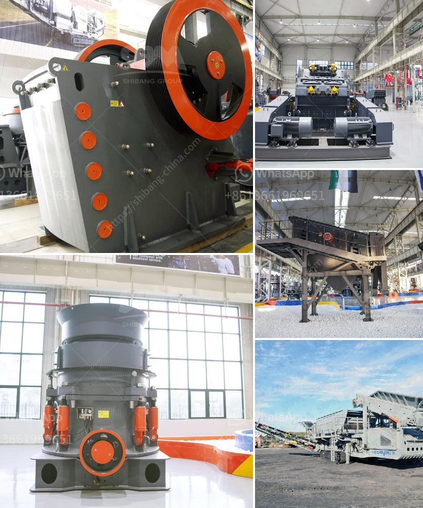

<h3>كسارة الفك ميم FR</h3>
كسارة الفك ميم FR واحدة من أهم الآلات المستخدمة في صناعة التعدين والبناء. تعتبر هذه الكسارات من أحدث التحسينات التكنولوجية في هذا المجال، حيث توفر كفاءة عالية وأداء ممتاز وصيانة سهلة.

تحظى كسارة الفك ميم FR بتصميم فريد يجمع بين القوة والمتانة مع الاهتمام بالتفاصيل الدقيقة. فهي مصنوعة من مواد عالية الجودة وتتمتع بأجزاء قوية تسمح لها بالتعامل مع الحمولات الثقيلة والصلبة بسهولة.

تتميز كسارة الفك ميم FR بالعديد من الميزات الفريدة التي تجعلها اختيارًا رائعًا في صناعة التعدين والبناء. فهي تتمتع بقوة دفع عالية تمكنها من تكسير المواد الصلبة بسهولة وفعالية. كما أنها تتميز بأداء ممتاز وكفاءة عالية في تكسير المواد.

واحدة من الميزات الهامة لكسارة الفك ميم FR هي سهولة الصيانة. فهي تتوفر على نظام تشحيم آلي يضمن استمرارية عمل الكسارة بدون توقف لفترات طويلة. كما أنها تتميز بأجزاء قابلة للتغيير بسهولة، مما يجعل صيانتها وإصلاحها أمرًا بسيطًا وسريعًا.

بالإضافة إلى ذلك، تتميز كسارة الفك ميم FR بتصميمها الهندسي الذكي الذي يضمن تقليل اهتزازات الجهاز والضوضاء. فهو يعمل بكفاءة عالية ودون إحداث أي اضطرابات غير مرغوب فيها مما يؤدي إلى تحسين جودة العمل وراحة العمال.

باختصار، تعد كسارة الفك ميم FR خيارًا مثاليًا في عمليات التكسير والتعدين والبناء. فهي تجمع بين الجودة والأداء العالي والصيانة السهلة في جهاز واحد. إذا كنت تبحث عن كسارة فعالة وموثوقة في هذه الصناعات، فإن كسارة الفك ميم FR تلبي كل احتياجاتك.
<h3>Contact us</h3><ul><li><strong>Whatsapp:&nbsp;<a href="https://wa.me/8613661969651">+8613661969651</a></strong></li><li><a href="https://swt.shibang-china.com/?git&amp;zhl&amp;كسارة الفك ميم FR"><strong>Online Service(chat now)</strong></a></li></ul><h3>Related</h3><ul><li><a href='كسارة للبيع في الفلبين.md'>كسارة للبيع في الفلبين</a></li><li><a href='تاجر آلة طحن في بنجلاديش.md'>تاجر آلة طحن في بنجلاديش</a></li><li><a href='مصنع الجبس في باكستان.md'>مصنع الجبس في باكستان</a></li><li><a href='موردين طاحونة الأسمنت.md'>موردين طاحونة الأسمنت</a></li><li><a href='مطاحن الأسطوانات في الدول.md'>مطاحن الأسطوانات في الدول</a></li></ul>