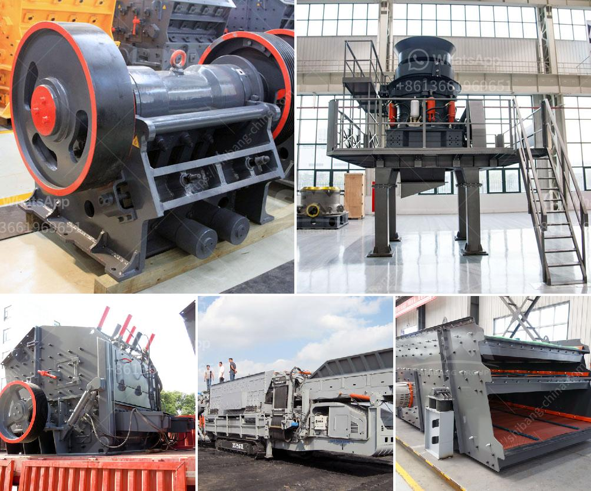

<h3>كسارة الفك هي</h3>
كسارة الفك هي إحدى أنواع المعدات الهامة والشائعة في صناعة التعدين والبناء. تعتبر كسارة الفك الأكثر استخدامًا في عمليات سحق المواد الخام وتكسيرها إلى قطع أصغر. يتم استخدامها عادة في تجهيز خامات المعادن والصخور غير القابلة للاشتعال وغيرها من المواد الصلبة.

تعمل كسارة الفك عن طريق تحويل الضغط من خلال محرك كهربائي إلى قوة ميكانيكية. تتألف الكسارة من جزأين رئيسيين هما الفك الثابت والفك المتحرك. الفك الثابت مثبت في مكانه بينما يتحرك الفك المتحرك بحرية لتكسير المواد. يتم تغذية المواد إلى الكسارة عبر فتحة الدخول وتكسيرها بين الفك الثابت والفك المتحرك عندما يتحرك الفك المتحرك للأسفل.

كسارة الفك توفر أداءًا ممتازًا في العمليات الصناعية المختلفة. فهي قادرة على تكسير المواد بطريقة فعالة وسريعة، وذلك بفضل قوتها الهائلة وصلابتها. قوة الضغط التي تقدمها الكسارة الفكية وقدرتها على تكسير المواد تجعلها قادرة على معالجة الخامات بحجم كبير وتحويلها إلى حجم أصغر بشكل فعال.

يتم استخدام كسارة الفك في تنوع كبير من الصناعات، بدءًا من صناعة التعدين حيث تستخدم لاستخراج المواد الثمينة والمعادن من المناجم بطريقة فعالة، وصولاً إلى صناعة البناء حيث تستخدم لتجهيز المواد الخام وتكسيرها لاستخدامها في إنشاء المباني والطرق والجسور.

تتميز كسارة الفك بعدة مزايا، فهي متينة وقوية في التصميم مما يجعلها قادرة على التعامل مع المواد ذات الصلابة العالية والقوة. كما أنها توفر نسبة تكسير عالية بفضل تصميم الفك المتحرك والفك الثابت. بالإضافة إلى ذلك، فإن كسارة الفك مناسبة للاستخدام في الظروف الصعبة، مثل البيئات الرطبة والمتسخة، وتعمل بكفاءة في درجات حرارة مختلفة.

في الختام، يجب أن يتم اختيار الكسارة الفكية المناسبة حسب الاحتياجات ومتطلبات الإنتاج. يجب اختيار الحجم والنوع المناسب للمواد المطلوب تكسيرها. يجب أيضًا الاهتمام بالصيانة الدورية والتشحيم لضمان استمرارية الكسارة في العمل بكفاءة وفاعلية. إذا تم استخدامها بشكل صحيح، فإن كسارة الفك يمكنها تحسين الإنتاجية وتقليل تكاليف التشغيل في الصناعات المختلفة.
<h3>Contact us</h3><ul><li><strong>Whatsapp:&nbsp;<a href="https://wa.me/8613661969651">+8613661969651</a></strong></li><li><a href="https://swt.shibang-china.com/?git&amp;zhl&amp;كسارة الفك هي"><strong>Online Service(chat now)</strong></a></li></ul><h3>Related</h3><ul><li><a href='مصنع كسارة الدولوميت في ناجبور.md'>مصنع كسارة الدولوميت في ناجبور</a></li><li><a href='مصنع الحجر الجيري والآلات في تاميل نادو للبيع.md'>مصنع الحجر الجيري والآلات في تاميل نادو للبيع</a></li><li><a href='معدات مطحنة الكرة.md'>معدات مطحنة الكرة</a></li><li><a href='عملية تصنيع كسارة الطين.md'>عملية تصنيع كسارة الطين</a></li><li><a href='مطحنة السيليكا المطحونة للبيع.md'>مطحنة السيليكا المطحونة للبيع</a></li></ul>