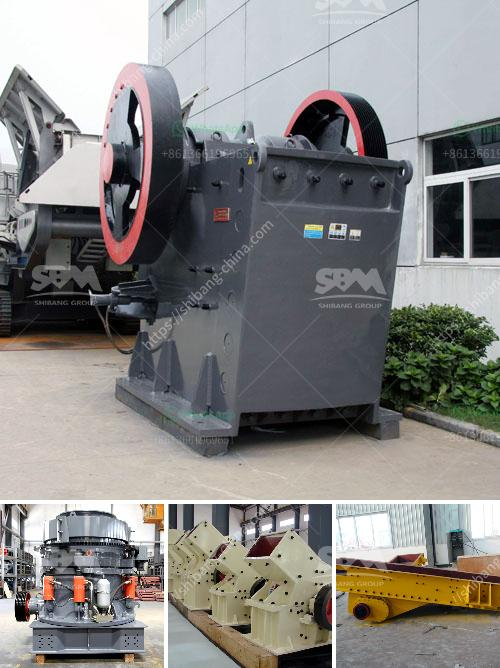

<h3>كسارة الفك والشاشة بتنسيق PDF</h3>
تعتبر كسارة الفك والشاشة من الأدوات الهامة في صناعة التعدين والإنشاءات. فهي تستخدم لتكسير الصخور الكبيرة إلى حجم أصغر، وفصل المواد المكسورة عن طريق الشاشة حسب الحجم المطلوب.

يعتمد تصميم كسارة الفك على فكين متحركين يتحركان في اتجاهين معاكسين. وهذه الحركة تعمل على تكسير المواد بين الفكين. يتم ضبط فتحة الفك وفقًا لحجم المواد النهائي المطلوب. وعند تحريك الفكين مع بعضهما، يتم ضغط وتكسير المواد بفعل القوة التي تولدها حركة الفكين.

بعد تكسير المواد بواسطة كسارة الفك، تمر المواد عبر الشاشة للفصل بين المواد المكسورة والتي تحتاج إلى تكسير إضافي والمواد النهائية التي تم الفصل عنها. تعمل الشاشة بواسطة ترتيب مجموعة من سلك الشاشة لتصفية الجسيمات حسب الحجم. وبذلك، يتم فصل المواد المكسورة ذات الحجم الكبير من المواد النهائية.

توجد عدة أنواع من كسارات الفك والشاشات، تعتمد على الاحتياجات والمتطلبات المحددة للصناعة التي تعمل فيها. تتميز بعض الكسارات بقوة تكسير عالية وتصميم متين؛ مما يجعلها قادرة على تكسير الصخور الكبيرة مع سهولة، بينما تتميز بعض الشاشات بخاصية تحكم في قوة الأهتزاز، مما يسمح بفصل المواد بدقة عالية.

من المهم اختيار الكسارة والشاشة المناسبة للمشروع، بحيث يتم تلبية الاحتياجات الفعلية للعملية. كما يجب الأخذ في الاعتبار عوامل مثل كفاءة الإنتاج، وتكلفة التشغيل، وصيانة المعدات، ويجب أيضًا التأكد من أن الكسارة والشاشة تلبي المعايير البيئية والأمنية.

باختصار، تلعب كسارة الفك والشاشة دورًا حيويًا في صناعة التعدين والإنشاءات. فهي تساعد على تكسير الصخور وفصل المواد، وتحسين كفاءة العملية. وباختيار الكسارة والشاشة المناسبة، يمكن تحقيق أقصى قدر من الكفاءة والإنتاجية في المشروع.
<h3>Contact us</h3><ul><li><strong>Whatsapp:&nbsp;<a href="https://wa.me/8613661969651">+8613661969651</a></strong></li><li><a href="https://swt.shibang-china.com/?git&amp;zhl&amp;كسارة الفك والشاشة بتنسيق PDF"><strong>Online Service(chat now)</strong></a></li></ul><h3>Related</h3><ul><li><a href='معدات تعدين الكسارة في تنزانيا.md'>معدات تعدين الكسارة في تنزانيا</a></li><li><a href='معدات طحن الرماد الخشن.md'>معدات طحن الرماد الخشن</a></li><li><a href='تصميم مصنع الإسمنت بتنسيق PDF.md'>تصميم مصنع الإسمنت بتنسيق PDF</a></li><li><a href='سعة مطحنة الكرة 10 تف في ماليزيا.md'>سعة مطحنة الكرة 10 تف في ماليزيا</a></li><li><a href='كسارات الخرسانة المصغرة.md'>كسارات الخرسانة المصغرة</a></li></ul>