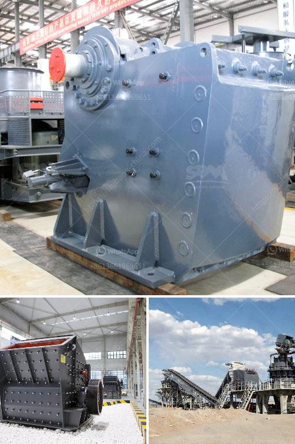

<h3>كسارة الفك وقطع الغيار</h3>
تعد كسارة الفك واحدة من الآلات المستخدمة في صناعة التعدين ومجالات أخرى مثل صناعة البناء والتشييد والطرق. تستخدم هذه الكسارة لسحق المواد الخام إلى قطع صغيرة من الحجم المناسب للاستخدام في عمليات التصنيع أو الإنشاءات. 

تتكون كسارة الفك من إطار صلب وقوي يحتوي على فتحة تغذية في الجزء العلوي وفتحة تفريغ في الجزء السفلي. يتم وضع المواد الخام في الفتحة العلوية وتسحق بين الفك الثابت والفك المتحرك. يعمل الفك المتحرك على التحرك للأمام والخلف بفضل آلية الربط المثبتة على الإطار، مما يؤدي إلى سحق المواد بشكل فعال. بالإضافة إلى ذلك، يمكن ضبط فتحة التفريغ للحصول على قطع بحجم محدد.

تتوفر قطع الغيار لكسارة الفك بعدة أشكال، بما في ذلك الفك الثابت والفك المتحرك ولوحة الفك والمحور والبكرة والمحمل وغيرها من الأجزاء المهمة. بسبب طبيعة عمل هذه الكسارة، يتعرض بعض الأجزاء للتآكل بشكل أكبر من غيرها، وبالتالي يحتاج إلى استبدال وتجديد من فترة لأخرى. ولذلك، يعتبر توفير قطع الغيار الأصلية ضروريًا للحفاظ على أداء الكسارة بكفاءة عالية.

بالإضافة إلى الأجزاء الأساسية، توفر العديد من الشركات المصنعة قطع الغيار الأخرى مثل الياقات الداخلية والأغطية والياقات الخارجية والأسطوانات. تختلف تكلفة قطع الغيار بناءً على العلامة التجارية والجودة، ويجب على المشترين اختيار الأجزاء المناسبة وفقًا لاحتياجاتهم وميزانياتهم. قد يؤثر اختيار جودة منتجات قطع الغيار على عمر الكسارة وأدائها. 

في النهاية، تعتبر كسارة الفك وقطع الغيار أدوات مهمة في صناعة التعدين والبناء. يجب على المشترين البحث عن الشركات المصنعة الموثوقة ومقدمي الخدمات لضمان جودة المنتجات والخدمات. بالتالي، ستكون الكسارة وقطع الغيار قادرة على العمل بكفاءة وتلبية احتياجات المشترين على المدى الطويل.
<h3>Contact us</h3><ul><li><strong>Whatsapp:&nbsp;<a href="https://wa.me/8613661969651">+8613661969651</a></strong></li><li><a href="https://swt.shibang-china.com/?git&amp;zhl&amp;كسارة الفك وقطع الغيار"><strong>Online Service(chat now)</strong></a></li></ul><h3>Related</h3><ul><li><a href='سعر مصنع الرمل والحصى في الهند.md'>سعر مصنع الرمل والحصى في الهند</a></li><li><a href='كسارات للإيجار في سينسيناتي.md'>كسارات للإيجار في سينسيناتي</a></li><li><a href='شركة تصنيع لوحات الجبس في سنغافورة.md'>شركة تصنيع لوحات الجبس في سنغافورة</a></li><li><a href='مصنع كسارة الحجر القديمة للبيع.md'>مصنع كسارة الحجر القديمة للبيع</a></li><li><a href='سعر آلة تكسير الذهب في الولايات المتحدة.md'>سعر آلة تكسير الذهب في الولايات المتحدة</a></li></ul>