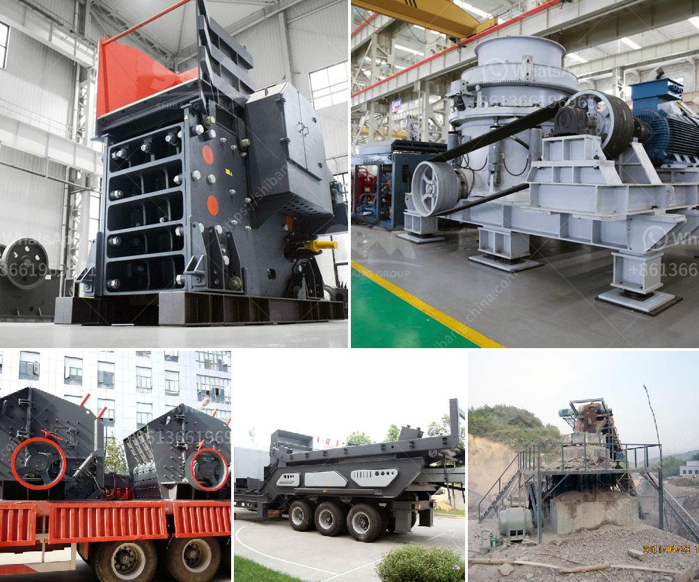

<h3>كسارة الفلدسبار بتأثير</h3>
تعتبر كسارة الفلدسبار من الأدوات المهمة في صناعة البناء والتعدين، حيث تعمل على تكسير وطحن الفلدسبار بغرض استخلاص المعادن منه واستخدامها في إنتاج المواد الخام للعديد من الصناعات.

يتم استخدام كسارة الفلدسبار عبر عدة مراحل، حيث يتم تحميل الفلدسبار الخام في الكسارة عن طريق الميناء أو الحزام النقال. ثم يتم تكسير الفلدسبار إلى قطع صغيرة باستخدام الكسارة الأولية، وتقوم بتحويلها إلى قطع أصغر وأنعم.

بعد ذلك، يتم نقل الفلدسبار إلى الكسارة الثانوية لمواصلة عملية التكسير حتى الحجم المطلوب. وفي المرحلة النهائية، يتم نقل الفلدسبار إلى الطاحونة للطحن النهائي للحصول على مسحوق الفلدسبار الجاهز للاستخدام.

تعتبر كسارة الفلدسبار فعالة جدًا ومؤثرة في تكسير الفلدسبار بطريقة سريعة وفعّالة. وبفضل تقنيات الطحن المتقدمة، يمكن أن تحقق الكسارة نسبة كبيرة من الاستخلاص، مما يزيد من كفاءة عملية التعدين.

بالإضافة إلى ذلك، توفر كسارة الفلدسبار أيضًا ميزة الاستدامة البيئية، حيث يمكن استخدامها لإعادة تدوير الفلدسبار واستخدامه مرة أخرى في صناعة المواد الخام. هذا يساهم في الحفاظ على الموارد الطبيعية وتقليل النفايات.

بشكل عام، تعتبر كسارة الفلدسبار أداة أساسية في صناعة التعدين والبناء، حيث تساهم في استخلاص المعادن بكفاءة وتحويلها إلى مواد خام قابلة للتصنيع. وباستخدام تقنيات حديثة، يمكن تحسين أداء الكسارة وزيادة كفاءتها، مما يعزز العملية الإنتاجية ويسهم في تطور صناعة البناء والتعدين.
<h3>Contact us</h3><ul><li><strong>Whatsapp:&nbsp;<a href="https://wa.me/8613661969651">+8613661969651</a></strong></li><li><a href="https://swt.shibang-china.com/?git&amp;zhl&amp;كسارة الفلدسبار بتأثير"><strong>Online Service(chat now)</strong></a></li></ul><h3>Related</h3><ul><li><a href='مصنع تكسير الخرسانة في دبي.md'>مصنع تكسير الخرسانة في دبي</a></li><li><a href='تقرير جدوى مصنع الأسمنت.md'>تقرير جدوى مصنع الأسمنت</a></li><li><a href='سعر مركز تركيز خام النحاس.md'>سعر مركز تركيز خام النحاس</a></li><li><a href='تأجير كسارة إعادة تدوير الخرسانة.md'>تأجير كسارة إعادة تدوير الخرسانة</a></li><li><a href='طاحونة عمودية للأسمنت في كينيا بسعة 100 طن.md'>طاحونة عمودية للأسمنت في كينيا بسعة 100 طن</a></li></ul>