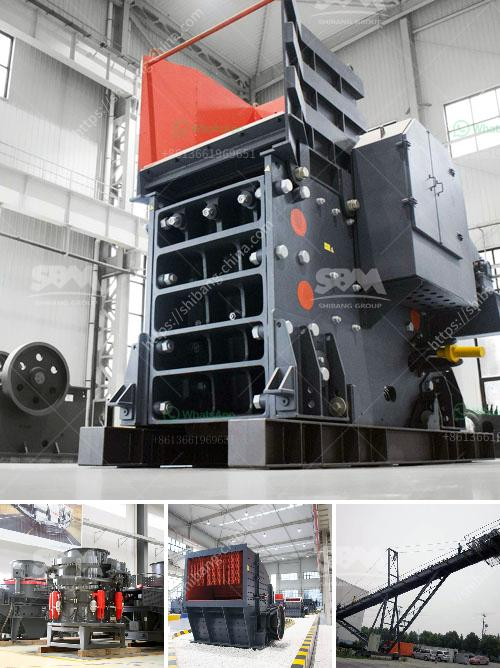

<h3>كسارة الكاولين المحمولة في نيجيريا</h3>
تنتج نيجيريا موارد كبيرة من الكاولين، وهو معدن رخيص ومتاح بكميات كبيرة في جميع أنحاء البلاد. يتم استخدام الكاولين في صناعة العديد من المنتجات مثل الأدوات الخزفية والألياف والأوراق ومستحضرات التجميل. ومع ذلك، فإن استخراج الكاولين التقليدي يشكل تحديات عديدة نظرًا للتكلفة العالية والتقنيات القديمة المستخدمة.

للتغلب على هذه التحديات وتحسين عملية استخراج الكاولين في نيجيريا، تم تطوير كسارة الكاولين المحمولة. تعتبر كسارة الكاولين المحمولة حلاً مثاليًا لاستخدامها في مناجم الكاولين، حيث يمكن نقلها بسهولة وتركيبها في مناطق الاستخراج.

من أهم الميزات التي تقدمها كسارة الكاولين المحمولة هي قدرتها على سحق الكاولين إلى قطع صغيرة بشكل فعال وفاصل، مما يسهل عملية استخراج الكاولين ويقلل من فاقد الكاولين المستخرج. تحتوي الكسارة المحمولة على مخروط محمول سحق الكاولين وشاشة تهتز، وهو يعمل عن طريق تغذية الكاولين في الكسارة وتحريك السطح بشكل متكرر والتي تنقل الكاولين إلى الشاشة لفصل الحجم المناسب.

يوفر الكسارة المحمولة مرونة كبيرة لمشغلي المناجم حيث يمكن استخدامها في أماكن مختلفة في المنجم دون الحاجة إلى إعادة ترتيب البنية الأساسية. كما أنه يوفر تكلفة منخفضة للصيانة وتشغيل مستقر وذلك لاحتوائه على نظام تشغيل وصيانة مبسط.

تتضمن مزايا كسارة الكاولين المحمولة أيضًا القدرة على التحكم في حجم الكاولين المسحوق النهائي. يمكن للمشغل ضبط حجم الفتحة في الفك لتحقيق حجم جسيمات مطلوب وفقًا لاحتياجات العملاء. يعني ذلك أن الكسارة المحمولة قادرة على تلبية متطلبات العميل الفردية وتحقيق الكفاءة العالية في استخراج الكاولين.

بشكل عام، تقدم كسارة الكاولين المحمولة في نيجيريا العديد من الفوائد لصناعة الكاولين في البلاد. من خلال تحسين عملية استخراج الكاولين وتقليل التكاليف وزيادة الكفاءة، يمكن للكسارة المحمولة أن تعزز الإنتاج وتساهم في تطوير الصناعة في نيجيريا.
<h3>Contact us</h3><ul><li><strong>Whatsapp:&nbsp;<a href="https://wa.me/8613661969651">+8613661969651</a></strong></li><li><a href="https://swt.shibang-china.com/?git&amp;zhl&amp;كسارة الكاولين المحمولة في نيجيريا"><strong>Online Service(chat now)</strong></a></li></ul><h3>Related</h3><ul><li><a href='آلة تحويل الحجر الجيري إلى مسحوق.md'>آلة تحويل الحجر الجيري إلى مسحوق</a></li><li><a href='مصنع إسمنت مربح للبيع في تاميل نادو.md'>مصنع إسمنت مربح للبيع في تاميل نادو</a></li><li><a href='شركة تصنيع كسارة الطحن في راجكوت، الهند.md'>شركة تصنيع كسارة الطحن في راجكوت، الهند</a></li><li><a href='مطحنة MTM ترابيزيوم.md'>مطحنة MTM ترابيزيوم</a></li><li><a href='عملية التحول للأسمنت.md'>عملية التحول للأسمنت</a></li></ul>