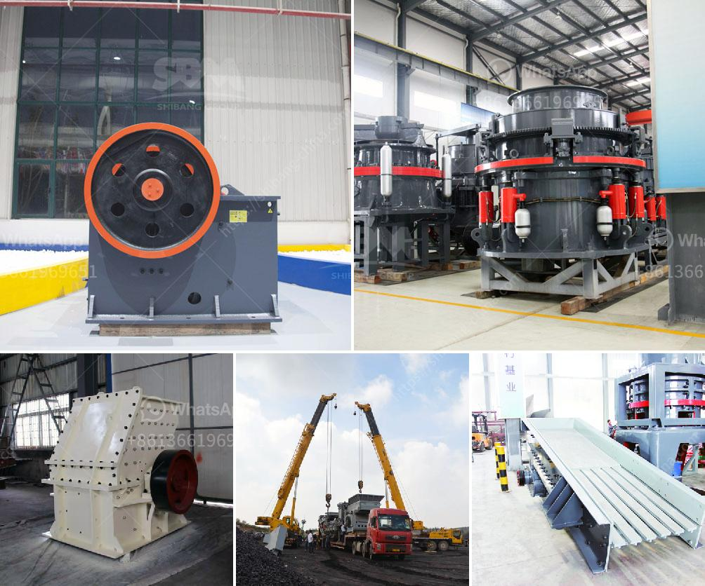

<h3>كسارة الكرة النحاس آلة كسارة النحاس</h3>
تعتبر آلة كسارة الكرة النحاس أحد أهم الأدوات المستخدمة في صناعة تكسير الخامات النحاسية. تستخدم هذه الآلة في عملية تكسير الخامات النحاسية إلى جزيئات صغيرة تمهد الطريق للعمليات اللاحقة في استخلاص النحاس النقي.

يتألف جهاز كسارة الكرة النحاس من محرك كهربائي يقود جرافة لتحريك الكرات النحاسية. تتمثل فكرة العمل في أنه عندما تدخل الخامات النحاسية إلى الآلة، تتعرض لضغط الكرات النحاسية المليئة بالطاقة الحركية. هذا الضغط يؤدي إلى تكسير الخامات النحاسية إلى حجم أصغر حتى يتم تكسيرها لتكون جزيئات صغيرة. تتم إزالة الكرات النحاسية من الجهاز بواسطة تدوير الجرافة.

تعتبر آلة كسارة الكرة النحاس فعالة لعدة أسباب. قوة التأثير العالية التي يمارسها الكرات النحاسية على الخامات تؤدي إلى تفتتها وتقسيمها إلى جزيئات صغيرة بشكل فعال. بالإضافة إلى ذلك، فإن هذه الآلة مصممة بطريقة تسمح بعدم وجود تراكمات وعقبات فيها، مما يجعل عملية التكسير مستمرة وسلسة.

توفر آلة كسارة الكرة النحاس العديد من الفوائد في صناعة تكسير الخامات النحاسية. أولاً، تعمل هذه الآلة على زيادة كفاءة استخلاص النحاس النقي من الخامات. وبالتالي، فإن استخدام هذه الآلة يعني زيادة الإنتاجية وتقليل التكاليف في عملية استخراج النحاس. ثانياً، تمكن هذه الآلة من تحسين جودة المنتج النهائي وتوحيد الحجم النهائي للجزيئات المكسورة. وأخيراً، بفضل عملية التكسير الفعالة، يتم تقليل ضياع الخامات الثمينة وبالتالي تحقيق أقصى قدر من الاستفادة من الموارد.

في الختام، تعتبر آلة كسارة الكرة النحاس أداة أساسية في صناعة تكسير الخامات النحاسية. يمكنها تكسير الخامات إلى جزيئات صغيرة، مما يجعل عملية استخراج النحاس النقي أكثر كفاءة وفعالية. تعتبر هذه الآلة فعالة في تحسين جودة المنتج النهائي وتقليل الضياع. بالإضافة إلى ذلك، فإن استخدام هذه الآلة يؤدي إلى زيادة الإنتاجية وتقليل التكاليف في صناعة استخراج النحاس.
<h3>Contact us</h3><ul><li><strong>Whatsapp:&nbsp;<a href="https://wa.me/8613661969651">+8613661969651</a></strong></li><li><a href="https://swt.shibang-china.com/?git&amp;zhl&amp;كسارة الكرة النحاس آلة كسارة النحاس"><strong>Online Service(chat now)</strong></a></li></ul><h3>Related</h3><ul><li><a href='مطحنة الأسطوانة مطحنة السميكة.md'>مطحنة الأسطوانة مطحنة السميكة</a></li><li><a href='أرض الجرانيت الأسود للبيع في تاميل نادو.md'>أرض الجرانيت الأسود للبيع في تاميل نادو</a></li><li><a href='كسارة ومطحنة للذهب.md'>كسارة ومطحنة للذهب</a></li><li><a href='كسارة الحجر في المغرب.md'>كسارة الحجر في المغرب</a></li><li><a href='مطحنة الضغط العالي.md'>مطحنة الضغط العالي</a></li></ul>