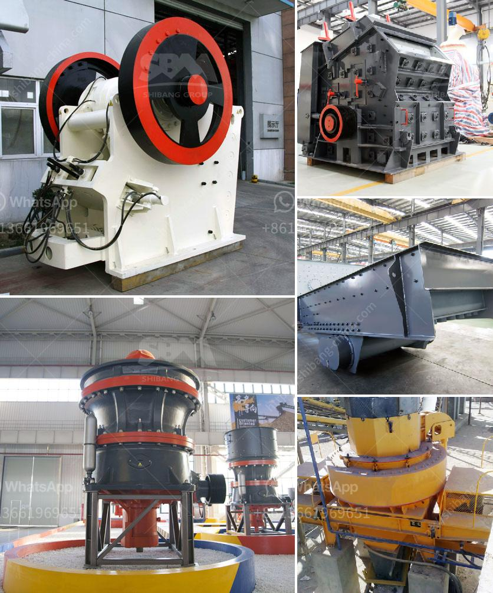

<h3>كسارة الكرة باكستان للبيع</h3>
تعتبر كسارة الكرة من أهم الأدوات والمعدات المستخدمة في صناعة التعدين وتكسير المواد الصلبة. وتستخدم هذه الكسارات في طحن المواد الخام وتكسيرها للحصول على حجم مطلوب قبل استخدامها في العمليات الإنتاجية الأخرى.

وتمتاز كسارة الكرة التي تباع في باكستان بقدرتها على طحن المواد الخام بشكل فعال وسرعة عالية. كما أنها تتميز بالقدرة على تكسير الصخور الصلبة والمواد الأخرى بطريقة سهلة وسريعة. وتتوفر هذه الكسارات بمختلف الأحجام والسعات الإنتاجية لتلبية احتياجات العملاء المختلفة.

إن استخدام كسارة الكرة في صناعة التعدين له العديد من المزايا. فبفضل تصميمها المتطور وهيكلها الصلب، فإنها تتمتع بقوة عالية ومتانة لضمان أداء مستدام على المدى الطويل. كما أنها تتمتع بكفاءة عالية في استخدام الطاقة، مما يقلل من تكاليف التشغيل والصيانة.

تشكل كسارات الكرة العنصر الأساسي لعملية التكسير والطحن في صناعة التعدين. حيث يتم تحميل المواد الخام في الكسارة ويتم طحنها بواسطة الكرات المعدنية الموجودة داخل الجهاز. وبفضل حركة الدوران المستمرة للكرات، تتمكن الكسارة من تكسير المواد الخام بفعالية وسرعة عالية.

وفيما يتعلق بسوق بيع كسارات الكرة في باكستان، فإنه يمكن العثور على العديد من الموردين والشركات المصنعة المتخصصة في هذا المجال. وتعرض الكسارات الجديدة والمستعملة للبيع بأسعار تتراوح بين 200 و 400 دولار، وذلك حسب الحجم والسعة الإنتاجية المطلوبة.

للخلاصة، تعتبر كسارة الكرة من أهم الأدوات المستخدمة في صناعة التعدين لتكسير وطحن المواد الخام. ويمكن العثور على العديد من موردي وشركات تصنيع كسارات الكرة في باكستان، حيث تتوفر بأحجام وسعات إنتاجية مختلفة. وتتميز هذه الكسارات بالكفاءة والمتانة والقوة العالية، مما يجعلها خيارًا مثاليًا لصناعة التعدين.
<h3>Contact us</h3><ul><li><strong>Whatsapp:&nbsp;<a href="https://wa.me/8613661969651">+8613661969651</a></strong></li><li><a href="https://swt.shibang-china.com/?git&amp;zhl&amp;كسارة الكرة باكستان للبيع"><strong>Online Service(chat now)</strong></a></li></ul><h3>Related</h3><ul><li><a href='مطحنة عمودية للكالسيوم.md'>مطحنة عمودية للكالسيوم</a></li><li><a href='آلة تكسير الحجر في الصين.md'>آلة تكسير الحجر في الصين</a></li><li><a href='مصنع غسيل الفحم في جنوب أفريقيا الفلبين.md'>مصنع غسيل الفحم في جنوب أفريقيا الفلبين</a></li><li><a href='كسارات الحجر في كاليفورنيا.md'>كسارات الحجر في كاليفورنيا</a></li><li><a href='كرات المطحنة للتعدين.md'>كرات المطحنة للتعدين</a></li></ul>