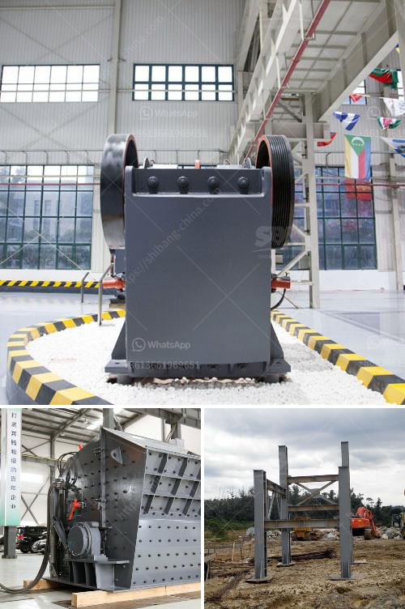

<h3>كسارة الكرة</h3>
تعد كسارة الكرة واحدة من الآلات الهامة في صناعة التعدين والبناء والصناعات الأخرى ذات الصلة. تستخدم كسارة الكرة لسحق المواد الخام إلى قطع صغيرة قبل أن يتم تطبيقها في العملية الإنتاجية النهائية. استخدام كسارة الكرة يتيح تحويل المواد الخام إلى حجم صغير يمكن معالجته وتشكيله بسهولة وفقًا لاحتياجات المشروع.

تتكون كسارة الكرة من اسطوانة طولية تحتوي على كرات صلبة في داخلها. يعمل المحرك على تدوير الأسطوانة بسرعة عالية، وبالتالي يسحق الكرات المواد الخام الموجودة داخلها. تختلف أحجام الكرات المستخدمة وفقًا لحجم المواد الخام وأنواعها.

تعتبر كسارة الكرة مفيدة للحصول على مواد نهائية ذات قوة عالية وحجم منتظم. فبفضل تأثير الكسارة واحتكاك الكرات على المواد الخام، يتم تفتيتها بشكل كبير وتجزئتها إلى قطع أصغر. هذا يعزز قدرة المواد على الذوبان والختم والتشكيل والتصنيع في المراحل اللاحقة.

علاوة على ذلك، تُستخدم كسارة الكرة في صناعة الصب والتشكيل. حيث يتم استخدام الكسارة لتفتيت الصخور الكبيرة إلى قطع صغيرة، ثم يتم صبها في قوالب لإنتاج المواد الأساسية للبناء، مثل الخرسانة والأسمنت والطوب.

من الجيد أن نذكر أن كسارة الكرة متوفرة بأحجام مختلفة تناسب متطلبات المشروعات المختلفة. يتم اختيار الحجم المناسب وفقًا لحجم ونوع المواد الخام، وكذلك الناتج المطلوب.

في الختام، يمكن القول أن كسارة الكرة تُعد أداة مهمة في صناعة التعدين والبناء. تساهم في تحويل المواد الخام إلى قطع صغيرة تسهل المعالجة وتطبيقها في العمليات الإنتاجية النهائية. استخدام كسارة الكرة يؤدي إلى تحسين جودة المنتج النهائي وتحسين كفاءة العملية الإنتاجية.
<h3>Contact us</h3><ul><li><strong>Whatsapp:&nbsp;<a href="https://wa.me/8613661969651">+8613661969651</a></strong></li><li><a href="https://swt.shibang-china.com/?git&amp;zhl&amp;كسارة الكرة"><strong>Online Service(chat now)</strong></a></li></ul><h3>Related</h3><ul><li><a href='عملية تعويم التلك.md'>عملية تعويم التلك</a></li><li><a href='مصنع تكسير وفحص متنقل.md'>مصنع تكسير وفحص متنقل</a></li><li><a href='ناقل البناء للبيع.md'>ناقل البناء للبيع</a></li><li><a href='أسعار كسارات الخرسانة.md'>أسعار كسارات الخرسانة</a></li><li><a href='سعر آلة المحجر.md'>سعر آلة المحجر</a></li></ul>