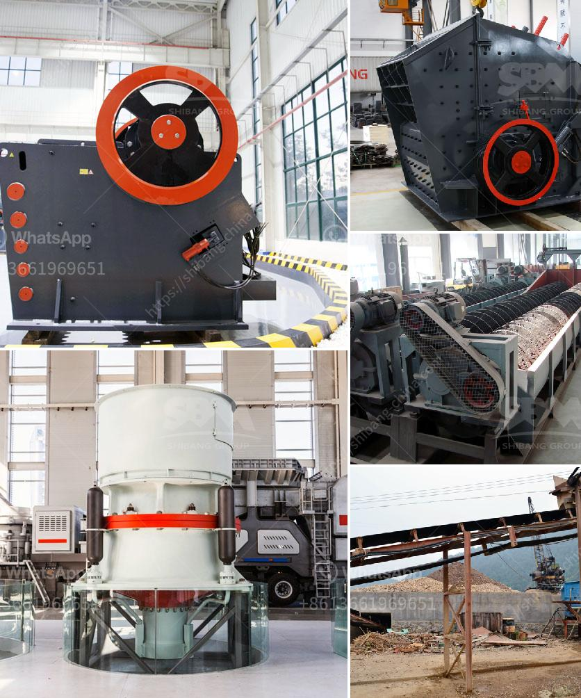

<h3>كسارة الكرةست في كينيا صنعت في الصين</h3>
تلعب البنية التحتية القوية دورًا حاسمًا في تنمية أي دولة وتحقيق التقدم الاقتصادي والاجتماعي. واحدة من وسائل تحسين البنية التحتية هي استخدام الآلات والمعدات المتطورة لإنجاز الأعمال الإنشائية. في هذا السياق، قد تكون كسارة الكرةست في كينيا صنعت في الصين واحدة من الحلول المثلى لتطوير البنية التحتية في البلاد. سنلقي نظرة على الأسباب التي تجعلها خيارًا مثاليًا وفوائدها المحتملة.

أولاً وقبل كل شيء، تمتاز كسارة الكرةست بقدرتها على سحق وتنقية المواد الكبيرة وتحويلها إلى مواد صغيرة قابلة للاستخدام في مختلف الأعمال الإنشائية. فهي تتيح للمقاولين إعادة تدوير المواد القديمة، مثل الخرسانة المهدمة والأحجار المكسورة، واستخدامها في مشاريع جديدة. وبفضل هذه الميزة، يمكن للكسارة الكرةست أن تسهم في تقليل المخلفات البنائية وتحسين الاستدامة البيئية.

ثانياً، تعتبر سعة الإنتاج العالية هي ميزة أخرى تجعل كسارة الكرةست مفيدة في تطوير البنية التحتية في كينيا. فإنها تتيح تجهيز كميات كبيرة من المواد في وقت قصير، مما يقلل من التكاليف ويحقق مزيدًا من الكفاءة في أعمال البناء والتشييد. وستساهم هذه الزيادة في الإنتاجية في تقديم مشاريع أسرع وأكثر جودة لصالح المجتمع.

بالإضافة إلى ذلك، يمكن تجهيز كسارة الكرةست بوحدات متحركة، وهو جانب مهم لتطوير البنية التحتية في مناطق نائية من كينيا. فهي توفر حلاً مرنًا يمكن نقله من موقع إلى آخر بسهولة، مما يسمح بالوصول إلى الأماكن التي يصعب الوصول إليها بسبب التضاريس المعقدة. وهذا سيتيح للحكومة والمقاولين الوصول إلى مناطق جديدة ومساهمة في تحسين البنية التحتية في محافظات ومناطق أخرى تحتاج إلى تطوير.

وفي النهاية، لا يمكن إغفال أهمية أن تكون كسارة الكرةست صنعت في الصين من حيث التكلفة. فالشراء من الصين يشكل فرصة ملائمة للحصول على معدات عالية الجودة بأسعار تنافسية. وهذا يعني أنه يمكن للحكومة الكينية توفير المزيد من الأموال لتمويل المشاريع الحكومية الأخرى وتحسين خدماتها للمواطنين.

باختصار، يمكن القول أن استخدام كسارة الكرةست صنعت في الصين في تطوير البنية التحتية في كينيا هو خطوة مثمرة. بفضل مزاياها القوية، مثل قدرتها على إعادة تدوير المواد القديمة وزيادة الإنتاجية، ستكون كسارة الكرةست مفيدة في تنمية حضرية مستدامة وتفعيل النمو الاقتصادي في البلاد. علاوة على ذلك، ستساهم في توفير فرص عمل جديدة وتحسين البيئة. وبالتالي، يجب على الحكومة الكينية تعزيز الاستثمار في هذه التكنولوجيا المتقدمة وتهيئة الظروف الملائمة لاستخدامها بشكل أوسع في المستقبل.
<h3>Contact us</h3><ul><li><strong>Whatsapp:&nbsp;<a href="https://wa.me/8613661969651">+8613661969651</a></strong></li><li><a href="https://swt.shibang-china.com/?git&amp;zhl&amp;كسارة الكرةست في كينيا صنعت في الصين"><strong>Online Service(chat now)</strong></a></li></ul><h3>Related</h3><ul><li><a href='جزء من مطحنة الكرة ومبدأ عمله.md'>جزء من مطحنة الكرة ومبدأ عمله</a></li><li><a href='سعر مصنع كسارة الفك.md'>سعر مصنع كسارة الفك</a></li><li><a href='آلة مسحوق التلك.md'>آلة مسحوق التلك</a></li><li><a href='مبدأ عمل مطحنة الهامر.md'>مبدأ عمل مطحنة الهامر</a></li><li><a href='معدات فاصل المغناطيس للبيع.md'>معدات فاصل المغناطيس للبيع</a></li></ul>