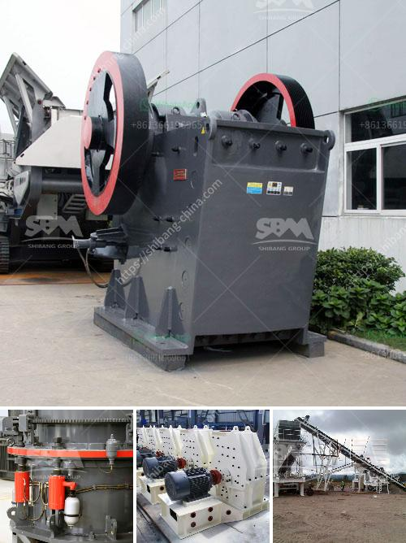

<h3>كسارة الكوارتز السيليكون</h3>
تُعتبر كسارة الكوارتز السيليكون من الأدوات الهامة في صناعة تكسير الصخور والمعادن. وتُستخدم على نطاق واسع في مجالات مختلفة مثل البناء والطرق وإنتاج الزجاج والسيراميك.

تكون كسارة الكوارتز السيليكون عبارة عن آلة تعمل على تفتيت الصخور والمعادن إلى قطع صغيرة أو رملية. وتعتبر قوتها وكفاءتها العالية من أهم مزاياها. فهي تعمل بسرعة عالية وتوفر الوقت والجهد للمشغلين.

قد تختلف تصاميم ومواصفات كسارات الكوارتز السيليكون حسب حاجة الصناعة المستخدمة فيها. على سبيل المثال، توجد بعض الكسارات ذات التصميم المحمول والتي يمكن نقلها وتركيبها بسهولة في مناطق العمل المختلفة. في المقابل، توجد أيضًا الكسارات الثابتة التي تُثبت في محلات الإنتاج الكبيرة وتعمل بكفاءة أكبر.

تعمل كسارات الكوارتز السيليكون عن طريق تطبيق قوة ميكانيكية شديدة على المواد الخام. فأولاً، يتم إدخال الصخور أو المعادن في فتحة الكسارة. ثم تعمل الكسارة على تفتيت هذه المواد عن طريق تحطيمها وتكسيرها بواسطة رؤوس معدنية تتحرك بسرعة عالية. وتكون هذه الرؤوس مزودة بشفرات حادة تقوم بتقطيع المواد إلى قطع أصغر.

تتميز كسارات الكوارتز السيليكون بأنها مُصممة للتحمل العالي وتحمل الاستخدام المستمر والظروف القاسية. فهي تصنع من مواد قوية وتتمتع ببنية صلبة. ويتم اختبار وتحليل جودة هذه الكسارات لضمان أدائها الممتاز والفعال.

يُعد التكسير الفعال والدقيق للصخور والمعادن استخدامًا حاسمًا في صناعة البناء والإنشاء. فالكسارة السيليكونية تعمل على فصل المواد ذات الحجم الكبير إلى قطع أصغر يمكن استخدامها في عمليات البناء والتشييد. كما تقوم بإعادة تدوير المواد الخام المستخدمة، مثل الصخور والأنقاض، وتحويلها إلى مواد صالحة للاستخدام مرة أخرى.

وفي الختام، تلعب كسارة الكوارتز السيليكون دورًا حيويًا في قطاعات صناعية متعددة. فهي تمكن من تحويل الصخور الكبيرة إلى مواد صغيرة ومناسبة للإنتاج والبناء. ترتدي هذه الكسارات بشكل بطيء، مما يمنحها عمرًا طويلًا وكفاءة عالية. وتعكس تقنياتها المبتكرة والفعالة التقدم الذي يحدث في صناعة البناء والتكنولوجيا.
<h3>Contact us</h3><ul><li><strong>Whatsapp:&nbsp;<a href="https://wa.me/8613661969651">+8613661969651</a></strong></li><li><a href="https://swt.shibang-china.com/?git&amp;zhl&amp;كسارة الكوارتز السيليكون"><strong>Online Service(chat now)</strong></a></li></ul><h3>Related</h3><ul><li><a href='مطحنة أسطوانية لطحن المعادن في سالم.md'>مطحنة أسطوانية لطحن المعادن في سالم</a></li><li><a href='مصنع غسيل الرمل للبيع.md'>مصنع غسيل الرمل للبيع</a></li><li><a href='صانع كسارة في مدينة سيبو.md'>صانع كسارة في مدينة سيبو</a></li><li><a href='كسارة تأثير الفك بولندا.md'>كسارة تأثير الفك بولندا</a></li><li><a href='آلات سحق تعمل في بيرو.md'>آلات سحق تعمل في بيرو</a></li></ul>