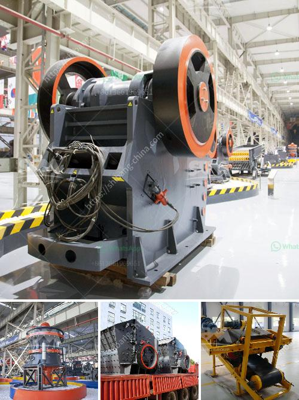

<h3>كسارة المحجر في الفلبين للبيع</h3>
تعتبر كسارة المحجر أحد الآلات الهامة في صناعة التعدين والبناء، حيث يتم استخدامها في سحق الصخور والأحجار الكبيرة للحصول على مواد بنائية صغيرة الحجم. وفي الفلبين، هناك العديد من كسارات المحاجر الموجودة والمعروضة للبيع بأسعار مناسبة تتراوح بين 200-400 دولار.

تعتبر الفلبين من الدول ذات الموارد الطبيعية الغنية، حيث يتواجد بها العديد من المحاجر والمناجم الصخرية. ولا يختلف الأمر في صناعة البناء، حيث يتم استخدام العديد من المواد البنائية مثل الحصى والرمل في إنشاء الطرق والمباني. تحظى كسارات المحاجر بشعبية كبيرة في الفلبين نظرًا لأهميتها في معالجة وتكسير المواد الصخرية للحصول على مواد بنائية جاهزة.

من بين الكسارات المستخدمة في الفلبين، يمكن العثور على العديد من الكسارات التي تباع بأسعار تتراوح بين 200-400 دولار. وعلى الرغم من أن هذه الأسعار معتدلة مقارنة بالكسارات ذات الحجم الكبير، إلا أنها توفر أداءً ممتازًا وعالي الجودة لتلبية احتياجات صناعة البناء. بالإضافة إلى ذلك، فإن الكسارات المستخدمة هي خيار رائع للعديد من المقاولين وأصحاب المشاريع الصغيرة والمتوسطة الحجم.

تحتوي الكسارات المستخدمة على نظام تكسير متقدم يمكنه سحق الصخور الكبيرة بفعالية وجودة عالية. تعمل الكسارة عن طريق توجيه المواد الصخرية إلى فكين متحركين يتم تحريكهما في اتجاه واحد لتحطيم الصخرة بينهما. وبعد ذلك، تخرج المواد الناتجة من الكسارة عن طريق الفتحة الموجودة في قاع الكسارة.

يعد شراء كسارة المحجر مستثمارًا جيدًا للمقاولين وأصحاب المشاريع الصغيرة الذين يحتاجون إلى تجهيز كميات كبيرة من المواد البنائية. إن استخدام كسارة المحجر يساعد على توفير الوقت والجهد والتكاليف، حيث يمكن إنتاج كميات كبيرة من المواد البنائية بسرعة وبوتيرة مرتفعة. بالإضافة إلى ذلك، فإنه يساهم في الحد من الاعتماد على المواد البنائية المستوردة من خارج البلاد ويعزز الاقتصاد المحلي.

في الختام، تعتبر كسارة المحجر أداة أساسية لصناعة التعدين والبناء في الفلبين. يتوفر العديد من هذه الكسارات للبيع بأسعار تتراوح بين 200-400 دولار وتتميز بأداء عالي وجودة ممتازة. يرجى ملاحظة أن الأسعار المذكورة تعتمد على الحجم والنوعية والمواصفات المطلوبة. بشكل عام، شراء كسارة المحجر يعتبر استثمارًا جيدًا للمقاولين وأصحاب المشاريع الصغيرة الذين يسعون لزيادة إنتاجيتهم وتحسين جودة الأعمال التي يقومون بها.
<h3>Contact us</h3><ul><li><strong>Whatsapp:&nbsp;<a href="https://wa.me/8613661969651">+8613661969651</a></strong></li><li><a href="https://swt.shibang-china.com/?git&amp;zhl&amp;كسارة المحجر في الفلبين للبيع"><strong>Online Service(chat now)</strong></a></li></ul><h3>Related</h3><ul><li><a href='مطحنة هامر في جنوب أفريقيا.md'>مطحنة هامر في جنوب أفريقيا</a></li><li><a href='التكسير والفرز المحمول.md'>التكسير والفرز المحمول</a></li><li><a href='آلة تعدين الكسارة.md'>آلة تعدين الكسارة</a></li><li><a href='صيغة حساب قدرة كسارة الفك.md'>صيغة حساب قدرة كسارة الفك</a></li><li><a href='مطحنة معدنية إلى 300 ميكرون.md'>مطحنة معدنية إلى 300 ميكرون</a></li></ul>