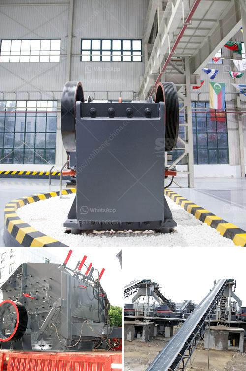

<h3>كسارة المحجر للحجر</h3>
تعد كسارة المحجر أداة أساسية في صناعة البناء والتشييد، حيث تستخدم لسحق الحجارة وتحويلها إلى حجم أصغر وأكثر ملاءمة للاستخدام في البناء والطرق والأعمال العامة. تعتبر هذه الآلة من أهم الوسائل التي تسهم في تنمية القطاعات الاقتصادية المرتبطة بالبناء والتشييد.

تتكون كسارة المحجر من هيكل فولاذي متين يحتوي على وحدة كسارة تتحرك بواسطة محرك كهربائي. يتم إدخال الحجارة الكبيرة إلى الكسارة من خلال طاحونة أو ناقل متحرك ينقل الحجارة إلى فوهة الكسارة حيث يتم سحقها بفعل الضغط والاحتكاك. يتم تحويل الحجر المسحوق الناعم إلى نوعية حبيبية أصغر من خلال الشاشة التي تحتوي على ثقوب بأحجام معينة للفصل بين الحجارة ذات الأحجام المختلفة.

تستخدم كسارة المحجر أساسًا في استخراج الحجر الطبيعي من المحاجر. يتم استخدام الحجر الناتج من الكسارة في تنفيذ العديد من المشاريع مثل بناء الطرق والجسور والأبنية التجارية والسكنية. نظرًا لأن الحجر يعتبر مادة قوية ومتينة ومقاومة للتآكل والعوامل الجوية، فإنه يستخدم بشكل واسع في البناء لضمان المتانة والاستدامة.

تساهم كسارة المحجر في تحسين جودة الحجر المستخدم في البناء، حيث يمكن للآلة سحق الحجارة بأحجام مختلفة وضبط الحجم المطلوب بدقة. بالإضافة إلى ذلك، فإنها تقلل من تكاليف النقل للحجارة، حيث يتم سحقها في الموقع نفسه وبالتالي يتم تقليل عدد الرحلات والمسافات المطلوبة لنقلها. هذا يوفر الوقت والمال للشركات التي تعمل في مجال البناء.

من الناحية البيئية، فإن كسارة المحجر يساهم في تقليل استغلال المحاجر وتجنب نفايات البناء وتلوث البيئة. حيث يمكن إعادة استخدام الحجارة المسحوقة في إعادة بناء الطرق أو استخدامها في الأعمال الزراعية كتربة غنية بالعناصر المعدنية.

باختصار، تعد كسارة المحجر أحد الأدوات الأساسية في صناعة البناء والتشييد. إن استخدامها يحسن جودة الحجر ويقلل من تكاليف النقل ويحمي البيئة. يمكن القول بأنها عنصر أساسي لتطوير القطاعات الاقتصادية المتعلقة بالبناء وتوفير فرص العمل وتحقيق التنمية المستدامة.
<h3>Contact us</h3><ul><li><strong>Whatsapp:&nbsp;<a href="https://wa.me/8613661969651">+8613661969651</a></strong></li><li><a href="https://swt.shibang-china.com/?git&amp;zhl&amp;كسارة المحجر للحجر"><strong>Online Service(chat now)</strong></a></li></ul><h3>Related</h3><ul><li><a href='مطحنة الأسطوانة الجبس.md'>مطحنة الأسطوانة الجبس</a></li><li><a href='كسارة للبيع بسعر دبي.md'>كسارة للبيع بسعر دبي</a></li><li><a href='تكلفة كسارة الفلسبار.md'>تكلفة كسارة الفلسبار</a></li><li><a href='معدات الطحن والفرز للرمل والحصى.md'>معدات الطحن والفرز للرمل والحصى</a></li><li><a href='مصانع طحن الكرات.md'>مصانع طحن الكرات</a></li></ul>