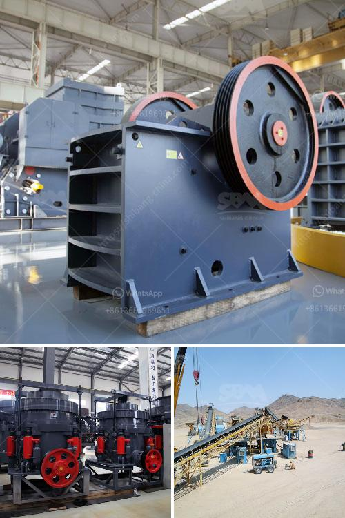

<h3>كسارة المطرقة بسعة ١٠ طن في الساعة وحجمها</h3>
كسارة المطرقة بسعة ١٠ طن في الساعة: تصنف الكسارات المطرقية كأحد أنواع معدات التكسير المستخدمة في صناعة التعدين وبناء البنية التحتية والأعمال الإنشائية الأخرى. تعتبر كسارة المطرقة بسعة ١٠ طن في الساعة واحدة من الكسارات المطرقية التي تُستخدم على نطاق واسع في عمليات التكسير.

تعمل كسارة المطرقة عن طريق توجيه مطرقة حجرية على المواد، مع تطبيق قوة الصدمة لتكسيرها. وتتميز هذه الكسارة بمحرك يدوي يدوم طويلاً وسرعة تشغيل عالية. تعتبر الكسارة المطرقة بسعة ١٠ طن في الساعة مناسبة للمواد ذات قوة الانضغاط أقل من ١٠٠ ميجاباسكال والرطوبة أقل من ١٥٪، مما يجعلها تستخدم عادة لتكسير المعادن والحجارة والفحم والأسمنت ومواد البناء الأخرى.

تتوفر كسارة المطرقة بأحجام مختلفة، وتتراوح القدرة الانتاجية لهذا الطراز بين ٥-١٠ طن في الساعة. تصمم الكسارة بشكل يحقق كفاءة عالية في عملية التكسير ويضمن السلامة أثناء التشغيل. بالإضافة إلى ذلك، يمكن ضبط حجم المنتج النهائي عن طريق تعديل الفجوة بين الشريط الحمل والمطارق، مما يوفر مرونة في تحقيق متطلبات التحجيم المطلوبة.

تتميز الكسارة ببساطة التشغيل والصيانة، بفضل تصميمها الذي يساعد على تجنب الانسدادات والأعطال المستمرة. كما يجمع تصميمها بين المتانة والكفاءة، لتوفير طوال عمر الخدمة الطويل للمعدة.

في الختام، تُعتبر كسارة المطرقة بسعة ١٠ طن في الساعة معدة مهمة وفعالة في صناعة التعدين والبناء. تستخدم لتكسير مجموعة متنوعة من المواد مثل المعادن والحجارة والفحم والأسمنت. تصميمها المبتكر وكفاءتها العالية يجعلانها اختياراً مثالياً للشركات والمصانع التي تحتاج إلى معدات قوية وفعالة لعملية التكسير.
<h3>Contact us</h3><ul><li><strong>Whatsapp:&nbsp;<a href="https://wa.me/8613661969651">+8613661969651</a></strong></li><li><a href="https://swt.shibang-china.com/?git&amp;zhl&amp;كسارة المطرقة بسعة ١٠ طن في الساعة وحجمها"><strong>Online Service(chat now)</strong></a></li></ul><h3>Related</h3><ul><li><a href='أنظمة ناقلات الحصى للمسافة.md'>أنظمة ناقلات الحصى للمسافة</a></li><li><a href='كسارات الحجر في جوتنغ.md'>كسارات الحجر في جوتنغ</a></li><li><a href='البحث عن معدات تجهيز الفحم الصغيرة.md'>البحث عن معدات تجهيز الفحم الصغيرة</a></li><li><a href='عملية سحق الفحم 200 tph.md'>عملية سحق الفحم 200 tph</a></li><li><a href='آلة تصنيع الجبس.md'>آلة تصنيع الجبس</a></li></ul>