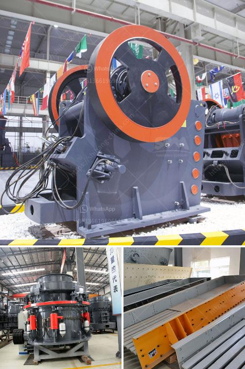

<h3>كسارة المطرقة في الصين</h3>
في الصين، تُعتبر كسارة المطرقة واحدة من أهم الآلات المستخدمة في صناعة التعدين والبناء. تستخدم الكسارة المطرقة لتكسير المواد الخام داخل الصخور الصلبة أو الحجارة لتحويلها إلى قطع أصغر وأكثر مناسبة للاستخدام في العديد من التطبيقات المختلفة.

تتكون كسارة المطرقة من غرفة تكسير تحتوي على مطرقة دوارة تتحرك بسرعة عالية. عندما يتم ضرب المواد الخام بواسطة المطرقة، يتم تحطيمها وتفتيتها وتقسيمها إلى قطع صغيرة. تعتبر الكسارة المطرقة فعالة جدًا في استخلاص المعادن والمواد الصلبة من الصخور.

تشتهر الصين بتصنيع وتوزيع العديد من الكسارات المطرقة العالية الجودة. توفر الشركات الصينية مجموعة واسعة من الكسارات المطرقة المصنوعة من مواد عالية الجودة وتكنولوجيا متقدمة. تتميز هذه الكسارات بالكفاءة العالية والاستدامة والمتانة، مما يجعلها خيارًا مثاليًا للعديد من الصناعات.

تستخدم كسارة المطرقة في الصين بشكل واسع في صناعة التعدين لاستخراج المعادن مثل الفحم والرمال والصخور. كما تستخدم أيضًا في صناعة البناء لكسر حجارة البناء الكبيرة وتحويلها إلى قطع صغيرة مناسبة للبناء. وبالإضافة إلى ذلك، يتم استخدام الكسارة المطرقة في صناعة الأسمنت وصناعة الكيماويات وصناعة الزجاج وغيرها من الصناعات الأخرى.

الكسارة المطرقة في الصين تشهد تجاوباً إيجابياً من قبل العديد من الشركات والمصانع الكبرى حول العالم. تُعتبر الصين واحدة من أكبر الأسواق للكسارات المطرقة بسبب الجودة العالية والأسعار التنافسية. بفضل الابتكارات التكنولوجية المستمرة والتطور الصناعي، فإن الكسارة المطرقة الصينية تحظى بشعبية كبيرة على المستوى العالمي.

باختصار، الكسارة المطرقة في الصين تُعتبر آلة رئيسية لصناعة التعدين والبناء. تعمل الشركات الصينية على توفير الكسارات المطرقة عالية الجودة والفعالة لتلبية احتياجات العملاء حول العالم. تعد الكسارة المطرقة الصينية خيارًا مثاليًا لتحطيم المواد الخام بكفاءة واستخلاص العديد من المواد القيمة وتحويلها في مختلف الصناعات.
<h3>Contact us</h3><ul><li><strong>Whatsapp:&nbsp;<a href="https://wa.me/8613661969651">+8613661969651</a></strong></li><li><a href="https://swt.shibang-china.com/?git&amp;zhl&amp;كسارة المطرقة في الصين"><strong>Online Service(chat now)</strong></a></li></ul><h3>Related</h3><ul><li><a href='مغذي اهتزازي لخام السنتر.md'>مغذي اهتزازي لخام السنتر</a></li><li><a href='مصنع كسارة الحجر القديمة للبيع.md'>مصنع كسارة الحجر القديمة للبيع</a></li><li><a href='مصنع غسيل الفحم المتنقل في جنوب أفريقيا.md'>مصنع غسيل الفحم المتنقل في جنوب أفريقيا</a></li><li><a href='مصنع كسارة الفك في ولاية جوجارات الهند.md'>مصنع كسارة الفك في ولاية جوجارات الهند</a></li><li><a href='موردين محمولين لكسارة الحجر.md'>موردين محمولين لكسارة الحجر</a></li></ul>