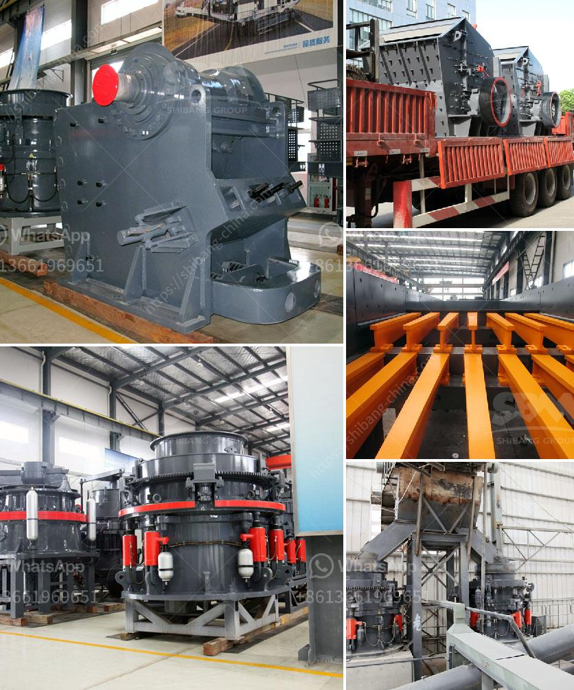

<h3>كسارة النحاس للبيع في ماليزيا</h3>
تعتبر صناعة التعدين من الصناعات الرئيسية في ماليزيا، حيث تشهد البلاد نمواً مستمراً في هذا القطاع. ولأن النحاس يُعتبر من المواد الأساسية التي تستخدم في تصنيع العديد من المنتجات، فإنها تعتبر استراتيجية وحيوية في اقتصاد البلاد. وفي ضوء ذلك، توجد في ماليزيا العديد من الكسارات المتخصصة في تكسير النحاس.

إن كسّارات النحاس هي من المعدات الحديثة التي تستخدم لتفتيت خام النحاس إلى قطع صغيرة لاحقًا يتم تصفية المعادن بطرق أخرى. وتتميز كسارات النحاس المتوفرة في ماليزيا بأنها عالية الجودة وتعمل بكفاءة عالية.

يتم بيع كسارات النحاس في ماليزيا بأسعار تتراوح بين 200 و 400 دولار حسب حجم الكسارة وقدرتها المطلوبة. ويتم استخدامها في المناجم الصغيرة والمتوسطة لتكسير خام النحاس حتى يتمكن المنقبون من استخلاص المعدن المرغوب فيه.

وعلى الرغم من أن المعدات المستخدمة في صناعة التعدين غالبًا تكون مكلفة، إلا أن الاستثمار في شراء كسارة نحاس يعتبر خطوة ذكية تؤدي إلى تحسين العملية الإنتاجية والكفاءة. بالإضافة إلى ذلك، تعتبر كسارات النحاس مستدامة وصديقة للبيئة نظرًا لأنها تستخدم تقنيات حديثة للحد من الانبعاثات الضارة للبيئة.

تتميز كسارات النحاس الماليزية أيضًا بتوافرها في السوق بأحجام مختلفة، مما يوفر مرونة للمنقبين في اختيار الكسارة التي تتناسب مع حجم المقلع وموارد خام النحاس المتاحة. وبسبب التوفر الوفير للموارد الطبيعية والنحاس في ماليزيا، يعتبر شراء كسارة النحاس في البلاد خيارًا مناسبًا واقتصاديًا للشركات العاملة في مجال التعدين.

بصفة عامة، تعد ماليزيا وجهة متميزة لشراء كسارة النحاس، حيث تتوفر المنتجات ذات الجودة العالية بأسعار تنافسية. وتشجع الحكومة الاستثمار في هذا القطاع من خلال توفير التسهيلات والتشريعات اللازمة. كما أن قطاع التعدين في ماليزيا يتمتع بتقنيات حديثة وخبرة كبيرة في هذا المجال.

لذلك، فإن استثمارات شراء كسارة النحاس في ماليزيا يعتبر خياراً موفقاً لأولئك الذين يبحثون عن نشاط تجاري واعد ومربح في قطاع التعدين. وبفضل توفر الموارد الغنية والتقنيات الحديثة، فإن بيع النحاس للعملاء والأسواق العالمية يمكن أن يكون جيدًا للشركات المتخصصة في هذا المجال.
<h3>Contact us</h3><ul><li><strong>Whatsapp:&nbsp;<a href="https://wa.me/8613661969651">+8613661969651</a></strong></li><li><a href="https://swt.shibang-china.com/?git&amp;zhl&amp;كسارة النحاس للبيع في ماليزيا"><strong>Online Service(chat now)</strong></a></li></ul><h3>Related</h3><ul><li><a href='طرق التعدين على الذهب الطبيعي في زيمبابوي.md'>طرق التعدين على الذهب الطبيعي في زيمبابوي</a></li><li><a href='كسارة الكرة باكستان للبيع.md'>كسارة الكرة باكستان للبيع</a></li><li><a href='آلة تصنيع الكرة الجبسية.md'>آلة تصنيع الكرة الجبسية</a></li><li><a href='قائمة الشركات المحاجر في نيجيريا.md'>قائمة الشركات المحاجر في نيجيريا</a></li><li><a href='حجم كرات الطحن في مطحنة الكرة لطحن الكوارتز.md'>حجم كرات الطحن في مطحنة الكرة لطحن الكوارتز</a></li></ul>