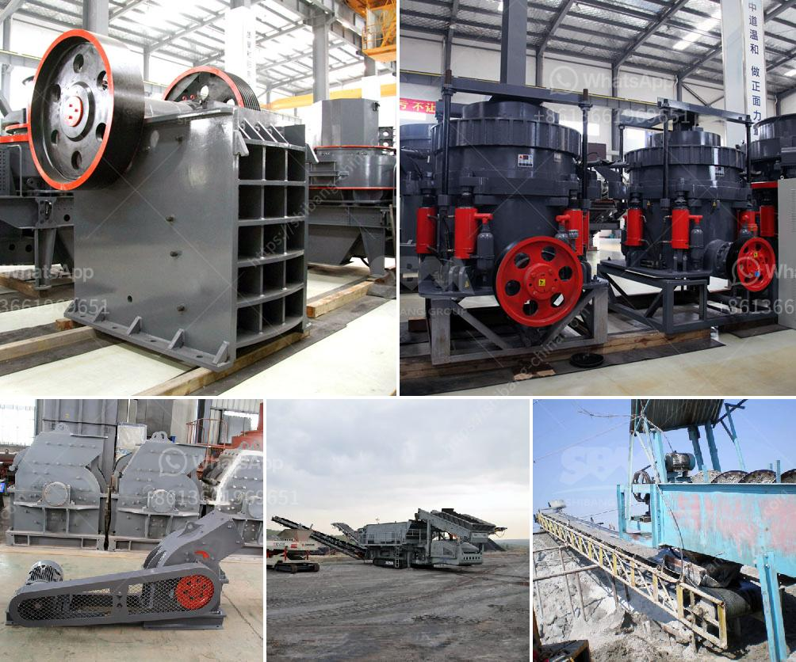

<h3>كسارة الهامر العمودية</h3>
تُستخدَم كسارة الهامر العمودية في صناعة البناء والتعدين لتكسير المواد الصلبة ذات الصلابة المتوسطة والعالية. وتُعرف هذه الكسّارة أيضًا بإسم كسّارة الصدم، وذلك لأنها تعتمد على تطبيق القوة الميكانيكية لتحطيم المواد من خلال كسرها بواسطة الهامر المدفعي المثبت على محور عمودي.

تعتبر كسارة الهامر العمودية من الأدوات الأساسية والمهمة في صناعة التكسير، حيث يتم تطبيق القوة الضاربة على المواد من خلال دوران المحور العمودي بسرعة عالية، مما يسبب تدمير المواد وتحطيمها إلى قطع صغيرة. ويتم تغذية المواد داخل الكسارة عن طريق فتحة التغذية في الأعلى، ومن ثم يتم إطلاق الهامر المدفعي لتحطيم المواد تحت تأثير الجاذبية.

تتميز كسارة الهامر العمودية بعدة مزايا. أهمها قدرتها على تكسير المواد الصلبة بفعالية وسرعة عالية، مما يساهم في زيادة الإنتاجية في عمليات التكسير. كما أنها تتميز بتصميم مدمج يسهل عملية التركيب والصيانة. وبفضل تصميمها الفريد، فإنها قادرة على تحقيق توزان مثالي بين الأداء والاستهلاك الطاقوي.

كما أن كسارة الهامر العمودية قادرة على تكسير مجموعة متنوعة من المواد، بما في ذلك الصخور الصلبة، والحجارة، ومخلفات البناء، والزجاج، والكوارتز، والفحم، والكلنكر، والخامات المعدنية، والخامات البازلتية، والخامات المعدنية غير الحديدية، والخامات السيراميك، والأسمنت، وغيرها الكثير.

باختصار، تعد كسارة الهامر العمودية أداة مهمة في صناعة التكسير، حيث تتمتع بالعديد من المزايا مثل السرعة والكفاءة والتوفير في الطاقة، مما يعزز عمليات التصنيع ويحسن الإنتاجية. إن استخدام هذه الكسارة يعتبر حلاً مثاليًا لتكسير المواد الصلبة ذات الصلابة المتوسطة والعالية في صناعة البناء والتعدين.
<h3>Contact us</h3><ul><li><strong>Whatsapp:&nbsp;<a href="https://wa.me/8613661969651">+8613661969651</a></strong></li><li><a href="https://swt.shibang-china.com/?git&amp;zhl&amp;كسارة الهامر العمودية"><strong>Online Service(chat now)</strong></a></li></ul><h3>Related</h3><ul><li><a href='آلات صنع الأسمنت لمصنع الأسمنت كامل.md'>آلات صنع الأسمنت لمصنع الأسمنت كامل</a></li><li><a href='كسارات محمولة جنوب أفريقيا.md'>كسارات محمولة جنوب أفريقيا</a></li><li><a href='الحجر الجيري اللازم لإنتاج طن واحد من الأسمنت.md'>الحجر الجيري اللازم لإنتاج طن واحد من الأسمنت</a></li><li><a href='مصنعي أحزمة الناقلات في بنجلاديش.md'>مصنعي أحزمة الناقلات في بنجلاديش</a></li><li><a href='كسارة سريلانكا.md'>كسارة سريلانكا</a></li></ul>