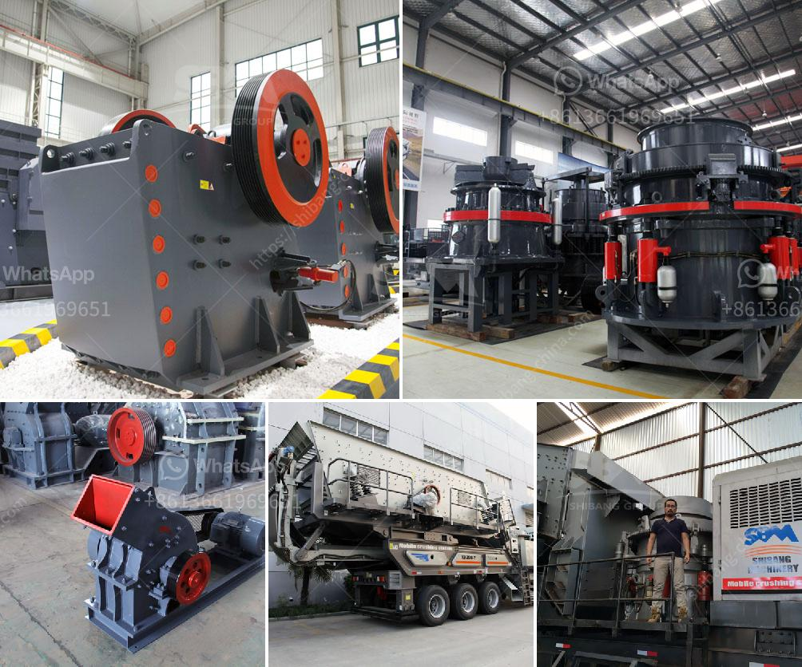

<h3>كسارة باكستان كسارة الجرانيت</h3>
تعتبر كسارة الجرانيت في باكستان من أهم المعدات اللازمة في صناعة البناء والبنية التحتية. فهي تستخدم لكسر وسحق الجرانيت، وهو مادة صلبة ومتينة تستخدم بشكل شائع في العديد من التطبيقات البنائية. وتعتبر باكستان واحدة من أكبر موردي ومصدري الجرانيت في العالم، مما يجعل كسارات الجرانيت في البلاد ضرورية لاستخراج وتصنيع هذه المادة القيمة.

تتميز كسارة الجرانيت في باكستان بالقدرة على كسر وسحق الجرانيت بكميات كبيرة وبسرعة فائقة. فهي مصممة بشكل خاص للتعامل مع هذه المادة الصلبة والمتينة، وتتميز بأداء استثنائي يساعد في تحويل الجرانيت الخام إلى حجارة صغيرة وذات حجم موحد. وتعمل هذه الكسارة عن طريق تغذية الجرانيت إلى الجزء العلوي منها، حيث يتم ضغطه وتحويله إلى حجارة صغيرة تنتج في نهاية المطاف.

تعد كسارة الجرانيت في باكستان مناسبة للاستخدامات البنائية المختلفة. فبعد كسر الجرانيت وتحويله إلى حجارات صغيرة، يستخدم هذا المنتج في العديد من التطبيقات مثل صناعة الخرسانة والركام الأساسي للأساسات والأرصفة. كما يمكن استخدامه أيضًا في إنتاج الحصى والمالحة، مما يساعد في تلبية الاحتياجات المتنوعة لصناعة البناء.

بالإضافة إلى ذلك، تلعب كسارات الجرانيت في باكستان دورًا مهمًا في توفير وظائف للعمالة المحلية. فهذه الصناعة تستهلك كميات كبيرة من الجرانيت وتحتاج إلى العديد من العمال لتشغيل وصيانة الكسارات والمعدات الأخرى. ونظرًا لكون باكستان من أكبر المصدرين للجرانيت في العالم، فإن هذه الصناعة توفر العديد من الوظائف وتسهم في تعزيز الاقتصاد المحلي.

ومع ذلك، يجب أن نأخذ في الاعتبار التأثير البيئي لكسارة الجرانيت في باكستان. فإن عملية كسر الجرانيت تتسبب في إنتاج الغبار والضوضاء، مما قد يؤثر على البيئة والسكان المحليين. لذلك، يجب تنفيذ تقنيات الحد من التلوث واتخاذ الإجراءات الوقائية اللازمة للحفاظ على البيئة وصحة السكان.

باختصار، كسارة الجرانيت في باكستان تعد عنصرًا أساسيًا في صناعة البناء والبنية التحتية. فهي تستخدم لكسر وسحق الجرانيت بكميات كبيرة وبسرعة فائقة، وتلعب دورًا مهمًا في تلبية احتياجات صناعة البناء المتنوعة. ومع ذلك، يجب أن يتم اتخاذ الاحتياطات اللازمة للحد من التأثير البيئي لهذه الصناعة.
<h3>Contact us</h3><ul><li><strong>Whatsapp:&nbsp;<a href="https://wa.me/8613661969651">+8613661969651</a></strong></li><li><a href="https://swt.shibang-china.com/?git&amp;zhl&amp;كسارة باكستان كسارة الجرانيت"><strong>Online Service(chat now)</strong></a></li></ul><h3>Related</h3><ul><li><a href='تركيبة مواد كسارة الفحم.md'>تركيبة مواد كسارة الفحم</a></li><li><a href='طحن الكرة الصين.md'>طحن الكرة الصين</a></li><li><a href='تجار كسارة الفك المحمولة في كينيا.md'>تجار كسارة الفك المحمولة في كينيا</a></li><li><a href='طحن المطاحن الصناعية.md'>طحن المطاحن الصناعية</a></li><li><a href='صيغة حساب قدرة كسارة الفك.md'>صيغة حساب قدرة كسارة الفك</a></li></ul>