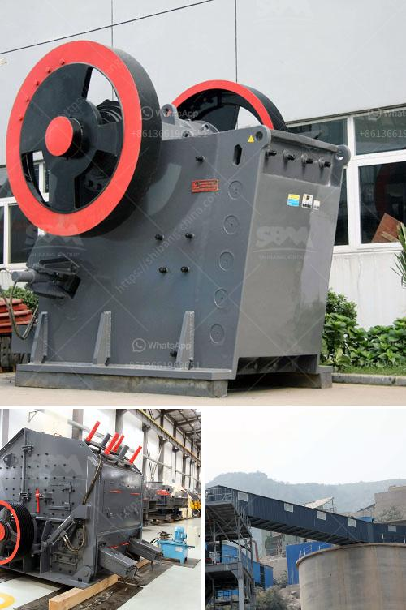

<h3>كسارة بوزولانا الماليزية</h3>
تعد كسارة بوزولانا الماليزية واحدة من الشركات الرائدة في مجال استخراج وتصنيع البوزولانا في ماليزيا. تأسست الشركة في عام 1996 وتتمتع بخبرة واسعة في هذا المجال. تعتبر البوزولانا من المواد الخام الهامة في صناعة الاسمنت والخرسانة المتطورة.

تقوم كسارة بوزولانا الماليزية بتعدين خام البوزولانا من مناطق غنية بالموارد الطبيعية في ماليزيا. ويتم طحن وتجهيز الخام المستخرج للحصول على البودرة الدقيقة المطلوبة. تضم الشركة معدات حديثة ومتطورة لضمان جودة المنتج النهائي والالتزام بأعلى المعايير الصناعية.

تعد البوزولانا ما يسمى بالمواد المضافة في الخرسانة والتي تستخدم لتعزيز خصائص الخرسانة المتطورة. فهي تزيد من قوة الخرسانة، وتقلل من نسبة استخدام الاسمنت العادي، وتجعل الخرسانة أكثر مقاومة للتآكل والتأثيرات البيئية المختلفة. بالإضافة إلى ذلك، تساهم البوزولانا في الحفاظ على البيئة وتلبية معايير الاستدامة، حيث أن استخدامها يقلل من الانبعاثات الكربونية ويعزز فعالية استخدام الموارد الطبيعية.

تعد كسارة بوزولانا الماليزية منتجًا رائدًا في السوق المحلية والعالمية. فقد حصلت الشركة على العديد من الشهادات والاعترافات الدولية لجودة منتجاتها والتزامها بالتقنيات المتطورة في صناعة البوزولانا. وتقوم الشركة أيضًا بالتصدير إلى العديد من الدول الأخرى، مما يعزز مكانتها كمورد موثوق به للصناعة العالمية.

بالاعتماد على خبرتها الفريدة وجودتها العالية، فإن كسارة بوزولانا الماليزية تلعب دورًا حاسمًا في تحويل صناعة الخرسانة والاسمنت. تساهم منتجاتها في بناء المشاريع العملاقة وتعزز من المستويات البيئية والاقتصادية للبنية التحتية في ماليزيا والدول المجاورة.

باختصار، تعتبر كسارة بوزولانا الماليزية رائدة في صناعة استخراج وتصنيع البوزولانا في ماليزيا وتلعب دورًا حاسمًا في تحويل صناعة الخرسانة والاسمنت. تتميز بمعدات حديثة ومتطورة ومنتجات عالية الجودة، مما يجعلها موردًا موثوقًا به للصناعة العالمية.
<h3>Contact us</h3><ul><li><strong>Whatsapp:&nbsp;<a href="https://wa.me/8613661969651">+8613661969651</a></strong></li><li><a href="https://swt.shibang-china.com/?git&amp;zhl&amp;كسارة بوزولانا الماليزية"><strong>Online Service(chat now)</strong></a></li></ul><h3>Related</h3><ul><li><a href='آلة كسارة الفحم 5 طن في الساعة.md'>آلة كسارة الفحم 5 طن في الساعة</a></li><li><a href='كسارة محمولة للحطام.md'>كسارة محمولة للحطام</a></li><li><a href='أصغر كسارة فك محمولة للبيع في جنوب أفريقيا.md'>أصغر كسارة فك محمولة للبيع في جنوب أفريقيا</a></li><li><a href='كسارة الحجر في تركيا.md'>كسارة الحجر في تركيا</a></li><li><a href='تكلفة مصنع الكسارة.md'>تكلفة مصنع الكسارة</a></li></ul>