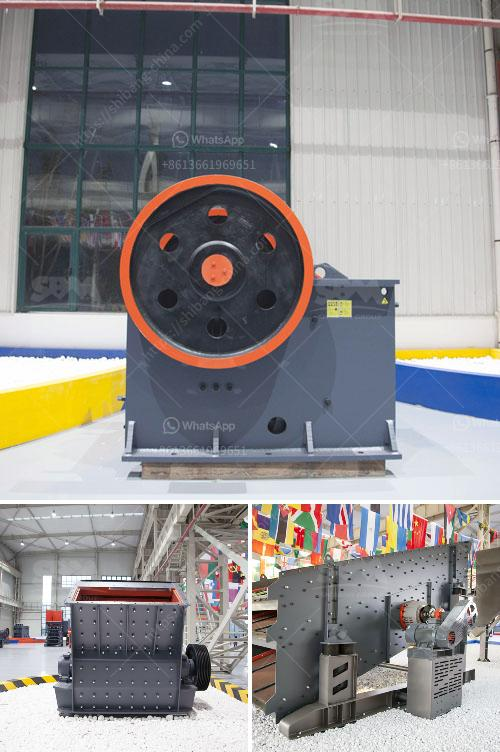

<h3>كسارة تأثير VSI</h3>
تُعد كسارة التأثير VSI (Vertical Shaft Impact Crusher) واحدة من أنواع كسارات الصخور المستخدمة في صناعة البناء والتعدين. تم تصميم هذا النوع من الكسارات لتكسير الصخور والأحجار والمواد الأخرى إلى حجم مطلوب للاستخدام في أعمال البناء أو للحصول على مواد أساسية لعمليات التصنيع.

تتميز كسارة VSI بأنها تعتمد على آلية حركة دوارة عمودية لتكسير المواد. يتم تفريغ المواد في فتحة الدخول من أعلى الكسارة ويتم توجيهها بشكل دقيق على طول الفتحة المركزية ، حيث تتأثر بالقوة المركزية الموجودة داخل الكسارة. يتم احتكاك المواد مع بعضها البعض أولاً قبل أن تلتقط بواسطة مواد التفجير الموجودة في الدوران العمودي، الأمر الذي يسبب تكسيرها وتحطمها تحت تأثير قوة الصدمة.

تتميز هذه الكسارات بالعديد من الفوائد والميزات الملحوظة. لأول شيء ، فإن استخدام القوة المركزية يؤدي إلى تقليل الاحتكاك وارتداء القطع الميكانيكية، مما يزيد من عمر الخدمة ويقلل من أعطال الكسارة. بالإضافة إلى ذلك، فإن حجم الانتاج المحدد يمكن تعديله عن طريق تغيير سرعة الدوران أو شكل لوحة التكسير، مما يجعلها كسارة مرنة وقابلة للاستخدام في مجموعة متنوعة من التطبيقات.

علاوة على ذلك، فإن كسارة VSI لديها أداء فعال للغاية من حيث تحقيق الكسر المطلوب والحصول على شكل الحصى أو الرمل المنتظم. يعتبر ذلك من الأهمية البالغة في مجال صناعة البناء، حيث يتم استخدام مثل هذه المواد في صنع الخرسانة والأسفلت والطوب وغيرها من المواد الأساسية. بفضل تكنولوجيا التكسير المتقدمة والتصميم الداخلي المحسّن، تضمن كسارات التأثير VSI الحصول على نسبة إنتاج عالية من المواد المرغوبة.

لخلاصة القول، فإن كسارات التأثير VSI هي أدوات ضرورية في صناعة التعدين والبناء. تمتاز بفعالية عالية ومرونة في الاستخدام وقدرة على تحقيق الكسر المطلوب والحصول على شكل المادة المطلوبة. إذا كنت تبحث عن كسارة قوية وفعالة في تكسير المواد، يُعد استخدام كسارة VSI الخيار الأمثل لك.
<h3>Contact us</h3><ul><li><strong>Whatsapp:&nbsp;<a href="https://wa.me/8613661969651">+8613661969651</a></strong></li><li><a href="https://swt.shibang-china.com/?git&amp;zhl&amp;كسارة تأثير VSI"><strong>Online Service(chat now)</strong></a></li></ul><h3>Related</h3><ul><li><a href='مطحنة رايموند للبيع مستعملة.md'>مطحنة رايموند للبيع مستعملة</a></li><li><a href='كسارة معدنية للإيجار.md'>كسارة معدنية للإيجار</a></li><li><a href='كسارة المحجر في الفلبين للبيع.md'>كسارة المحجر في الفلبين للبيع</a></li><li><a href='آلات كسارة للبيع.md'>آلات كسارة للبيع</a></li><li><a href='تأجير سيارات الكسارة في كالتيم.md'>تأجير سيارات الكسارة في كالتيم</a></li></ul>