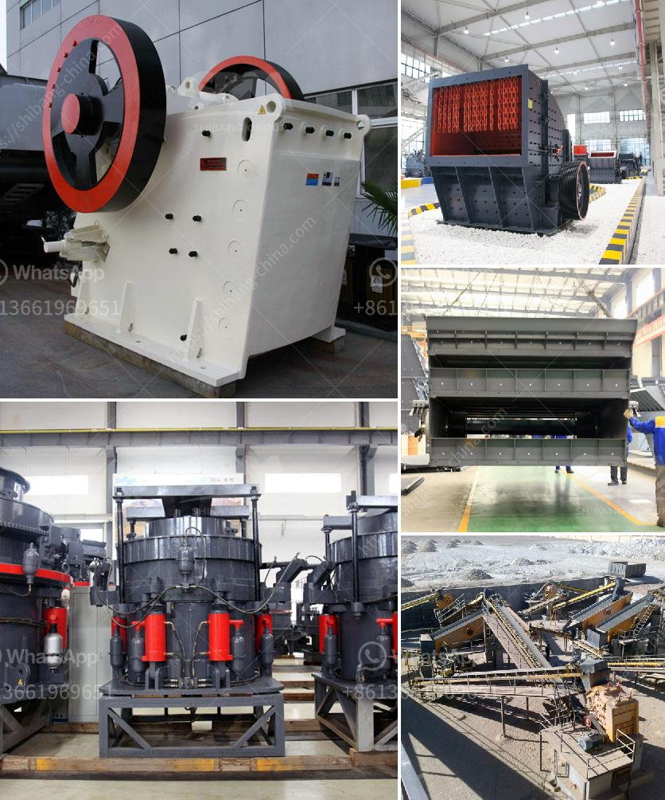

<h3>كسارة تأثير الحجر الجيري</h3>
تعتبر كسارة تأثير الحجر الجيري من المعدات المهمة في صناعة التعدين والبناء حيث يتم استخدامها لسحق الحجر الجيري الخام وتحويله إلى قطع صغيرة تستخدم في عدة مجالات. تتكون الكسارة من مطرقة تدور بسرعة عالية تصطدم بالحجر الجيري لتسحقه وتقسمه إلى أجزاء أصغر.

يتم استخدام الحجر الجيري في العديد من الصناعات مثل صناعة الاسمنت والصلصال والزجاج والأسمنت المضاف إليه الجبس والبلاط والمواد العازلة. وتعتبر كسارة تأثير الحجر الجيري أحد الوسائل الرئيسية لتحويل الحجر الجيري الخام إلى منتج نهائي يمكن استخدامه في هذه الصناعات.

تعمل الكسارة بواسطة نظام الضغط والجاذبية والاحتكاك. تتألف الكسارة من جسم خارجي يحتوي على مجموعة من الأجزاء المتحركة والثابتة. يتم وضع الحجر الجيري في فتحة الكسارة ويتم مروره بين الأسطوانات الدوارة المتحركة والمثبتة. تتسبب القوة الدورانية للأسطوانات المتحركة في سحق الحجر الجيري وتقسيمه إلى أجزاء أصغر. تستخدم المطارق القاسية الموجودة في الكسارة لتسريع عملية السحق.

يعتبر استخدام كسارة تأثير الحجر الجيري سهلاً وفعالاً. تتميز بأداء مستقر وكفاءة عالية في سحق الحجر الجيري. تعتبر مثالية للتعامل مع الحجر الجيري ذو القساوة المتوسطة والصعبة. توفر الكسارة حجمًا قابلاً للتعديل وجودة موحدة للمنتج النهائي. كما تحتوي على نظام إزالة الغبار الفعال لتجنب تلوث البيئة.

بشكل عام، تعتبر كسارة تأثير الحجر الجيري أداة مهمة في عملية تحويل الحجر الجيري الخام إلى منتج نهائي يمكن استخدامه في العديد من الصناعات. تسهم في تحسين كفاءة الإنتاج وجودة المنتج النهائي. كما تسهم في تحسين الاستدامة البيئية من خلال استخدام نظم إزالة الغبار والقليل من الانبعاثات الضارة. يتعين على الشركات تطبيق إجراءات السلامة المناسبة وتدريب العاملين بشكل جيد لضمان سلامتهم وفعالية عملية التشغيل.
<h3>Contact us</h3><ul><li><strong>Whatsapp:&nbsp;<a href="https://wa.me/8613661969651">+8613661969651</a></strong></li><li><a href="https://swt.shibang-china.com/?git&amp;zhl&amp;كسارة تأثير الحجر الجيري"><strong>Online Service(chat now)</strong></a></li></ul><h3>Related</h3><ul><li><a href='سعة مطحنة الكرة بالأطنان.md'>سعة مطحنة الكرة بالأطنان</a></li><li><a href='سيور ناقلة للخرسانة.md'>سيور ناقلة للخرسانة</a></li><li><a href='مطحنة رايموند في ماليزيا.md'>مطحنة رايموند في ماليزيا</a></li><li><a href='كيف يعمل مطحنة الطحن.md'>كيف يعمل مطحنة الطحن</a></li><li><a href='آلة مسحوق الجير السريع.md'>آلة مسحوق الجير السريع</a></li></ul>