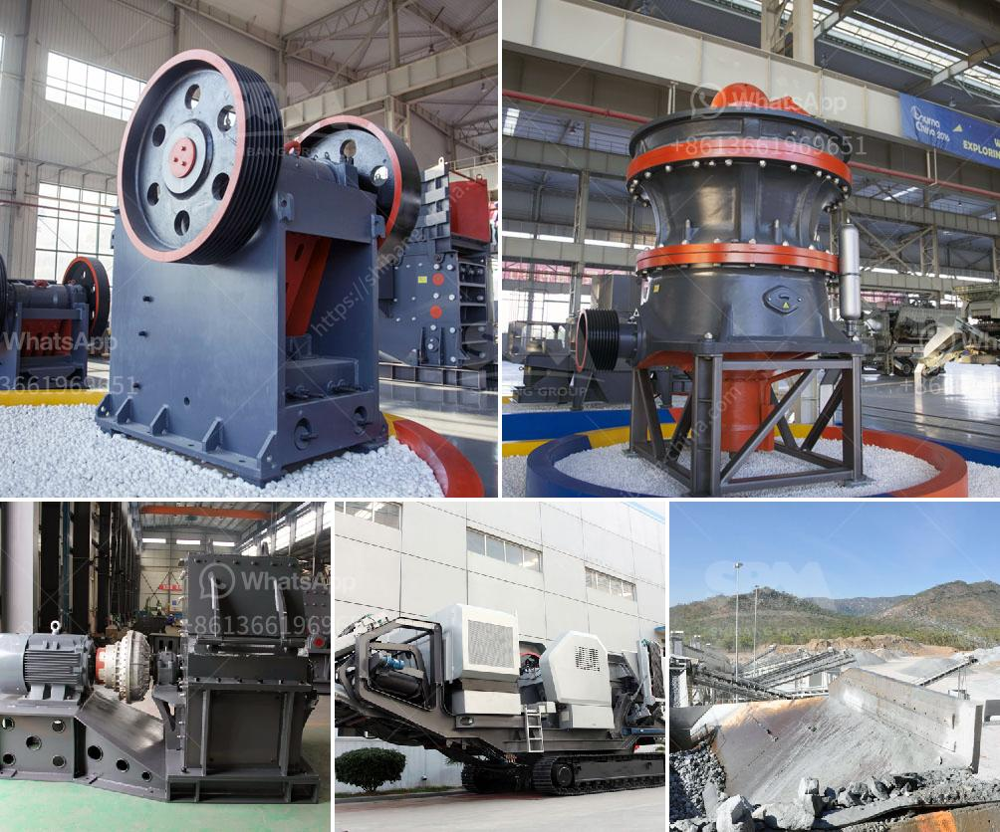

<h3>كسارة تأثير الفك بولندا</h3>
تُعد كسارة تأثير الفك واحدة من أهم الأدوات في صناعة التعدين ومعالجة المواد. تم تصميمها لكسر المواد الخام بفعالية وتحويلها إلى الحجم المطلوب للاستخدام في العديد من التطبيقات الصناعية.

تُستخدم كسارات الفك في عملية التعدين لكسر المواد الأولية المستخرجة من المناجم. بغض النظر عن نوع المواد المستخدمة مثل الحجر الجيري أو الجرانيت أو خام الحديد أو الفحم، يقوم هذا الجهاز القوي بسحقها للحصول على حجم أصغر قابل للتحمل والنقل. تعتبر الكسارة ذات الفك الواحد هي الأكثر استخداماً لأنها تعمل على طحن المواد بعكس الاتجاه القوي.

تتمتع كسارة الفك بتصميم متين ومتقدم يجعلها متينة وموثوقة. يتميز الجهاز بمجموعة من الفكين المتحركين والثابتين المثبتين على اتصال وثيق معًا. يعمل الفك الثابت كنقطة ثابتة ويضغط المادة المُكسرة ضد الفك المتحرك بحركة تقابلية. تنتقل المادة المكسورة من خلال الفكين إلى حجرة الكسر حيث يتم سحقها وتقسيمها إلى أجزاء أصغر.

تعتبر الكسارة ذات الفك الواحد مناسبة لتحقيق تأثير سحق كبير، وخاصةً في المواد ذات المقاومة المنخفضة مثل الصخور الناعمة والحجم الصغير. وتُستخدم هذه الكسارة بشكل واسع في العديد من الصناعات مثل صناعة البناء والصناعات الكيماوية والصناعات الكهربائية.

في بولندا، يوجد العديد من مصانع التعدين والصناعات المعدنية التي تعتمد بشكل كبير على كسارة التأثير بولندا لإنتاج المواد الخام. تشتهر كسارات الفك المصنوعة في بولندا بالدقة والمتانة. تضمن الشركات المصنعة اختبار وفحص كل كسارة تأكد من أدائها الممتاز وجودتها العالية.

بالإضافة إلى ذلك، توفر بعض الكسارات في بولندا مزايا إضافية مثل تقنية ضبط فجوة التفتيش الهيدروليكية ونظام التشحيم الآلي. تعزز هذه الميزات الأداء وتطيل عمر الكسارة، مما يؤدي إلى تقليل التكاليف وزيادة الإنتاجية.

باختصار، فإن كسارة تأثير الفك بولندا تعد أداة أساسية في صناعة التعدين ومعالجة المواد. تُستخدم لكسر الصخور والمواد الخام للحصول على حجم أصغر واستخدامها في العديد من التطبيقات الصناعية. يتميز تصميمها المتقدم والدقة العالية بأداء موثوق وجودة عالية، مما يجعلها خيارًا شائعًا في صناعة التعدين.
<h3>Contact us</h3><ul><li><strong>Whatsapp:&nbsp;<a href="https://wa.me/8613661969651">+8613661969651</a></strong></li><li><a href="https://swt.shibang-china.com/?git&amp;zhl&amp;كسارة تأثير الفك بولندا"><strong>Online Service(chat now)</strong></a></li></ul><h3>Related</h3><ul><li><a href='شركة تصنيع كسارة الحصى.md'>شركة تصنيع كسارة الحصى</a></li><li><a href='آلة تكسير للمواد الكاشطة للبيع.md'>آلة تكسير للمواد الكاشطة للبيع</a></li><li><a href='البحث عن شريك لكسارة الآلات.md'>البحث عن شريك لكسارة الآلات</a></li><li><a href='سعر كسارة حجر البازلت.md'>سعر كسارة حجر البازلت</a></li><li><a href='مجفف رمل مستعمل للبيع.md'>مجفف رمل مستعمل للبيع</a></li></ul>