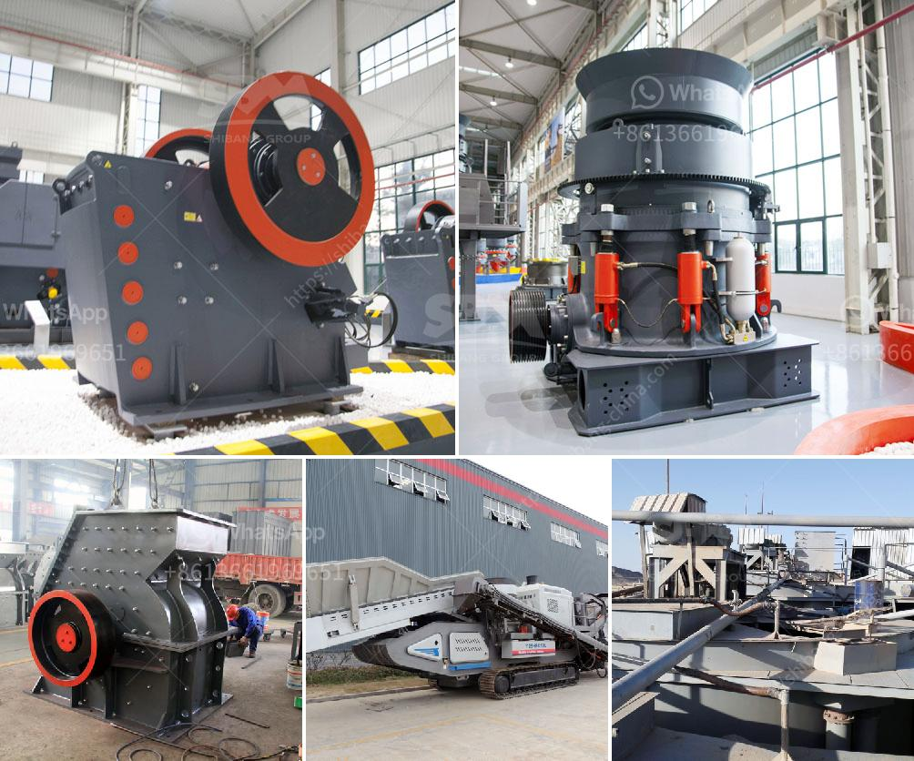

<h3>كسارة تأثير الكلي</h3>
تعتبر كسارة التأثير الكلي أحد الآلات الهامة في صناعة البناء والتشييد. تستخدم هذه الكسارة لتكسير الصخور والحجارة الكبيرة إلى أجزاء صغيرة ومتجانسة، وبالتالي تحسين جودة المواد المستخدمة في الإنشاءات وتسهيل عملية تدوير الخرسانة وإعادة استخدامها.

تعمل كسارة التأثير الكلي عن طريق تسخين المواد الخام بواسطة المطرقة الدوارة الموجودة في الجزء العلوي من الكسارة، ثم تسحق المواد المسخنة عن طريق الصدمات المتتالية في الجزء السفلي من الكسارة. يتم استخدام المطرقة الدوارة لتطبيق قوة الصدمة اللازمة لكسر الصخور والحجارة. تتميز هذه الطريقة بسهولة استخدامها وقدرتها على تحقيق نتائج جيدة بكل سهولة وسرعة.

تتوفر كسارات التأثير الكلي بمختلف الأحجام والقدرات لتلبية احتياجات العملاء المختلفة. تستخدم الكسارات التأثير الكلي غالبًا في صناعة البناء والأعمال العامة، حيث يتم استخدامها لتكسير الحجارة والصخور الكبيرة إلى جسيمات أصغر قبل استخدامها في البناء. كما يمكن استخدامها أيضًا في عمليات التعدين واستخراج المواد الخام في المحاجر.

إحدى مزايا استخدام كسارة التأثير الكلي هي قدرتها على تقديم جسيمات متجانسة وموحدة في الحجم. يتم ذلك بفضل عملية التكسير والصدمات المتتالية التي يطبقها الجهاز على المواد. هذا يساعد في تحسين جودة المواد المستخدمة في البناء ويسهل استخدامها في عمليات الخرسانة. بالإضافة إلى ذلك، يمكن استخدام الجسيمات المتجانسة في مجالات أخرى مثل صناعة الأسفلت أو في تصنيع الطوب.

علاوة على ذلك، تساهم كسارة التأثير الكلي في عملية التدوير وإعادة استخدام المواد البنائية. فبدلاً من التخلص من الخرسانة القديمة أو البناء القديم، يمكن استخدامها مرة أخرى بعد تمريرها في الكسارة لتصبح جسيمات متجانسة ومستدامة. هذا يقلل من استنزاف الموارد الطبيعية ويحسن الاستدامة البيئية لعمليات البناء والتشييد.

باختصار، تعتبر كسارة التأثير الكلي جهازًا هامًا وفعالًا في صناعة البناء والتشييد. تساهم في تحسين جودة المواد المستخدمة وتحقيق الاستدامة البيئية من خلال تدوير الخرسانة وإعادة استخدامها. تعد هذه الكسارة أداة مفيدة لتكسير الحجارة والصخور وتقديم جسيمات متجانسة وموحدة للاستخدام في البناء والأعمال العامة.
<h3>Contact us</h3><ul><li><strong>Whatsapp:&nbsp;<a href="https://wa.me/8613661969651">+8613661969651</a></strong></li><li><a href="https://swt.shibang-china.com/?git&amp;zhl&amp;كسارة تأثير الكلي"><strong>Online Service(chat now)</strong></a></li></ul><h3>Related</h3><ul><li><a href='كسارة الفك المحمولة في غرب أفريقيا تجار.md'>كسارة الفك المحمولة في غرب أفريقيا تجار</a></li><li><a href='معدات كسارة الفك للبيع في الفلبين.md'>معدات كسارة الفك للبيع في الفلبين</a></li><li><a href='آلة طحن الكالسايت للبيع.md'>آلة طحن الكالسايت للبيع</a></li><li><a href='كيفية سحق خام الذهب في ماين كرافت.md'>كيفية سحق خام الذهب في ماين كرافت</a></li><li><a href='مطحنة MTW.md'>مطحنة MTW</a></li></ul>