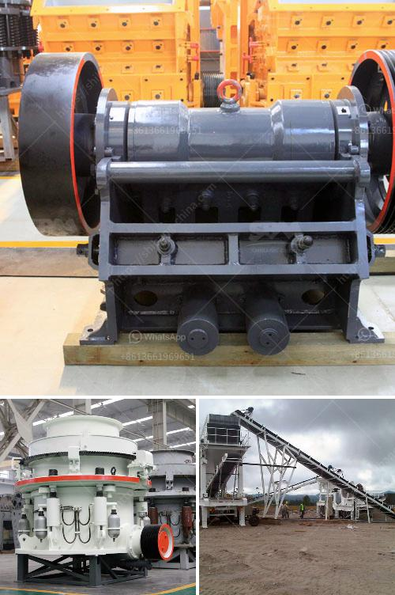

<h3>كسارة تأثير تنزانيا</h3>
تعد الكسارات مكونًا حيويًا في صناعة البناء والبنية التحتية في جميع أنحاء العالم. تلعب الكسارات الحجرية دورًا هامًا في تكسير الصخور الكبيرة إلى قطع صغيرة قابلة للاستخدام في الإنشاءات المختلفة مثل الطرق والأبنية والسدود والسكك الحديدية والمطارات وغيرها. واحدة من الكسارات المثيرة للاهتمام في تنزانيا هي كسارة الصخور المتحركة. تعد هذه الكسارة معدة محمولة التي تمكنها من التنقل بسهولة بين المواقع المختلفة لتلبية الاحتياجات المتغيرة.

تعمل كسارة الصخور المتحركة عن طريق استخدام القوة الهيدروليكية والتيار الكهربائي لتكسير الصخور بفعالية وسرعة. يتم استخدام الكسارة بشكل أساسي لتكسير الصخور الكبيرة وتحويلها إلى حصى صغيرة أو حجارة متوسطة الحجم. تتميز هذه الكسارة بمرونة عالية حيث يمكن نقلها بسرعة إلى المواقع المختلفة بواسطة المقطورات والشاحنات. وبالتالي فإن استخدامها أمر مفيد في المشاريع الكبيرة التي تتطلب نقل الكسارة بين المواقع.

تعتبر كسارة الصخور المتحركة في تنزانيا ضرورية في العديد من المشاريع الكبيرة والصغيرة. يمكن استخدامها في بناء الطرق ومد الخطوط السكك الحديدية وإعادة تدوير مخلفات البناء وإنشاء الأبنية والأعمال الهندسية المدنية الأخرى. بفضل آلية تكسيرها الفعالة ومرونتها التشغيلية، فإن استخدام هذه الكسارة يتيح الوصول إلى مواد بناء ذات جودة عالية في وقت أقل وبتكلفة أقل.

وعلاوة على ذلك، فإن استخدام كسارة الصخور المتحركة في تنزانيا يعد أيضًا خيارًا صديقًا للبيئة. حيث تتمتع الكسارة بنظام غبار فعال يقلل من انبعاثات الغبار الملوثة للبيئة أثناء عمليات التكسير. بالإضافة إلى ذلك، يمكن أن تساهم هذه الكسارة في إعادة تدوير المواد البنائية وبالتالي الحد من استخدام الموارد الطبيعية.

باختصار، يعتبر استخدام كسارة الصخور المتحركة في تنزانيا خطوة مهمة في صناعة البناء. فهي توفر القدرة على تكسير الصخور بفاعلية وتحويلها إلى مواد بناء قابلة للاستخدام. وبفضل قابليتها للتحرك بسهولة واستدامتها البيئية، فإنها تساهم في تحسين وتطوير البنية التحتية لتنزانيا وتخفيف تأثيراتها على البيئة.
<h3>Contact us</h3><ul><li><strong>Whatsapp:&nbsp;<a href="https://wa.me/8613661969651">+8613661969651</a></strong></li><li><a href="https://swt.shibang-china.com/?git&amp;zhl&amp;كسارة تأثير تنزانيا"><strong>Online Service(chat now)</strong></a></li></ul><h3>Related</h3><ul><li><a href='كسارة الفك bb 50 من ريتش.md'>كسارة الفك bb 50 من ريتش</a></li><li><a href='مخطط تدفق عملية استرداد الذهب بتنسيق PDF.md'>مخطط تدفق عملية استرداد الذهب بتنسيق PDF</a></li><li><a href='جزء من مطحنة الكرة ومبدأ عمله.md'>جزء من مطحنة الكرة ومبدأ عمله</a></li><li><a href='أعمال المحاجر في جنوب أفريقيا.md'>أعمال المحاجر في جنوب أفريقيا</a></li><li><a href='مصنع معالجة الفحم في الفلبين.md'>مصنع معالجة الفحم في الفلبين</a></li></ul>