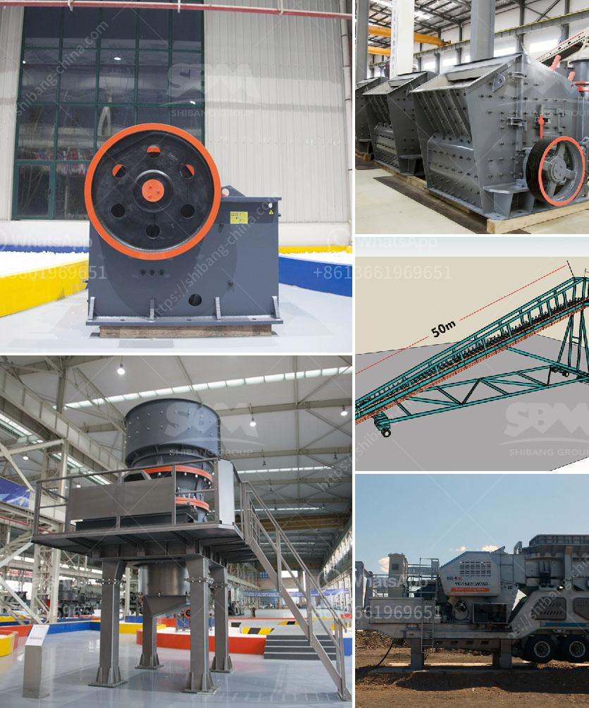

<h3>كسارة تأثير خام الحديد المتنقلة في الهند</h3>
تعد كسارات تأثير خام الحديد المتنقلة من المعدات الحديثة التي تستخدم في صناعة التعدين والبناء، وتعتبر الهند واحدة من الدول التي استثمرت بشكل كبير في هذه التكنولوجيا المتطورة. تساهم كسارات تأثير خام الحديد المتنقلة في زيادة عمليات التعدين وإعادة التدوير في البلاد، ورفع كفاءة الإنتاج وتقليل النفايات.

تتميز هذه الكسارات بقدرتها على تكسير خام الحديد إلى أحجام مختلفة بطريقة سريعة وفعالة. تتكون الكسارة من فكين قابلين للتعديل تتحرك بحركة دائرية، تسمح بتكسير الخام بطريقة سريعة وفعالة. كما تتميز هذه الكسارات بقدرتها على تكسير الخام الملون وغير الملون، وتلبية متطلبات العميل بدقة وفقًا للمواصفات المحددة.

تعمل الكسارات المتنقلة على الحد من تكاليف وجهود النقل لأنها تتنقل بسهولة في وقت قصير حتى تتمكن من تكسير الخام في مواقع مختلفة. لذلك، فإن استخدام كسارات تأثير خام الحديد المتنقلة يسهم في زيادة الإنتاجية وخفض التكاليف للشركات التعدينية التي تعتمد على هذا النوع من الكسارات.

الهند مشهورة بصناعة الحديد والصلب، وتملك كميات كبيرة من خام الحديد في مناطقها المختلفة. يعد استخدام الكسارات المتنقلة في تكسير خام الحديد مهم جدًا لتحقيق أعلى قدر من الاستفادة من موردي الخام المحليين. فقد تم دمج هذه التكنولوجيا الحديثة في عمليات التعدين في الهند لتحقيق أقصى قدر من الكفاءة والإنتاجية.

علاوة على ذلك، تساهم هذه الكسارات في حماية البيئة من خلال تقليل النفايات وإعادة التدوير. فهي تساعد في تقليل كمية النفايات الناجمة عن عملية تكسير الخام، مما يحسن الاستدامة البيئية لصناعة التعدين في الهند.

في الختام، يمثل استخدام كسارات تأثير خام الحديد المتنقلة في الهند نقلة نوعية في صناعة التعدين والبناء. تعمل هذه الكسارات على زيادة الإنتاجية وتقليل التكاليف وحماية البيئة. وباستمرار تطوير هذه التكنولوجيا المتقدمة، يمكن توقع المزيد من التحسينات والاستخدام الأوسع في المستقبل.
<h3>Contact us</h3><ul><li><strong>Whatsapp:&nbsp;<a href="https://wa.me/8613661969651">+8613661969651</a></strong></li><li><a href="https://swt.shibang-china.com/?git&amp;zhl&amp;كسارة تأثير خام الحديد المتنقلة في الهند"><strong>Online Service(chat now)</strong></a></li></ul><h3>Related</h3><ul><li><a href='مصنع تكسير الخرسانة في تركيا.md'>مصنع تكسير الخرسانة في تركيا</a></li><li><a href='آلة سحق جوز الهند.md'>آلة سحق جوز الهند</a></li><li><a href='آلات لايم ستوم 100 إلى 500 شبكة مسحوق.md'>آلات لايم ستوم 100 إلى 500 شبكة مسحوق</a></li><li><a href='كسارة مخروطية للبيع.md'>كسارة مخروطية للبيع</a></li><li><a href='للحصول على تصريح كسارة في الفلبين.md'>للحصول على تصريح كسارة في الفلبين</a></li></ul>