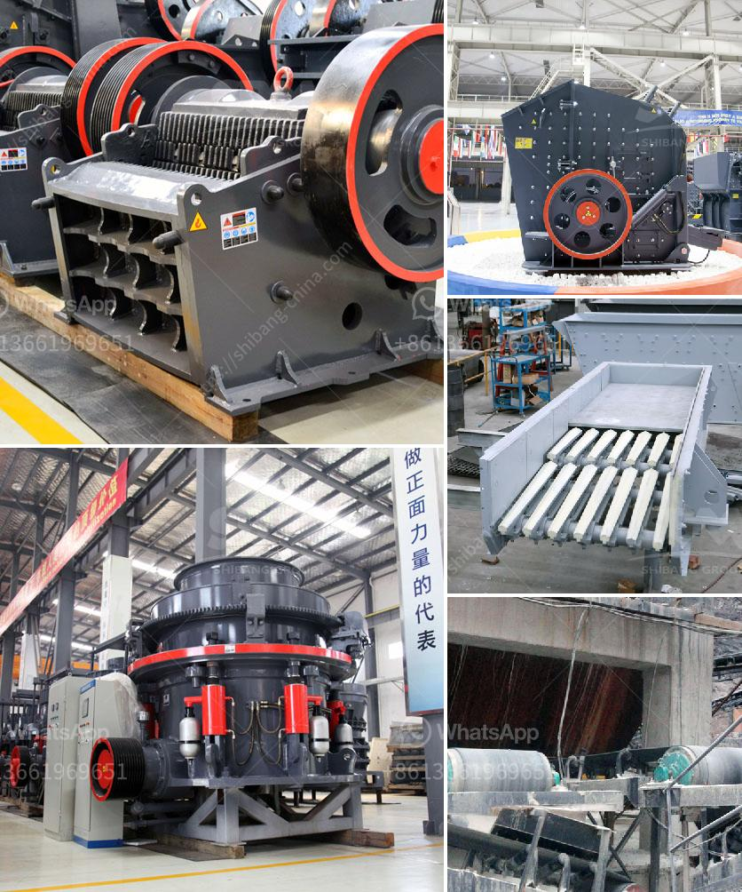

<h3>كسارة تأثير رأسية</h3>
تعتبر الكسارة التأثيرية الرأسية أحد أدوات التكسير التي تستخدم في صناعة التعدين والبناء لتكسير المواد الصلبة. تتميز هذه الكسارة بأنها تستخدم ضغط عالٍ لكسر المواد بواسطة ضربات قوية تتم عن طريق الدوران السريع للروتور الموجود فيها. تعتبر الكسارة التأثيرية الرأسية كايندر من أبرز الأنواع التي تستخدم في هذا المجال.

تتألف الكسارة التأثيرية الرأسية من جزئين رئيسيين: الجسم الرئيسي والروتور. يحتوي الجسم الرئيسي على فتحة مرشدة يتم من خلالها تغذية المواد. بالإضافة إلى ذلك، يحتوي الجسم الرئيسي على قذيفة خارجية تحيط بالجزء الداخلي. بينما يتكون الروتور من العمود المركزي ومجموعة من القرص المتمايلة المثبتة على العمود. عندما يعمل الروتور، فإن القرص يدور بسرعة عالية، وبذلك يتم إنشاء قوة جاذبية عالية لتكسير المواد.

تتميز الكسارة التأثيرية الرأسية بعدة مزايا. أولاً، فإنها تعمل بكفاءة عالية في تكسير المواد. يتم تصميمها بحيث يمكن أن تشتمل على العديد من القرص، وبذلك يتم تحسين فعالية عملية التكسير. ثانياً، فإنها تنتج تأثير تكسير قوي وسريع. يؤدي الدوران السريع للروتور إلى توليد الطاقة المرتدة القوية التي تساعد على تكسير المواد بشكل فعال. ثالثاً، فإنها تتميز بدرجة انخفاض الضوضاء والاهتزاز الناتج عن عملية التكسير، مما يوفر بيئة عمل آمنة ومريحة للعمال.

يتم استخدام الكسارة التأثيرية الرأسية في مجموعة متنوعة من الصناعات. يمكن استخدامها في تكسير المعادن الصلبة، مثل الحجر الجيري والغرانيت والرخام والصخور الصلبة الأخرى. كما يمكن استخدامها في تكسير المواد الخام في صناعة الأسمنت والبناء والطاقة الكهرمائية ومواد البناء. إن تحسين كفاءة عملية التكسير بواسطة الكسارة التأثيرية الرأسية يؤدي إلى توفير في التكاليف ومصادر الطاقة.

باختصار، الكسارة التأثيرية الرأسية هي أداة قوية وفعالة لتكسير المواد الصلبة في صناعة التعدين والبناء. تتميز بعدة مزايا، مثل كفاءة عالية وإنتاجية مرتفعة وضوضاء منخفضة. تستخدم في صناعة متنوعة وتساهم في تحقيق توفير في التكلفة وتحسين الكفاءة في عمليات التكسير.
<h3>Contact us</h3><ul><li><strong>Whatsapp:&nbsp;<a href="https://wa.me/8613661969651">+8613661969651</a></strong></li><li><a href="https://swt.shibang-china.com/?git&amp;zhl&amp;كسارة تأثير رأسية"><strong>Online Service(chat now)</strong></a></li></ul><h3>Related</h3><ul><li><a href='حول مصنع سحق الصخور.md'>حول مصنع سحق الصخور</a></li><li><a href='مطحنة الأسطوانة العمودية في تايوان.md'>مطحنة الأسطوانة العمودية في تايوان</a></li><li><a href='مصنع كسارة خام الحديد.md'>مصنع كسارة خام الحديد</a></li><li><a href='عملية تشكيل الأسمنت.md'>عملية تشكيل الأسمنت</a></li><li><a href='تجهيز مسحوق الكوارتز السيليكا.md'>تجهيز مسحوق الكوارتز السيليكا</a></li></ul>