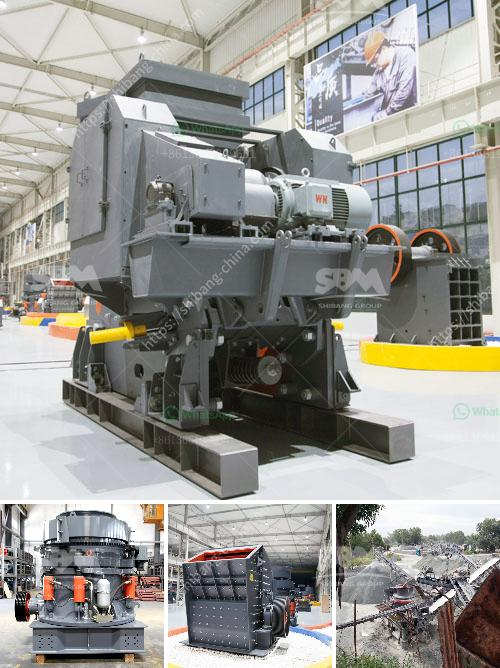

<h3>كسارة تأثير صغيرة بشبكة 100</h3>
تعتبر الكسارة التأثيرية الصغيرة من الأدوات المهمة في صناعة التعدين والبناء وغيرها من الصناعات ذات الصلة. إنها تستخدم لتكسير المواد الخام الصلبة والمتوسطة الصلابة إلى أجزاء صغيرة ومتجانسة. تعمل هذه الكسارة عن طريق تأثير المواد الخام بواسطة الهامش الروتوري الدوار الذي يتحرك بسرعة عالية.

من الجوانب الرئيسية لهذا الجهاز هو حجمه الصغير، مما يجعله مناسبًا للاستخدام في الأماكن ذات المساحة المحدودة أو المشاريع ذات الحجم الصغير. فهو يوفر للمستخدمين إمكانية تكسير المواد المصغرة على الفور دون الحاجة إلى نقلها إلى الموقع الرئيسي. بالإضافة إلى ذلك، فإن هذه الكسارة الصغيرة يمكن تثبيتها بشكل محمول على عربة أو مقطورة لمزيد من المرونة وسهولة النقل.

يتميز الجهاز أيضًا بقدرته على تكسير المواد الخام بشكل سريع وفعال. يشتمل الجهاز عادةً على مطرقة تدور بسرعة عالية، وتصطدم بالمواد الخام المتدفقة بفعل الجاذبية أو بفعل التغذية المباشرة. هذا يتيح للكسارة تكسير المواد بشكل كامل وفعال، مما يقلل من حاجتك لعمليات تكسير إضافية.

بالإضافة إلى ذلك، فإن صغر حجم الكسارة يسمح بتوفير تكاليف الطاقة والصيانة. يتميز الجهاز بمحرك كهربائي صغير الحجم (عادة ٥-١٠ حصان)، والذي يعمل بكفاءة عالية ولا يستهلك الكثير من الطاقة، مما يوفر المال ويقلل من الأثر البيئي.

ومن أهم الاستخدامات للكسارة التأثيرية الصغيرة هو تكسير الأحجار الكبيرة إلى حجم أصغر ومنتجات متنوعة مثل الزلط والرمل والحصى. كما يمكن استخدامها في صناعة البناء لتكسير الخرسانة الراكدة أو الردم. توفر الكسارة الصغيرة الحل المتكامل والاقتصادي لمشروعات البناء الصغيرة.

في الختام، تظهر الكسارة التأثيرية الصغيرة فوائدها وفاعليتها في مجال صناعة التعدين والبناء. يمكن اعتبارها أداة أساسية ومهمة في مشاريع البناء الصغيرة التي تحتاج إلى تكسير المواد الخام بشكل فوري وفعال. إنها توفر كفاءة عالية وتكاليف منخفضة، وتسهل عملية النقل والتشغيل.
<h3>Contact us</h3><ul><li><strong>Whatsapp:&nbsp;<a href="https://wa.me/8613661969651">+8613661969651</a></strong></li><li><a href="https://swt.shibang-china.com/?git&amp;zhl&amp;كسارة تأثير صغيرة بشبكة 100"><strong>Online Service(chat now)</strong></a></li></ul><h3>Related</h3><ul><li><a href='كسارة فك محمولة مستعملة في إسبانيا.md'>كسارة فك محمولة مستعملة في إسبانيا</a></li><li><a href='سعر آلة طحن المطحنة.md'>سعر آلة طحن المطحنة</a></li><li><a href='آلة غسيل الذهب.md'>آلة غسيل الذهب</a></li><li><a href='التدفق النموذجي لمحجر الجرانيت.md'>التدفق النموذجي لمحجر الجرانيت</a></li><li><a href='مصنعي كسارات الصدم في ألمانيا.md'>مصنعي كسارات الصدم في ألمانيا</a></li></ul>