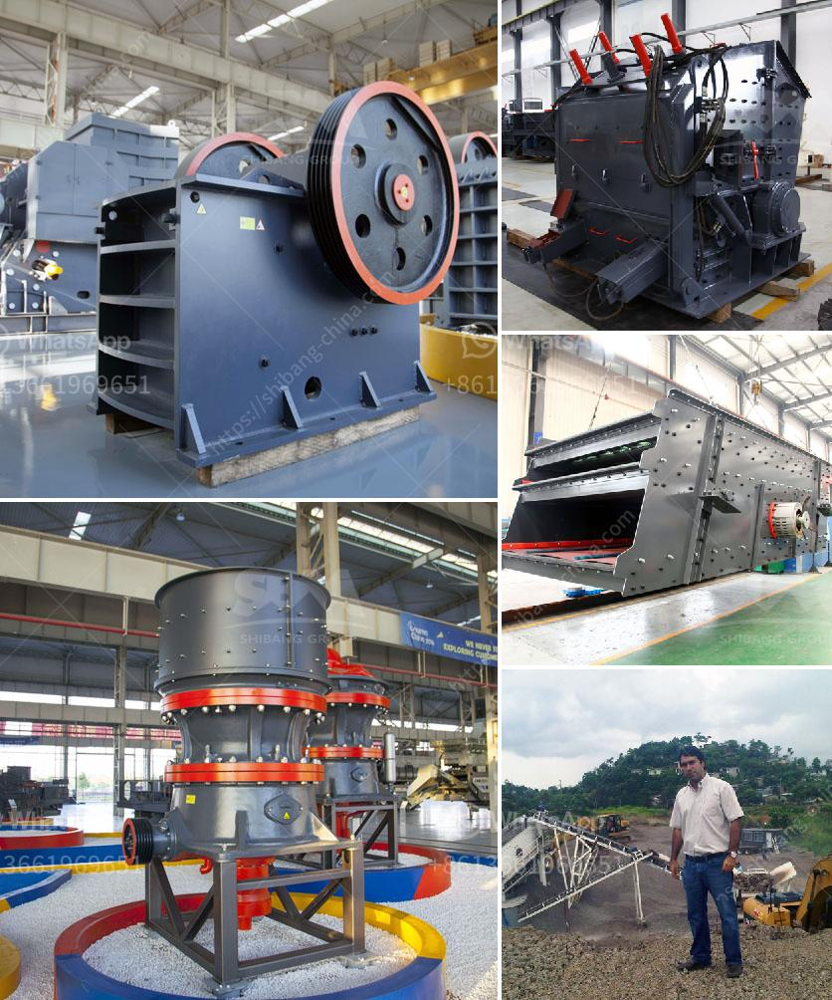

<h3>كسارة تأثير صناعية</h3>
تعتبر الكسارة التأثيرية الصناعية أحد الآلات الأساسية التي تستخدم في صناعة التعدين والبناء ومواد البناء. تستخدم الكسارات التأثيرية لسحق المواد الخام بفعالية وسرعة عالية قبل معالجتها أو استخدامها في الإنتاج.

تعمل الكسارة التأثيرية بنظام يعتمد على تأثير الطاقة الكهربائية على المواد. يتم إدخال المواد إلى الكسارة عن طريق فتحة الإدخال، حيث يتم توجيهها نحو السطح الدوار للكسارة. يتم تقسيم المواد وسحقها عن طريق ضربها بالمطرقة الدوارة المقواة بقوة عالية. تتمثل الفائدة الرئيسية للكسارة التأثيرية في تكسير المواد إلى قطع صغيرة بحيث يتسنى استخدامها بشكل أفضل في عملية التصنيع.

تعد الكسارة التأثيرية فعالة وموفرة للطاقة وتتميز بعدة مزايا. فهي تقدم أداء عالي الجودة وذات كفاءة عالية في عملية سحق المواد الخام. تستخدم الكسارات التأثيرية أيضًا لتجهيز مواد معدنية وغير معدنية مثل الحصى والركام والصخور.

تتكون الكسارة التأثيرية من عدد من الأجزاء الرئيسية. تشمل الأجزاء الرئيسية الصفائح المقواة والمطرقة الدوارة وشريط الاصطدام المقاوم للبلى. يتم تطبيق الفكرة العامة لتصميم النسخة الجديدة من الكسارة التأثيرية لضمان أقصى قدر من الأداء العالي بأقل قدر من الصيانة.

تعتبر الكسارة التأثيرية الصناعية أداة لا غنى عنها في صناعة التعدين والبناء. فهي تسمح بتحقيق أعلى مستويات الإنتاجية وكفاءة استخدام المواد الخام. تستخدم الكسارة التأثيرية في تكسير الصخور والمواد الصلبة بشكل عام وخاصة في صناعة الأسمنت والخرسانة.

باختصار، الكسارة التأثيرية الصناعية هي أداة مهمة في عمليات التكسير والسحق. تساهم في تحسين جودة المنتجات النهائية وتوفير الوقت والجهد في عملية الإنتاج. يمكن القول أن استخدام هذه الكسارة ضروري لتحقيق التطور والتقدم في صناعة البناء والتعدين.
<h3>Contact us</h3><ul><li><strong>Whatsapp:&nbsp;<a href="https://wa.me/8613661969651">+8613661969651</a></strong></li><li><a href="https://swt.shibang-china.com/?git&amp;zhl&amp;كسارة تأثير صناعية"><strong>Online Service(chat now)</strong></a></li></ul><h3>Related</h3><ul><li><a href='طاحونة طحن الكالسيوم.md'>طاحونة طحن الكالسيوم</a></li><li><a href='مصنع تكسير المحاجر المحمول للبيع في جامايكا.md'>مصنع تكسير المحاجر المحمول للبيع في جامايكا</a></li><li><a href='مصنع تركيز النحاس الصغير.md'>مصنع تركيز النحاس الصغير</a></li><li><a href='مطحنة رايموند بخمس أسطوانات لوحدة الطحن.md'>مطحنة رايموند بخمس أسطوانات لوحدة الطحن</a></li><li><a href='اليابان لمصنع تكسير متنقل.md'>اليابان لمصنع تكسير متنقل</a></li></ul>