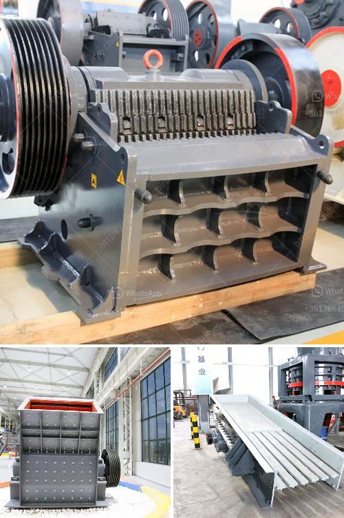

<h3>كسارة تأثير في المملكة العربية السعودية</h3>
تعتبر كسارات التأثير أحد أنواع المعدات الهندسية الحديثة التي تستخدم في صناعة البناء والإنشاءات في المملكة العربية السعودية وفي العديد من دول العالم. تمتاز هذه الكسارات بقدرتها على تكسير الصخور والأحجار بفضل لوحين من الحديد الثقيل، اللذين يقومان بالضغط على المادة المحطمة بقوة عالية ونتيجة لذلك يتم تحسين جودة المواد الانشائية المستخدمة في البناء وتقليل التكاليف.

تلعب كسارات التأثير دوراً هاما في صناعة البناء، حيث تُستخدم في تكسير الصخور الكبيرة والأحجار الضخمة لتتمكن من تحويلها إلى قطع صغيرة يسهل استخدامها في إنتاج الخرسانة والأسفلت والطرق والأعمال الانشائية الأخرى. وتساهم كسارات التأثير في توفير تكلفة الصيانة والتشغيل بسبب توافر القطع البديلة والاستبدال السريع لأجزاء الماكينة.

وفي المملكة العربية السعودية، حيث يتطلب الاقتصاد المتنامي تنفيذ العديد من المشاريع الضخمة في مختلف قطاعات البناء والتشييد، تعتبر كسارات التأثير أداة حيوية لتلبية هذه الاحتياجات. فهي تعمل على تحويل الصخور الضخمة إلى حصى رملية صغيرة يمكن استخدامها بكفاءة في إنتاج مواد البناء المختلفة.

بالإضافة إلى ذلك، تسهم كسارات التأثير في الحفاظ على البيئة وتقليل التلوث الناتج عن مشاريع البناء والهدم. فبدلاً من نقل الصخور والأحجار الضخمة إلى مواقع أخرى وإتلاف المواد الزائدة، يمكن استخدام كسارات التأثير في الموقع نفسه لتحويل هذه المواد الزائدة إلى قطع أصغر يسهل إعادة استخدامها في المشروع.

علاوة على ذلك، تتميز كسارات التأثير بقدرتها على معالجة الصخور الصلبة والمواد ذات الملمس القاسي بكفاءة عالية، مما يوفر الوقت والجهد في عملية التكسير. وبفضل التحسينات التكنولوجية المستمرة، تقدم الشركات المصنعة للكسارات تصاميم متقدمة ومبتكرة تعمل على زيادة القدرة الإنتاجية وتقليل استهلاك الطاقة.

وفي الختام، تُعد كسارات التأثير أداة لا غنى عنها في صناعة البناء والإنشاءات في المملكة العربية السعودية. فهي تلعب دورًا حاسمًا في تعزيز جودة المواد الانشائية، توفير الوقت والجهد، تحسين الاستدامة البيئية وتحقيق التوازن بين تلبية الاحتياجات الحالية والحفاظ على المستقبل.
<h3>Contact us</h3><ul><li><strong>Whatsapp:&nbsp;<a href="https://wa.me/8613661969651">+8613661969651</a></strong></li><li><a href="https://swt.shibang-china.com/?git&amp;zhl&amp;كسارة تأثير في المملكة العربية السعودية"><strong>Online Service(chat now)</strong></a></li></ul><h3>Related</h3><ul><li><a href='آلات تكسير وفرز.md'>آلات تكسير وفرز</a></li><li><a href='معالجة الحجر الجيري على نطاق صغير.md'>معالجة الحجر الجيري على نطاق صغير</a></li><li><a href='شاشة تهتز الفحم المصنعين في جنوب أفريقيا.md'>شاشة تهتز الفحم المصنعين في جنوب أفريقيا</a></li><li><a href='أصغر كسارة فك محمولة للبيع في جنوب أفريقيا.md'>أصغر كسارة فك محمولة للبيع في جنوب أفريقيا</a></li><li><a href='سيور ناقلة للخرسانة.md'>سيور ناقلة للخرسانة</a></li></ul>