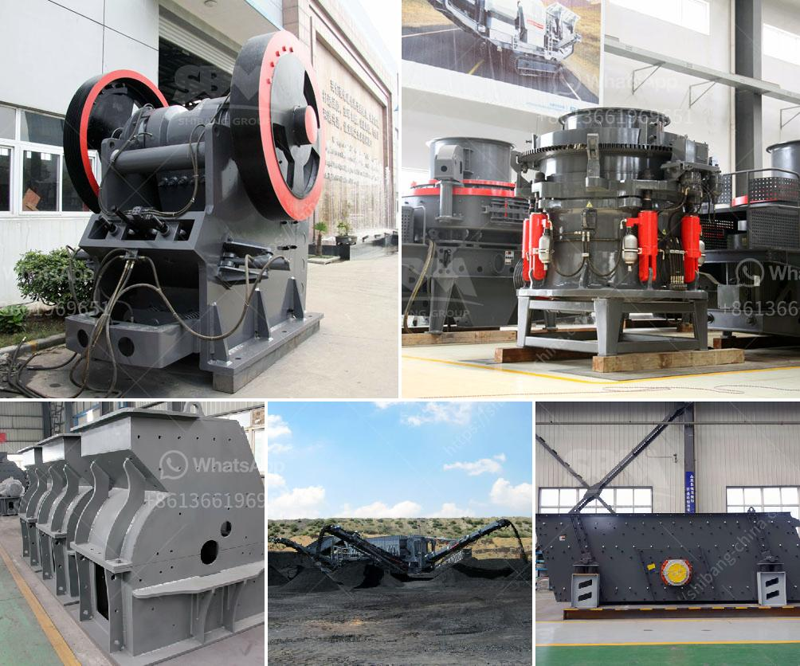

<h3>كسارة تأثير كبيرة بسعة ١٠٠٠ طن في الساعة</h3>
تُعد الكسارات التأثيرية من أهم الأدوات المستخدمة في صناعة التعدين والبناء، وتقوم بتكسير المواد الخام أو الصخور إلى أحجام أصغر للاستخدام في إنتاج المواد الإنشائية. ومن بين هذه الكسارات تأتي الكسارة ذات التأثير الكبيرة بسعة 1000 طن في الساعة.

تتميز هذه الكسارة بالقدرة على تفتيت المواد المختلفة بسرعة وكفاءة، حيث يتم أدخال المواد إلى الكسارة عبر مصنف ينقلها إلى الروتور المتحرك. يُطرح المواد بقوة على نهايات الروتور، مما يتسبب في تفتيتها وسحقها بواسطة الهمس المتواجد على الروتور. ثم يتم نقل المواد المفتتة إلى الشاشة الاهتزازية، حيث يتم فرزها بحجمها المطلوب.

توفر الكسارة ذات التأثير الكبيرة بسعة 1000 طن في الساعة مجموعة من المزايا المهمة. فمن بينها قدرتها على معالجة كميات كبيرة من المواد في وقت قصير، مما يزيد من كفاءة عملية الإنتاج ويقلل من النفايات. وبفضل تكنولوجيا القيادة الهيدروليكية المتقدمة، يمكن ضبط حجم المواد المفتتة بسهولة عن طريق تعديل سرعة الروتور والهمس.

تعتبر الكسارة ذات التأثير الكبيرة بسعة 1000 طن في الساعة مناسبة لمجموعة متنوعة من المواد من الحجر الجيري والجرانيت والحجر الطبيعي إلى الخرسانة المكسرة وركام البناء. هذا النوع من الكسارات غالبًا ما يتم استخدامه في مشاريع البناء الكبيرة مثل الطرق والجسور والأبنية العملاقة.

بالإضافة إلى ذلك، تمتاز هذه الكسارة ببنية متينة ومتانة عالية، مما يعني أنها تعمل بكفاءة لفترات طويلة دون الحاجة إلى صيانة متكررة. كما تتميز بنظام الأمان الفعال الذي يحمي المشغلين والجهاز من الحوادث المحتملة.

باختصار، تُعد الكسارة ذات التأثير الكبيرة بسعة 1000 طن في الساعة أداة مهمة في صناعة التعدين والبناء. وبفضل قدرتها على تفتيت المواد بكفاءة عالية وتوفيرها في وقت قصير، تزيد من إنتاجية العمل وتحسن من جودة المواد المستخدمة في مشاريع البناء.
<h3>Contact us</h3><ul><li><strong>Whatsapp:&nbsp;<a href="https://wa.me/8613661969651">+8613661969651</a></strong></li><li><a href="https://swt.shibang-china.com/?git&amp;zhl&amp;كسارة تأثير كبيرة بسعة ١٠٠٠ طن في الساعة"><strong>Online Service(chat now)</strong></a></li></ul><h3>Related</h3><ul><li><a href='تصميم مصنع تكسير وتخطيطه.md'>تصميم مصنع تكسير وتخطيطه</a></li><li><a href='معدات مستخدمة في تعدين الفحم.md'>معدات مستخدمة في تعدين الفحم</a></li><li><a href='آلات كبيرة القدرة لمبيعاتها في الهند.md'>آلات كبيرة القدرة لمبيعاتها في الهند</a></li><li><a href='مطحنة هامر للأسمنت.md'>مطحنة هامر للأسمنت</a></li><li><a href='كسارة محمولة في الفلبين بسعر مناسب.md'>كسارة محمولة في الفلبين بسعر مناسب</a></li></ul>