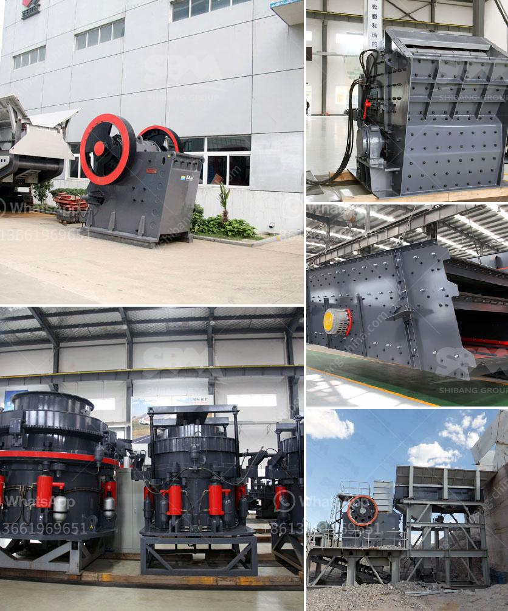

<h3>كسارة تأثير من الصين</h3>
تشتهر الصين بصناعتها المتقدمة والمبتكرة في مجموعة متنوعة من الصناعات. واحدة من هذه الصناعات هي صناعة كسارات التأثير. يعد التأثير في هذا السياق مشتقًا من قدرتها على سحق الصخور وتحويلها إلى قطع أصغر. تعمل كسارات التأثير عن طريق توجيه الصخور في فوهة الكسارة حيث يتم سحقها وتحويلها إلى قطع صغيرة باستخدام حركة دورانية عالية السرعة وتأثير المطرقة. تتميز الكسارات بأنها قادرة على كسر الصخور الصلبة والمتينة والحصى والأحجار والخرسانة والأسفلت بكفاءة عالية.

تتميز كسارات التأثير المصنوعة في الصين بالعديد من الميزات التي تجعلها تتفوق عن منافسيها. أولاً وقبل كل شيء ، تتميز بتصميم دقيق وجيد يضمن الكفاءة العالية والتشغيل السلس. يتم تحسين توازن الجهاز وتخفيض اهتزازه لتقليل مخاطر الضرر. تعمل هذه الكسارات أيضًا بكفاءة عالية تحت ضغوط قوية للحفاظ على أدائها المستمر على المدى الطويل.

بالإضافة إلى ذلك ، توفر الكسارات المصنوعة في الصين كفاءة عالية في استخدام الطاقة. تستخدم التكنولوجيا المتقدمة وتعتمد على ماكينات متطورة لتقليل استهلاك الطاقة وتحسين كفاءة العملية. تعمل هذه الكسارات بشكل فعال على توفير الطاقة والحد من الاعتماد على المواد الكيميائية الضارة أو الوقود الأحفوري.

علاوة على ذلك ، تتميز الكسارات المصنوعة في الصين بجودة عالية ومتانة قوية. يتم استخدام مواد عالية الجودة في بناء هذه الكسارات لضمان قدرتها على تلبية احتياجات السوق المتنوعة والمتطلبات البيئية المشددة. تم تصميم الكسارات بشكل يجعلها قادرة على التعامل مع الظروف الصعبة وتحمل الاستخدام الطويل دون تعطل غير مقصود.

باختصار ، تعتبر كسارات التأثير المصنوعة في الصين أدوات قوية وفعالة لتحقيق غرض السحق وتجهيز المواد. تجمع بين الجودة والكفاءة والتكنولوجيا المبتكرة لتوفير أفضل أداء واستدامة طويلة الأمد. بفضل هذه الصفات المميزة والمزايا ، تحظى كسارات التأثير بشعبية كبيرة في السوق العالمية وتعد خيارًا مثاليًا للشركات والمهندسين المدنيين الذين يبحثون عن حلول فعالة واقتصادية لاحتياجاتهم في مجال سحق المواد.
<h3>Contact us</h3><ul><li><strong>Whatsapp:&nbsp;<a href="https://wa.me/8613661969651">+8613661969651</a></strong></li><li><a href="https://swt.shibang-china.com/?git&amp;zhl&amp;كسارة تأثير من الصين"><strong>Online Service(chat now)</strong></a></li></ul><h3>Related</h3><ul><li><a href='آلة طحن دقيقة في الصين.md'>آلة طحن دقيقة في الصين</a></li><li><a href='التكسير الصخور للبيع.md'>التكسير الصخور للبيع</a></li><li><a href='حساب تكلفة سحق الركام.md'>حساب تكلفة سحق الركام</a></li><li><a href='عمليات كسارة وغسل الحجر.md'>عمليات كسارة وغسل الحجر</a></li><li><a href='حجم مدخلات ومخرجات مصنع تكسير الكوارتز.md'>حجم مدخلات ومخرجات مصنع تكسير الكوارتز</a></li></ul>