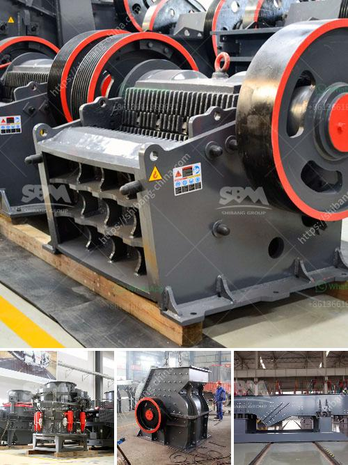

<h3>كسارة ثالثية</h3>
تشكل الكسارة الثالثية أحد أهم الأدوات اللازمة في صناعة البناء والإنشاءات. فهي تستخدم لتكسير وطحن المواد الخام كالحجر والرمل والحصى، مما يسهم في تحويلها إلى مواد نهائية جاهزة للاستخدام في البناء.

تعد الكسارة الثالثية حلاً فعالاً واقتصادياً لتحويل المواد الخام إلى منتجات ذات جودة عالية. فهي تقوم بتكسير المواد الخام بأحجام محددة، مما يسهل عملية البناء ويساعد على توفير الوقت والجهد. بالإضافة إلى ذلك، تساهم الكسارة الثالثية في تقليل فاقد التكسير وتحسين أداء العملية بشكل عام.

تعتمد الكسارة الثالثية على آلية تحويل العناصر الأكبر حجمًا إلى قطع صغيرة بواسطة المطارق الدوارة. ثم يتم طحن هذه القطع الصغيرة في غرفة الطحن الداخلية، مما يؤدي إلى الحصول على مواد نهائية ذات حجم وشكل مناسبين للاستخدام في البناء.

تتميز الكسارة الثالثية بأنها قابلة للتكيف ومتعددة الاستخدامات، حيث يمكن استخدامها لتكسير مجموعة متنوعة من المواد الخام. كما أنها قادرة على تحمل العمل الشاق والمستمر طوال فترة التشغيل.

تساهم الكسارة الثالثية في توفير الكثير من المزايا لقطاع البناء والإنشاءات. فعند استخدامها، يمكن تحسين جودة المواد النهائية والتحكم في حجم الجسيمات المنتجة. وهذا يؤدي إلى تحسين جودة الأعمال المنجزة والحد من الفاقد والهدر في عملية البناء.

علاوة على ذلك، تساعد الكسارة الثالثية في تقليل التلوث البيئي الذي ينتج عن عمليات التكسير التقليدية. فهي تستهلك كمية أقل من الوقود وتقلل من الانبعاثات الضارة للهواء خلال عملية التشغيل. وهذا يعزز الاستدامة ويحافظ على البيئة المحيطة.

بالاستفادة من فوائد الكسارة الثالثية، يمكن لقطاع البناء الاستفادة من خفض التكاليف وزيادة الإنتاجية. فعملية التكسير الأكثر كفاءة يمكن أن تُعدل نتائج الأعمال وتقلل من الوقت والموارد المستخدمة.

في الختام، فإن الكسارة الثالثية تعتبر أداة حيوية لقطاع البناء والإنشاءات. فهي تساهم في تحويل المواد الخام إلى منتجات نهائية جاهزة للاستخدام وتحسين جودة الأعمال. كما تقلل من التلوث وتزيد من الاستدامة البيئية. لذا، يجب تعزيز استخدام الكسارة الثالثية وتحسين تقنياتها لتعزيز قطاع البناء وتحقيق التنمية المستدامة.
<h3>Contact us</h3><ul><li><strong>Whatsapp:&nbsp;<a href="https://wa.me/8613661969651">+8613661969651</a></strong></li><li><a href="https://swt.shibang-china.com/?git&amp;zhl&amp;كسارة ثالثية"><strong>Online Service(chat now)</strong></a></li></ul><h3>Related</h3><ul><li><a href='طاحونة الكرة 800 طن يومياً.md'>طاحونة الكرة 800 طن يومياً</a></li><li><a href='تقرير جدوى المشروع حول كسارة الحجر.md'>تقرير جدوى المشروع حول كسارة الحجر</a></li><li><a href='كسارة الفك في كينيا مصنعة.md'>كسارة الفك في كينيا مصنعة</a></li><li><a href='معدات طحن الرماد الخشن.md'>معدات طحن الرماد الخشن</a></li><li><a href='كسارة مخروطية للبيع.md'>كسارة مخروطية للبيع</a></li></ul>