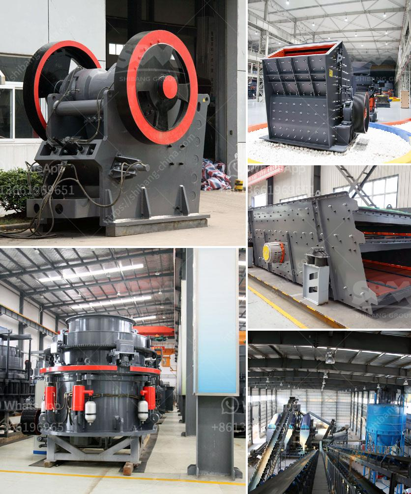

<h3>كسارة حجر ألمانية</h3>
تعتبر الكسارات الحجرية من المعدات الهامة في عملية تكسير الصخور والأحجار لاستخدامها في العديد من الأغراض المختلفة، سواء في إعداد مواد البناء أو في صناعة الركام. ومن بين الكسارات الحجرية المعروفة، تبرز الكسارات الحجرية الألمانية نظرًا لجودتها العالية وخدماتها المميزة.

تتميز الكسارات الحجرية الألمانية بأداء قوي وفعالية في تكسير الصخور الصلبة بفضل تقنياتها المتطورة وتصميماتها الدقيقة. تتوفر هذه الكسارات في مجموعة متنوعة من الأحجام والقدرات، وتناسب جميع أحجام وأنواع الأحجار المختلفة. وتستطيع هذه الكسارات تكسير الأحجار بدقة عالية وفي وقت قصير، مما يجعلها مثالية للاستخدام في مشاريع البناء الكبيرة والمتوسطة.

تعتبر الكسارات الحجرية الألمانية موثوقة وتتميز بمتانتها العالية وقدرتها على تحمل الظروف القاسية. فهي مبنية من مواد ذات جودة عالية، مما يجعلها قادرة على التعامل مع الأحمال الثقيلة والاستمرار في العمل لفترات طويلة دون مشاكل. ويتميز تصميم هذه الكسارات بسهولة الصيانة والإصلاح، مما يعزز ثقة المستخدمين في جودتها ويسهم في زيادة عمرها الافتراضي.

تتمتع الكسارات الحجرية الألمانية بكفاءة واستدامة عالية في استهلاك الطاقة. وتساهم تقنيات الطحن المبتكرة في تقليل استهلاك الطاقة بصورة كبيرة، مما يوفر توفيرًا هامًا في تكاليف التشغيل. كما أن استخدام هذه الكسارات يحافظ على البيئة نظرًا لانبعاثاتها المنخفضة وقدرتها على معالجة النفايات بشكل فعال.

بالإضافة إلى جودة الأداء والاعتمادية العالية، فإن الكسارات الحجرية الألمانية تتميز بالابتكار والتقنيات الحديثة المستخدمة في تصنيعها. فهي مزودة بنظام تحكم ذكي متطور يسمح بمراقبة وضبط العمليات بدقة، مما يجعلها سهلة الاستخدام وفعالة في إنتاجية المواد.

لخلاصة القول، تُعَد الكسارات الحجرية الألمانية خيارًا ممتازًا للعديد من الصناعات التي تحتاج إلى تكسير الصخور. فبفضل جودتها وأدائها العالي، يمكن الاعتماد عليها في تزويد المشاريع بمواد البناء المُكسرة والركام بكفاءة وفعالية، مما يسهم في نجاح تلك المشاريع وتقدم الصناعات المختلفة.
<h3>Contact us</h3><ul><li><strong>Whatsapp:&nbsp;<a href="https://wa.me/8613661969651">+8613661969651</a></strong></li><li><a href="https://swt.shibang-china.com/?git&amp;zhl&amp;كسارة حجر ألمانية"><strong>Online Service(chat now)</strong></a></li></ul><h3>Related</h3><ul><li><a href='إغلاق محطة الكسارة.md'>إغلاق محطة الكسارة</a></li><li><a href='مصنع غسيل الماس في جنوب أفريقيا.md'>مصنع غسيل الماس في جنوب أفريقيا</a></li><li><a href='مطحنة رايموند في بورور.md'>مطحنة رايموند في بورور</a></li><li><a href='مطحنة الكرة الثقيلة الوزن في الهند.md'>مطحنة الكرة الثقيلة الوزن في الهند</a></li><li><a href='عملية استخراج الحجر الجيري.md'>عملية استخراج الحجر الجيري</a></li></ul>