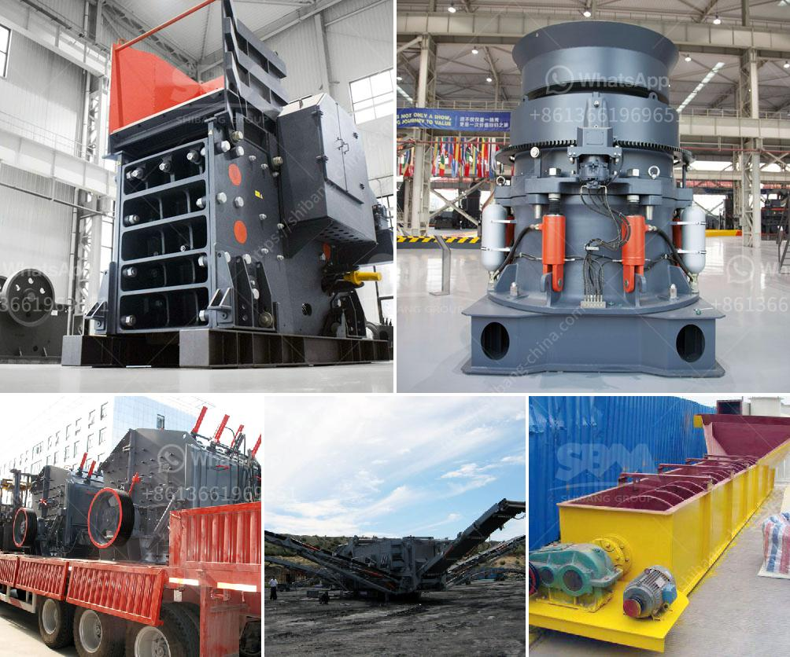

<h3>كسارة حجر إيطالية</h3>
تعد الكسارات الحجرية من أهم المعدات في صناعة البناء والبنية التحتية. ومن بين تلك الكسارات، تأتي الكسارات الحجرية الإيطالية في المقدمة بالجودة والكفاءة التي توفرها للمستخدمين. تعتبر الكسارات الحجرية الإيطالية الافضل على الاطلاق لأنها تتسم بالتصميم المبتكر والتقنيات الحديثة التي تعطيها القدرة على سحق الأحجار بكفاءة عالية.

تمتاز الكسارات الحجرية الإيطالية بالعديد من المزايا، بدءًا من التصميم القوي والمتين الذي يضمن استدامة الكسّارة لفترة طويلة من الزمن. كما أنها مصممة بطريقة تسمح بتقليل الاهتزازات والضوضاء التي يمكن أن تحدث أثناء عملية السحق. بفضل هذا التصميم المحسن، يمكن استخدام هذه الكسّارات في مواقع مختلفة، بغض النظر عن الظروف البيئية والجغرافية.

بالإضافة إلى ذلك، تعمل الكسارات الحجرية الإيطالية بكفاءة عالية وبطاقة إنتاجية كبيرة. تتيح التقنيات المتقدمة المستخدمة في تصنيع هذه الكسارات سحق الأحجار الكبيرة والصخور الجبلية بسهولة، مما يوفر عملية إزالة الحجر الكبيرة والتقليل من حجم المواد لتسهيل عملية التخزين والنقل.

تعتبر الكسارات الحجرية الإيطالية متعددة الاستخدامات ومتنوعة الأحجام، حيث تتوفر بأحجام مختلفة، تبدأ من الكسارات الصغيرة المحمولة وتنتهي بالكسارات الكبيرة والثابتة. يمكن استخدامها في العديد من التطبيقات مثل بناء الطرق والجسور والمباني وحتى في صناعة الرمل والحصى.

أخيراً، تشمل الكسارات الحجرية الإيطالية خدمات ما بعد البيع الممتازة، حيث تقدم الشركات المصنعة الدعم الفني والتدريب للعاملين على تشغيل الكسات المحجرية، بالإضافة إلى توفير قطع الغيار اللازمة والصيانة الدورية. هذه الخدمات المهنية تساعد في زيادة عمر الكسّارة وتحسين أدائها على المدى الطويل.

باختصار، الكسارات الحجرية الإيطالية تعد الخيار الأمثل للمقاولين ومالكي المحاجر الحجرية، حيث تجمع بين الجودة العالية والتصميم المبتكر والكفاءة العالية. فهي توفر أداءً مهنياً وترفع من مستوى الإنتاجية في مواقع البناء.
<h3>Contact us</h3><ul><li><strong>Whatsapp:&nbsp;<a href="https://wa.me/8613661969651">+8613661969651</a></strong></li><li><a href="https://swt.shibang-china.com/?git&amp;zhl&amp;كسارة حجر إيطالية"><strong>Online Service(chat now)</strong></a></li></ul><h3>Related</h3><ul><li><a href='نماذج كسارات الحجر في ماليزيا.md'>نماذج كسارات الحجر في ماليزيا</a></li><li><a href='آلة طحن الكرة من المنغنيز.md'>آلة طحن الكرة من المنغنيز</a></li><li><a href='عملية تصنيع كسارة الطين المكلس.md'>عملية تصنيع كسارة الطين المكلس</a></li><li><a href='أفضل وسادات طحن للرخام في باكستان.md'>أفضل وسادات طحن للرخام في باكستان</a></li><li><a href='موردين آلة طحن الجبس.md'>موردين آلة طحن الجبس</a></li></ul>