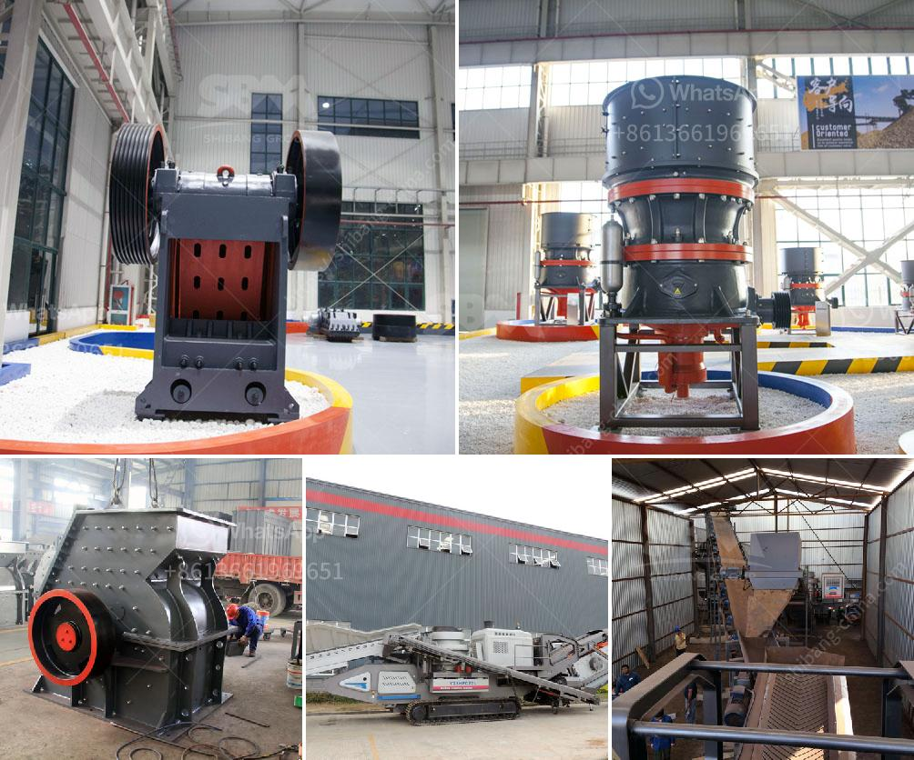

<h3>كسارة حجر البلاد في الهند</h3>
تعتبر كسارة حجر البلاد في الهند من أهم المشاريع الصناعية في البلاد. وهي تعمل على استخراج وتكسير حجر البناء لاستخدامه في العديد من الأغراض الهندسية والبنائية. تحظى هذه الصناعة بشعبية كبيرة في الهند وتلعب دورًا حيويًا في تطور القطاع العقاري والبنية التحتية للبلاد.

تستخدم كسارة حجر البلاد في الهند أحدث التقنيات والمعدات الحديثة لاستخلاص الصخور وتكسيرها. تتم عمليات التكسير باستخدام الآلات الثقيلة مثل الكسارات الفكية وصوامع التخزين والمطاحن ومناطق الفرز. تعمل هذه الأجهزة بكفاءة عالية وتساهم في زيادة الإنتاجية وتقليل تكاليف العمل.

تتم عمليات تكسير حجر البناء بواسطة الكسارة بشكل تسلسلي حسب الحجم ونوع الحجر المطلوب. يتم استخدام الكسارات الفكية لتكسير الحجارة الكبيرة إلى قطع أصغر بأحجام محددة. بعد ذلك، يتم تخزين قطع الحجر المكسر في صوامع التخزين لفصلها بناءً على حجمها وجودتها. وأخيرًا، يتم نقل الحجارة المكسرة إلى المطاحن لطحنها وتحويلها إلى المواد النهائية المطلوبة.

يعتبر حجر البلاد المنتج من كسارة حجر البلاد في الهند من الخامات الهامة لصناعة البناء. فهو يستخدم في إنشاء الطرق والجسور والمباني والسدود والأنفاق. كما يستخدم أيضًا لصناعة البلاط والأرصفة والأرضيات والجدران الخارجية. يتميز حجر البلاد بمقاومته العالية للتآكل وقدرته على تحمل ضغوط أثناء الاستخدام، وله تأثير جمالي يتناسب مع مختلف التصاميم المعمارية.

تلعب صناعة كسارة حجر البلاد دورًا هامًا في دعم التنمية الاقتصادية في الهند. فهي توفر فرص عمل للعديد من العمال وتسهم في زيادة الناتج المحلي الإجمالي للبلاد. كما تساهم أيضًا في توفير مواد البناء اللازمة لمشاريع البنية التحتية والتطوير العمراني.

وفي الختام، تعد صناعة كسارة حجر البلاد في الهند من الصناعات الحيوية والحيوية للاقتصاد الهندي. تلعب دورًا مهما في تطور القطاع العقاري والبنية التحتية للبلاد، وتساهم في تحسين مستوى عيش السكان وتوفير فرص عمل واقتصاد قوي.
<h3>Contact us</h3><ul><li><strong>Whatsapp:&nbsp;<a href="https://wa.me/8613661969651">+8613661969651</a></strong></li><li><a href="https://swt.shibang-china.com/?git&amp;zhl&amp;كسارة حجر البلاد في الهند"><strong>Online Service(chat now)</strong></a></li></ul><h3>Related</h3><ul><li><a href='آلة معالجة الكاولين في المصنع.md'>آلة معالجة الكاولين في المصنع</a></li><li><a href='موردين كسارات الفك والمخروط في موكوباني.md'>موردين كسارات الفك والمخروط في موكوباني</a></li><li><a href='فحص الشاشة التحجيم.md'>فحص الشاشة التحجيم</a></li><li><a href='كسارة النحاس للبيع في ماليزيا.md'>كسارة النحاس للبيع في ماليزيا</a></li><li><a href='سحق الحجر الأسود تايلاند.md'>سحق الحجر الأسود تايلاند</a></li></ul>