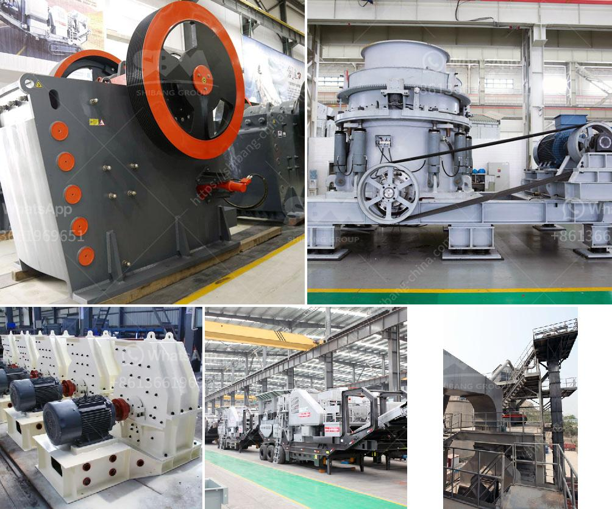

<h3>كسارة حجر الكاولين</h3>
تُعتبر كسارة حجر الكاولين أحد الآلات المستخدمة في صناعة التعدين، وتهدف إلى سحق حجارة الكاولين إلى حجم صغير يمكن استخدامه في تجهيزات أخرى. يستخدم الكاولين بشكل واسع في صناعات مختلفة مثل الورق والسيراميك والدهانات والورنيش ومواد البناء وصناعة الزجاج، ومن أجل تصنيع هذه المنتجات، يتم تكسير الكاولين بواسطة الكسارة.

تُستخدم الكسارة الحجرية لكاولين لسحق الصخور الكبيرة إلى حجم صغير باستخدام قوة الضغط والاحتكاك. يتكون هيكل الكسارة من العديد من الأجزاء المختلفة مثل الفك الثابت والفك المتحرك والقاعدة والجزء العلوي والسفلي. يتحرك الفك المتحرك بين الصخور الكبيرة ويقوم بضغطها لتكسيرها إلى صخور صغيرة. 

تتميز الكسارة الحجرية بالعديد من المزايا التي تجعلها ذات استخدام واسع في صناعة التعدين. فعلى سبيل المثال، فإن استخدام الكسارة يقلل من تكاليف التشغيل ويزيد من كفاءة الإنتاج. بالإضافة إلى ذلك، فإن الكسارة تتمتع بحجم صغير وهيكل بسيط، مما يتيح الحد من استهلاك الطاقة والمساحة وتوفير الموارد. وباستخدام التحكم الأوتوماتيكي في الكسارة، يتم تقليل أيضًا خطر الكسارة وزيادة السلامة عند التشغيل.

مع مرور الوقت، تطورت التكنولوجيا وتحسنت أنواع الكسارات المستخدمة في سحق حجارة الكاولين. ومن بين الأنواع الأكثر شيوعًا تجدر الإشارة إلى كسارة الفك وكسارة المخروط وكسارة تأثير العتاد. تختلف هذه الأنواع في تركيبها وطريقة عملها، وتختلف أيضًا في القدرة على سحق حجم صخور معينة.

في الختام، تعتبر كسارة حجر الكاولين أداة مهمة في صناعة التعدين، حيث تقوم بتحويل الحجارة الكبيرة إلى الحجم المناسب للاستخدام في صناعات مختلفة مثل الورق والسيراميك والدهانات والورنيش، مما يساهم في تطوير العديد من الصناعات وتحسين كفاءتها وجودتها.
<h3>Contact us</h3><ul><li><strong>Whatsapp:&nbsp;<a href="https://wa.me/8613661969651">+8613661969651</a></strong></li><li><a href="https://swt.shibang-china.com/?git&amp;zhl&amp;كسارة حجر الكاولين"><strong>Online Service(chat now)</strong></a></li></ul><h3>Related</h3><ul><li><a href='مصانع الكسارات الصينية.md'>مصانع الكسارات الصينية</a></li><li><a href='مشروع حجر الزلط في إثيوبيا.md'>مشروع حجر الزلط في إثيوبيا</a></li><li><a href='تقدير تكلفة مصنع تعدين النحاس.md'>تقدير تكلفة مصنع تعدين النحاس</a></li><li><a href='مصنع الأسمنت للبيع في دبي.md'>مصنع الأسمنت للبيع في دبي</a></li><li><a href='سعة الكسارة المحمولة ٢٠٠ طن في الساعة.md'>سعة الكسارة المحمولة ٢٠٠ طن في الساعة</a></li></ul>