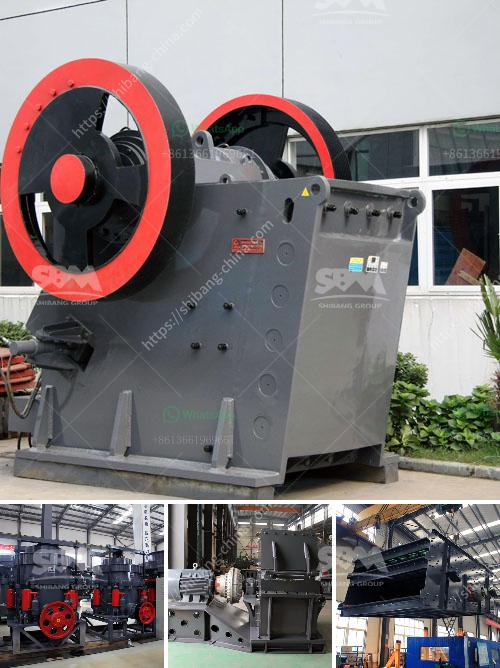

<h3>كسارة حجر ثالثية</h3>
تعتبر كسارات الحجر ثالثية أحد المعدات الهامة في صناعة البناء والإنشاء. فهي تعمل على سحق الصخور والحصى إلى جزيئات صغيرة بحجم محدد، وتستخدم بعد ذلك في تصنيع الخرسانة والأسفلت والطرق وغيرها من المشاريع الإنشائية.

تعتبر الكسارات ثالثية الحجم من أقدم وأكثر الأنواع استخدامًا في عملية السحق. فتتميز بقدرتها الفائقة على سحق الصخور ذات الصلابة العالية، وتحويلها إلى جسيمات أصغر تسهل عملية معالجة المواد وتقليل استخدام المواد الخام.

وتتألف كسارات الحجر الثالثية من عدة أجزاء مهمة تعمل سويًا لتنفيذ عملية السحق بكفاءة. يتم تحميل الصخور والحصى في الجزء العلوي من الكسارة، ثم يتم نقلها إلى غرفة السحق عن طريق السيور الناقلة. تتم العملية عادة بواسطة ثلاثة أسطوانات أفقية موزعة تتحرك في الاتجاه المعاكس للصخرة، مما يؤدي إلى الضغط عليها وتكسيرها إلى جزيئات صغيرة.

يتم استخدام كسارات الحجر الثالثية في عمليات التعدين ومحاجر الحجر وتصنيع الخرسانة والإنشاءات العامة، حيث توفر هذه الآلات كفاءة عالية في عملية السحق وإنتاجية ممتازة. ومن الميزات الأخرى التي تجعل الكسارات الثالثية مفضلة هي تكلفتها المنخفضة للصيانة وسهولة التشغيل وقدرتها على التكيف مع مختلف أنواع المواد والحجم.

بالإضافة إلى ذلك، فإن استخدام كسارات الحجر الثالثية يسهم في الحد من تلوث البيئة. إذ يمكن إعادة استخدام المواد المسحوقة واستغلالها في صناعة الرمل والخرسانة، مما يقلل من حاجة استخدام الموارد الطبيعية والحفاظ على البيئة.

باختصار، تلعب كسارات الحجر الثالثية دورًا حاسمًا في صناعة البناء والإنشاء حيث تلبي احتياجات السوق بكفاءة عالية وتسهم في حماية البيئة. ومع استمرار التطورات التكنولوجية، من المتوقع أن تزداد قدرة وكفاءة هذه الكسارات في المستقبل، مما يؤدي إلى تحسين العمليات الإنشائية وزيادة الإنتاجية.
<h3>Contact us</h3><ul><li><strong>Whatsapp:&nbsp;<a href="https://wa.me/8613661969651">+8613661969651</a></strong></li><li><a href="https://swt.shibang-china.com/?git&amp;zhl&amp;كسارة حجر ثالثية"><strong>Online Service(chat now)</strong></a></li></ul><h3>Related</h3><ul><li><a href='كسارة أولية للبيع.md'>كسارة أولية للبيع</a></li><li><a href='مطحنة أسطوانية للبيع في نيوزيلندا.md'>مطحنة أسطوانية للبيع في نيوزيلندا</a></li><li><a href='كيفية صنع مسحوق التلك الصناعي.md'>كيفية صنع مسحوق التلك الصناعي</a></li><li><a href='مطحنة المطرقة في نيجيريا.md'>مطحنة المطرقة في نيجيريا</a></li><li><a href='مصنع الكرة.md'>مصنع الكرة</a></li></ul>