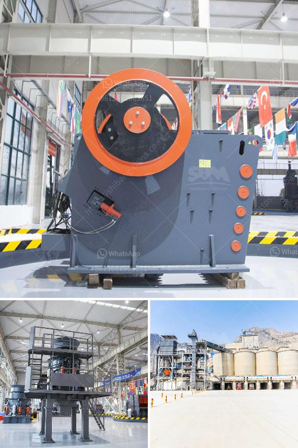

<h3>كسارة حجر ثانوية للبيع في الفلبين</h3>
تعتبر صناعة البناء والتشييد من أهم القطاعات الاقتصادية في الفلبين، حيث يتطلب نمو البنية التحتية للبلاد والتطور العمراني وجود معدات وآليات حديثة تلبي احتياجات السوق. ومن بين هذه المعدات الهامة التي تستخدم في مشاريع البناء، تأتي في مقدمتها كسارات الحجر الثانوية.

الكسارات الثانوية هي عبارة عن آلات تعمل على سحق الصخور الكبيرة إلى حجم يمكن استخدامه في إنتاج الخرسانة والأسفلت وغيرها من المنتجات. تستخدم هذه الكسارات في عمليات تكسير الصخور الحجرية، والتي يمكن أن تتراوح من الجرانيت والرخام والحجر الجيري إلى الحجر الزينكون وغيرها.

في الفلبين، تتوفر العديد من الكسارات الثانوية للبيع، والتي تلبي احتياجات الشركات والمشاريع الكبيرة والصغيرة على حد سواء. يتراوح سعر هذه الكسارات بين 200 إلى 400 ألف دولار حسب الموديل والحجم والقدرة.

تتميز الكسارات الثانوية في الفلبين بالعديد من الميزات التي تجعلها مفضلة للمستخدمين. فهي تتميز بسهولة الصيانة والتشغيل، وكذلك بقدرتها على معالجة كميات كبيرة من الصخور دون أي مشاكل. تعتمد هذه الكسارات على تقنيات حديثة، مثل تقنية الهيدروليكية والإلكترونيات، لتحقيق أداء ممتاز واستهلاك منخفض للطاقة.

بالإضافة إلى ذلك، فإن اقتناء كسارة حجر ثانوية في الفلبين يعد استثماراً ممتازاً للشركات والأفراد الذين يعملون في صناعة البناء. فبفضل توفر هذه الكسارات المتطورة، يمكن للمشاريع البنائية أن توفر الوقت والجهد في عمليات التكسير وإعادة استخدام الصخور المكسورة في الإنتاج. كما أنها تساهم في خفض تكاليف البناء وتحسين جودة المنتج النهائي.

في الختام، نستنتج أن الكسارات الثانوية للبيع في الفلبين تعتبر خيارًا ممتازًا للشركات والأفراد العاملين في صناعة البناء. فباستخدام هذه الآلات الحديثة والعالية الجودة، يمكن تحسين العمليات وزيادة الإنتاجية وتحقيق التوفير في التكاليف. إذا كنت تبحث عن كسارة حجر ثانوية للاستخدام في مشروعك القادم، فإن الفلبين تقدم الخيارات المثلى لتلبية احتياجاتك.
<h3>Contact us</h3><ul><li><strong>Whatsapp:&nbsp;<a href="https://wa.me/8613661969651">+8613661969651</a></strong></li><li><a href="https://swt.shibang-china.com/?git&amp;zhl&amp;كسارة حجر ثانوية للبيع في الفلبين"><strong>Online Service(chat now)</strong></a></li></ul><h3>Related</h3><ul><li><a href='براميل أحزمة الناقلات في ماليزيا.md'>براميل أحزمة الناقلات في ماليزيا</a></li><li><a href='كسارة مخروطية قياسية دليل الإصلاح.md'>كسارة مخروطية قياسية دليل الإصلاح</a></li><li><a href='موقع إنتاج مطحنة المطرقة في نيجيريا.md'>موقع إنتاج مطحنة المطرقة في نيجيريا</a></li><li><a href='موردين معدات سحق السيليكا.md'>موردين معدات سحق السيليكا</a></li><li><a href='مصنع معالجة للبيع في جنوب أفريقيا.md'>مصنع معالجة للبيع في جنوب أفريقيا</a></li></ul>