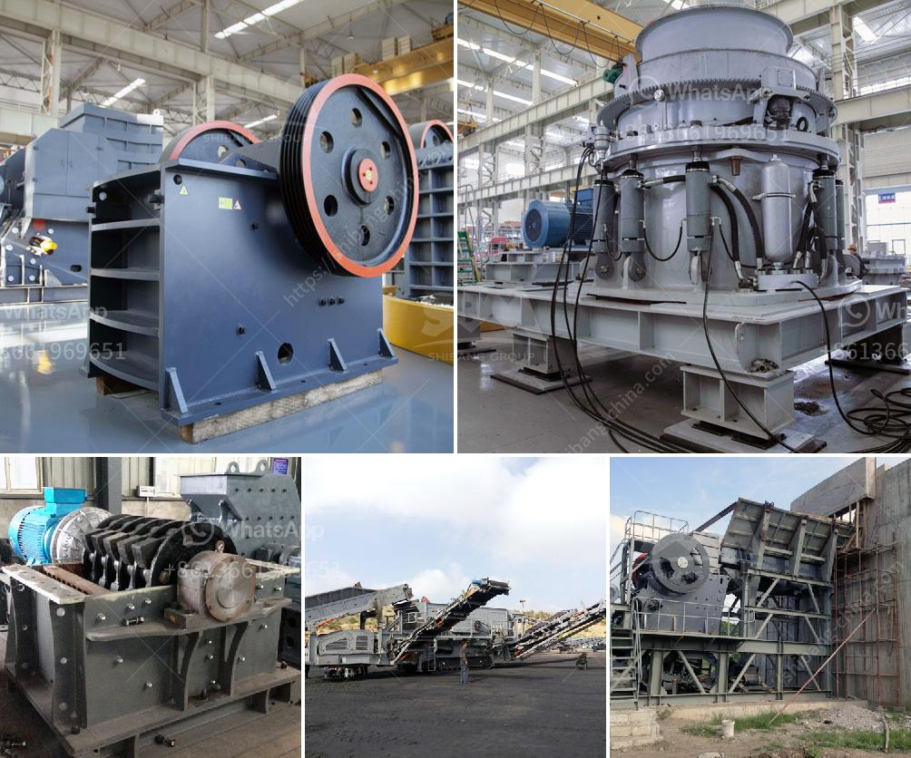

<h3>كسارة حجر في إندونيسيا</h3>
تزخر إندونيسيا بثروات طبيعية هائلة، ومن أبرزها الموارد المعدنية والأحجار الكريمة. وفي ظل التنمية المُتسارعة التي تشهدها البلاد، يعزز استخراج وتعدين الحجارة الطبيعية الاقتصاد المحلي ويواكب توجهات النمو العمراني.

كسارة الحجر هي آلة تستخدم لتكسير الأحجار الكبيرة إلى قطع صغيرة من الحجم المناسب للاستخدام في البناء والإنشاءات. وتتمتع إندونيسيا بأراضٍ شاسعة تحتضن مصانع لتصنيع الحصى والرمال والحصى المستخدمة في البناء.

بدأ استخدام الكسارات في إندونيسيا بشكل واسع في عقود الستينات من القرن الماضي، مما جعلها تلعب دوراً رئيسياً في تغيير قواعد اللعبة في صناعة البناء. حيث ظهرت تقنيات وآلات جديدة لتحديث العمليات اليدوية التقليدية وتسريع عملية التعدين والتكسير.

تعتبر كسارة الحجر في إندونيسيا تقنية حديثة تساهم في تحسين الإنتاجية وخفض التكاليف التشغيلية. وتجعل العملية أكثر سلاسة وفعالية، مما ينتج عنه توفير في الوقت والجهد وتقليل الأخطاء البشرية.

تتعاون العديد من الشركات الكبرى في إندونيسيا مع مصانع تصنيع الكسارات لتوفير معدات عالية الجودة وأنظمة استغلال فعالة لقطاع التعدين. وتعمل هذه الشركات على توفير الاسلوب الأمثل في استخدام الموارد وتعزيز التطور الاقتصادي في البلاد.

من الجوانب الإيجابية لاستخدام الكسارات في إندونيسيا هو التأثير البيئي المنخفض. فهي تساهم في تقليل الحاجة للتعدين في مناطق طبيعية حماية. وبالتالي، فإن استخدام الحجر المكسر يساهم في الحفاظ على التنوع البيولوجي والحيواني في تلك المناطق.

ومع ذلك، هناك أيضاً بعض التحديات التي تواجه صناعة الكسارات في إندونيسيا. فمع ظهور التكنولوجيات الحديثة، يتطلب تحسين استخدام المصانع المعتمدة على الكهرباء الصديقة للبيئة وتقنيات التحكم الآلي. وتُطالب الحكومة بتنظيم القوانين البيئية وفرض رسوم على التلوث لتحفيز استخدام تكنولوجيا مستدامة وصديقة للبيئة.

بالختام، تلعب صناعة كسارة الحجر في إندونيسيا دوراً حيوياً في تطور البنية التحتية والنمو الاقتصادي. وبفضل تبني التقنيات الحديثة وتنظيمها بشكل جيد، فإنها ستستمر في تحقيق التطور المستدام وتلبية احتياجات البناء والتعمير في البلاد.
<h3>Contact us</h3><ul><li><strong>Whatsapp:&nbsp;<a href="https://wa.me/8613661969651">+8613661969651</a></strong></li><li><a href="https://swt.shibang-china.com/?git&amp;zhl&amp;كسارة حجر في إندونيسيا"><strong>Online Service(chat now)</strong></a></li></ul><h3>Related</h3><ul><li><a href='شركات مصنعي مطاحن الأسطوانات في الهند.md'>شركات مصنعي مطاحن الأسطوانات في الهند</a></li><li><a href='مصنع تكسير الحجارة المستعمل للبيع في إسبانيا.md'>مصنع تكسير الحجارة المستعمل للبيع في إسبانيا</a></li><li><a href='سعر كسارة الفك 24x12.md'>سعر كسارة الفك 24x12</a></li><li><a href='مناجم الكوبالت والنحاس في زامبيا.md'>مناجم الكوبالت والنحاس في زامبيا</a></li><li><a href='سعر المكبس لمطحنة المطرقة.md'>سعر المكبس لمطحنة المطرقة</a></li></ul>