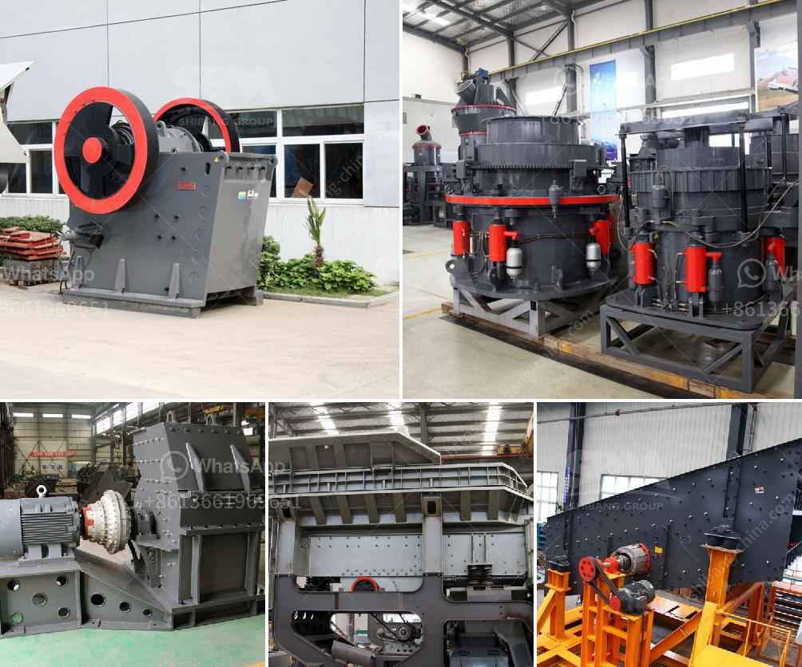

<h3>كسارة حجر في العمود الفقري</h3>
تعد كسارة الحجر في العمود الفقري من الحالات الشائعة التي يعاني منها الناس في العصر الحديث. يحدث هذا العرض عندما يتعرض الشخص لضغط زائد على العمود الفقري نتيجة لعوامل متعددة مثل التدهور التدريجي للفقرات، والإصابة الناتجة عن الحوادث أو السقوط، وقلة النشاط البدني، وعدم وجود نظام غذائي صحي، وعوامل أخرى.

تصف المرضى أعراضًا مزعجة ومؤلمة تتضمن الألم في الظهر والرقبة، وقد تشمل الألم أيضًا العضلات والأعصاب المحيطة. كما قد يعاني المرضى من صعوبة في الجلوس والوقوف لفترات طويلة من الزمن، وتنقص لياقتهم البدنية والقدرة على القيام بالأنشطة التي كانوا يستمتعون بها سابقًا.

للتعامل مع هذه الحالة، ينبغي على المرء أن يتخذ بعض التدابير الوقائية والعلاجية. يوصى بالحفاظ على وضعية صحيحة للجلوس والوقوف، وتقوية عضلات الظهر والبطن من خلال ممارسة التمارين الرياضية المناسبة. ينصح أيضاً بتجنب رفع الأثقال الثقيلة وتجنب الجلوس لفترات طويلة من الوقت، وعلى العكس يجب أن يتم تبديل الوضعية بين الجلوس والوقوف باستمرار.

عندما يتم تشخيص حالة كسارة الحجر في العمود الفقري، فإن خيارات العلاج تشمل العلاج الطبيعي، واستخدام الأدوية المسكنة للألم، والتدليك المهني، والعلاج بالحرارة أو البرد، وأحيانًا يتم تنصيب الأجهزة الطبية مثل أطقم الدعم أو الجبائر. في بعض الحالات الشديدة، يمكن أن يكون الجراحة الخيار الوحيد لتخفيف الألم واستعادة وظائف العمود الفقري الطبيعية.

على المرأة التي تحمل الحمل أن تكون حذرة وتتبع نصائح الأطباء بعناية لتجنب تفاقم حالتها، حيث أن الحمل يمثل ضغطًا إضافيًا على العمود الفقري وقد يؤدي إلى تفاقم أعراض كسارة الحجر.

في الختام، تعتبر كسارة الحجر في العمود الفقري حالة مؤلمة يعاني منها الكثيرون في العالم. ومع ذلك، يمكن تجنبها والتعامل معها بشكل فعال من خلال اتباع نمط حياة صحي وممارسة التمارين الرياضية الملائمة، بالإضافة إلى استشارة الأطباء والمتخصصين للحصول على العلاج المناسب.
<h3>Contact us</h3><ul><li><strong>Whatsapp:&nbsp;<a href="https://wa.me/8613661969651">+8613661969651</a></strong></li><li><a href="https://swt.shibang-china.com/?git&amp;zhl&amp;كسارة حجر في العمود الفقري"><strong>Online Service(chat now)</strong></a></li></ul><h3>Related</h3><ul><li><a href='كسارة الكرة النحاس آلة كسارة النحاس.md'>كسارة الكرة النحاس آلة كسارة النحاس</a></li><li><a href='مطحنة هامر للحجر الجيري في جنوب أفريقيا.md'>مطحنة هامر للحجر الجيري في جنوب أفريقيا</a></li><li><a href='آلة كسارة البنتونيت.md'>آلة كسارة البنتونيت</a></li><li><a href='صناعة تكسير الحجر.md'>صناعة تكسير الحجر</a></li><li><a href='مواصفات مصنع سحق الحجر الجيري 450 طن في الساعة.md'>مواصفات مصنع سحق الحجر الجيري 450 طن في الساعة</a></li></ul>