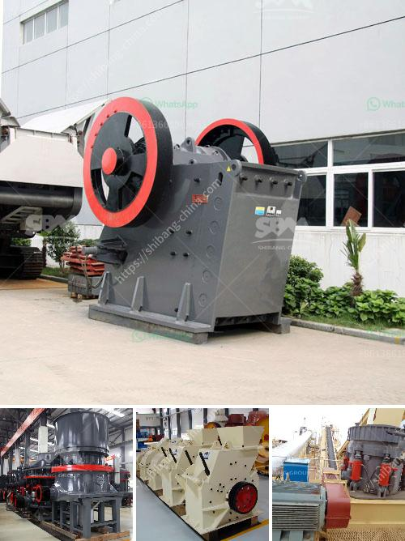

<h3>كسارة حجر في المملكة المتحدة</h3>
تعتبر كسارة الحجر من المعدات الضرورية في صناعة البناء والإنشاءات في المملكة المتحدة. تُستخدم كسارة الحجر لسحق الصخور الكبيرة وتحويلها إلى fragments أصغر الحجم، والتي يتم استخدامها بدورها في البناء والتشييد.

تتواجد العديد من كسارات الحجر في المملكة المتحدة، وقد تم تجهيزها بأحدث التقنيات والآلات لضمان تشغيلها بكفاءة عالية وأقصى قدر من الأمان. تحتوي الكسارة على تجهيزات متطورة مثل الكسارات المخروطية والكسارات الفكية التي تعمل على سحق الصخور بشكل دقيق وفعال.

واجهت صناعة البناء في المملكة المتحدة تحديات كبيرة في السنوات الأخيرة، حيث ارتفعت تكاليف المواد الخام والتشغيل والنقل. وعلاوة على ذلك، يتعين على البنائين الامتثال للمعايير واللوائح البيئية للحد من التأثير البيئي السلبي لعمليات البناء. لذلك، أصبح استخدام كسارات الحجر ذات الكفاءة العالية أمرًا ضرورياً.

تعمل كسارات الحجر في المملكة المتحدة على معالجة الصخور وتحويلها إلى مواد قابلة للاستخدام في البناء، مثل حصى، ورمل، وغيرها من المنتجات. يتم فرز وتصنيف هذه المواد وفقًا لاحتياجات وتفضيلات العملاء، وتوفير منتجات ذات جودة عالية وخاصة بتلبية المعايير الفنية والبيئية.

إضافةً إلى ذلك، تسهم كسارات الحجر في الحد من الاعتماد على الموارد الطبيعية، حيث يمكن إعادة استخدام المواد المنتجة من كسارات الحجر بعد استكمال دورة حياتها الأولية. وبالتالي، تقدم تكنولوجيا كسارة الحجر في المملكة المتحدة حلاً مستدامًا وموجهًا نحو المستقبل لاحتياجات صناعة البناء.

باستخدام كسارات الحجر في المملكة المتحدة، تصبح عملية البناء أكثر كفاءة وتؤدي إلى تقليل التكاليف والأثر البيئي. بالإضافة إلى ذلك، تساهم هذه الكسارات في تلبية الطلب المتزايد على مواد البناء عالية الجودة.

في الختام، يمكن القول إن كسارة الحجر تلعب دورًا حيويًا في صناعة البناء والإنشاءات في المملكة المتحدة. توفر هذه المعدات الحديثة والمتطورة منتجات عالية الجودة وتعمل على تحسين الكفاءة والاستدامة في عملية البناء. بفضل التقنيات المستخدمة في كسارات الحجر، يتم تلبية احتياجات العملاء بشكل فعال وتعزيز تطور صناعة البناء في المملكة المتحدة.
<h3>Contact us</h3><ul><li><strong>Whatsapp:&nbsp;<a href="https://wa.me/8613661969651">+8613661969651</a></strong></li><li><a href="https://swt.shibang-china.com/?git&amp;zhl&amp;كسارة حجر في المملكة المتحدة"><strong>Online Service(chat now)</strong></a></li></ul><h3>Related</h3><ul><li><a href='محطم الحجر الجيري روتور.md'>محطم الحجر الجيري روتور</a></li><li><a href='كسارة الفك bb 50 من ريتش.md'>كسارة الفك bb 50 من ريتش</a></li><li><a href='كسارات للركام الجرانيت.md'>كسارات للركام الجرانيت</a></li><li><a href='مصنع غسيل رمل السيليكا بالحمض.md'>مصنع غسيل رمل السيليكا بالحمض</a></li><li><a href='تصميم مصنع الإسمنت بتنسيق PDF.md'>تصميم مصنع الإسمنت بتنسيق PDF</a></li></ul>