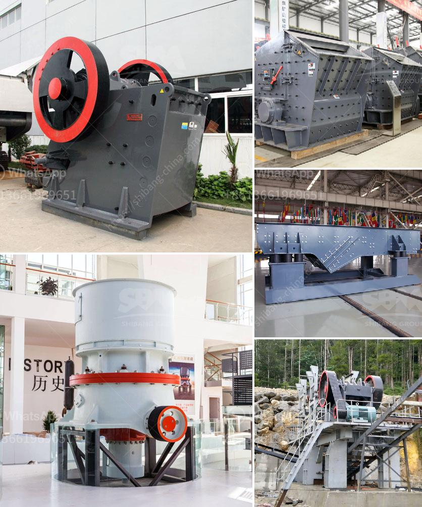

<h3>كسارة حجر في الهند</h3>
تعتبر صناعة البناء والإنشاء واحدة من الصناعات الأكثر أهمية في الهند، حيث يتطلب الإنشاء نوعًا من المواد الأساسية مثل الحجر والرمل والأسمنت. واحدة من المعدات التي تستخدم بشكل واسع في هذه الصناعة هي الكسارات الحجرية.

تشتهر الهند بمصادر غنية من الحجر الجيري والغرانيت والبازلت والرخام، وتحظى بصناعة كبيرة لتقطيع هذه المواد وتحويلها إلى مختلف المنتجات مثل البلاط، والألواح، والطوب، والأعمدة، وسطح الأرضية، وأكثر من ذلك.

تعد كسارات الحجر أداة مهمة جدًا في هذه الصناعة، حيث تقوم بتكسير الحجارة الكبيرة إلى حجم صغير يمكن استخدامه في البناء والإنشاء. تتوفر الكسارات الحجرية بأحجام وأنواع مختلفة، بعضها يعمل بالضغط الهيدروليكي والبعض الآخر يعمل بالاهتزاز، وتستخدم بنيتها من الفولاذ الصلب لتحمل الضغط العالي والاستخدام الشاق للغاية.

وتزدهر صناعة الكسارات الحجرية في الهند، حيث تعتبر واحدة من أكبر منتجي الحجر في العالم. وتتواجد معظم الكسارات في مناطق غرب الهند، مثل راجاستان وغوجارات وماديا براديش.

تعد صناعة الكسارات الحجرية أساسية لتلبية الطلب المتزايد على مواد البناء في الهند. حيث يتم استخدام الحجر المكسر في البناء والعديد من المشاريع الأخرى مثل الطرق والسكك الحديدية والأنفاق.

وبالإضافة إلى ذلك، تساهم الكسارات الحجرية في توفير الوظائف ودعم الاقتصاد المحلي. حيث توفر فرص عمل للكثير من العمال في مناطق الكسارات، كما تشجع على نمو الصناعات الأخرى المرتبطة بالبناء مثل نقل المواد وتجارة الحجر.

ومع ذلك، تواجه صناعة الكسارات الحجرية في الهند تحديات عديدة. فعلى الرغم من وفرة الموارد الحجرية، فإنها تواجه الإشكاليات في الحصول على التراخيص الحكومية والتصاريح البيئية، مما يؤثر على عملية الإنتاج. ويجب على الصناعة أيضًا مواجهة التحديات البيئية، حيث يجب اتخاذ إجراءات للحفاظ على البيئة وتقليل الآثار السلبية لعمليات الكسارة.

في الختام، يمكن القول إن الكسارات الحجرية أصبحت جزءًا لا غنى عنه في صناعة البناء في الهند. تلعب دورًا هامًا في تلبية احتياجات البناء المتزايدة وتساهم في توفير الوظائف ودعم الاقتصاد المحلي. ومع مواجهة التحديات البيئية والقوانين الحكومية، يجب على الصناعة العمل بجد للمحافظة على البيئة وضمان استدامة عمليات الكسارة في المستقبل.
<h3>Contact us</h3><ul><li><strong>Whatsapp:&nbsp;<a href="https://wa.me/8613661969651">+8613661969651</a></strong></li><li><a href="https://swt.shibang-china.com/?git&amp;zhl&amp;كسارة حجر في الهند"><strong>Online Service(chat now)</strong></a></li></ul><h3>Related</h3><ul><li><a href='آلة كسارة للبيع بسعر منخفض في أوريسا.md'>آلة كسارة للبيع بسعر منخفض في أوريسا</a></li><li><a href='كيفية صنع مسحوق وضع الجدار.md'>كيفية صنع مسحوق وضع الجدار</a></li><li><a href='مصنع غسيل الذهب المتنقل.md'>مصنع غسيل الذهب المتنقل</a></li><li><a href='الفرق بين مطاحن الكرات ومطاحن الأنابيب.md'>الفرق بين مطاحن الكرات ومطاحن الأنابيب</a></li><li><a href='مصنع تكسير في مالي.md'>مصنع تكسير في مالي</a></li></ul>