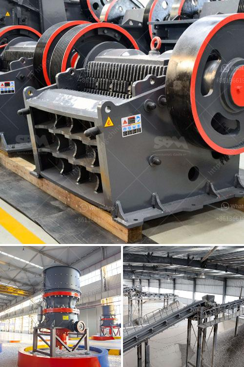

<h3>كسارة حجر في تروخيلو، بوليفيا</h3>
تقع كسارة حجر في تروخيلو، بوليفيا في إحدى المناطق الجبلية الجميلة بالبلاد. تعتبر هذه الكسارة من أماكن الجذب السياحي الشهيرة في المنطقة، حيث تجذب الزوار بمناظرها الطبيعية الخلابة والجمال الساحر للصخور.

تتميز كسارة حجر في تروخيلو بموقعها المثير ومناظرها الخلابة. تحاط الكسارة بجبال شاهقة ووديان عميقة، وتقدم منظرًا طبيعيًا استثنائيًا يجذب السياح من مختلف أنحاء العالم. تتكون الصخور في المنطقة من مادة الغرانيت، وتعكس ندوب الزمن وتشكيلاته الفريدة التي تجذب انتباه المشاهدين.

تعتبر هذه المنطقة غنية بالتاريخ والثقافة، حيث يمكن للزوار استكشاف العديد من المعالم الثقافية والأثرية المتنوعة في المنطقة المحيطة بالكسارة. تشتهر تروخيلو بالمزارع التي تنتج النبيذ والبخاريات، مما يوفر فرصة للزوار لاستكشاف العمليات التقليدية لإنتاج هذه المنتجات وتجربتها.

توفر كسارة حجر في تروخيلو أيضًا فرصة لممارسة الأنشطة الخارجية، مثل رياضة المشي لمسافات طويلة وركوب الدراجات الجبلية وركوب الخيل. يمكن للزوار اكتشاف المسارات الجبلية الخلابة والأماكن الرائعة للمشاهدة والاستمتاع بالطبيعة الساحرة في المنطقة.

من الناحية العملية، يمكن للزوار الوصول إلى كسارة حجر في تروخيلو بسهولة من مدينة لاباز أو سوكري أو من خلال رحلة بالقطار الجبلي المشهورة. تقع كسارة الحجر في قلب المنطقة الجبلية الوعرة، وتعد من الوجهات السياحية الشهيرة في بوليفيا.

في الختام، تعتبر كسارة حجر في تروخيلو وجهة رائعة للزوار الذين يبحثون عن مغامرة في الطبيعة الساحرة. تُقدم هذه المنطقة مناظر خلابة، تاريخ غني وفرصًا لممارسة العديد من الأنشطة الخارجية. إذا كنت تخطط لزيارة بوليفيا، فإنني أوصي بأن تجعل من كسارة حجر في تروخيلو وجهتك القادمة.
<h3>Contact us</h3><ul><li><strong>Whatsapp:&nbsp;<a href="https://wa.me/8613661969651">+8613661969651</a></strong></li><li><a href="https://swt.shibang-china.com/?git&amp;zhl&amp;كسارة حجر في تروخيلو، بوليفيا"><strong>Online Service(chat now)</strong></a></li></ul><h3>Related</h3><ul><li><a href='مورد قطع غيار الكسارة كينيا.md'>مورد قطع غيار الكسارة كينيا</a></li><li><a href='حساب سعة كسارة الأسطوانة.md'>حساب سعة كسارة الأسطوانة</a></li><li><a href='مصنع الجبس في باكستان.md'>مصنع الجبس في باكستان</a></li><li><a href='عملية الكرة الطحن.md'>عملية الكرة الطحن</a></li><li><a href='اقتباسات مطحنة الكرة.md'>اقتباسات مطحنة الكرة</a></li></ul>