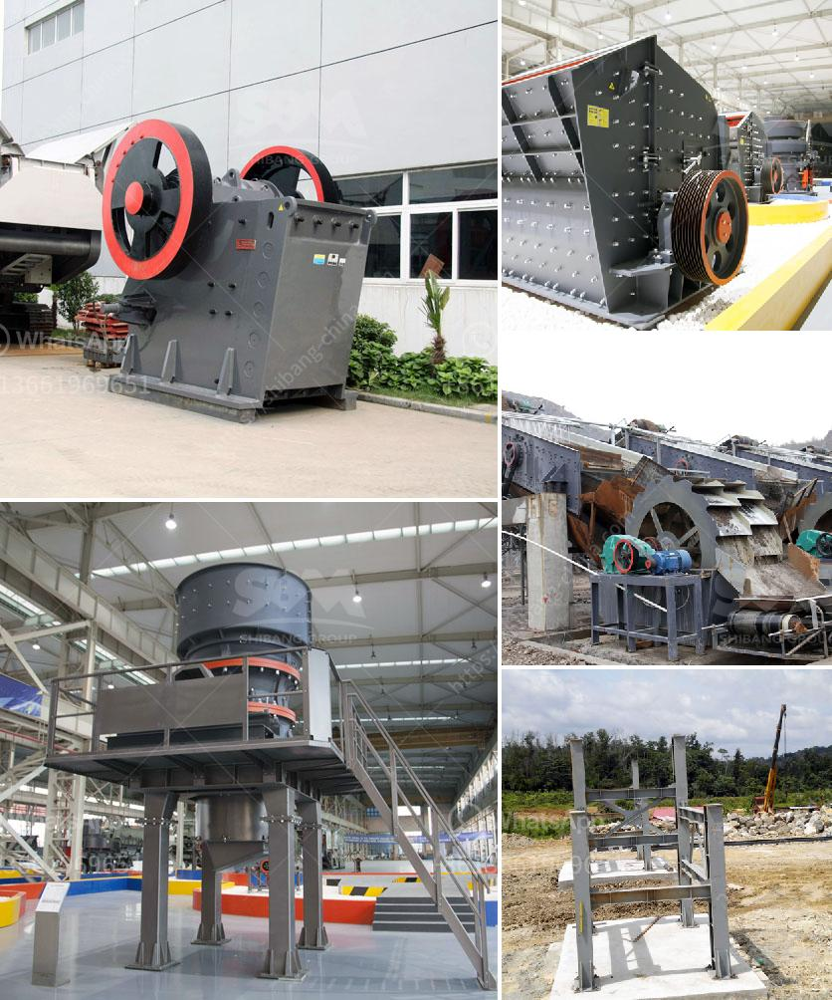

<h3>كسارة حجر لاستخراج الحجر</h3>
تعتبر كسارة الحجر أحد الأدوات الرئيسية المستخدمة في صناعة البناء واستخراج الحجر. تلعب هذه الآلة دورًا حيويًا في تكسير الصخور الكبيرة إلى قطع صغيرة من الحصى أو الركام المستخدم في البناء والطرق والأعمال الإنشائية.

تتكون كسارة الحجر من عدة أجزاء رئيسية تعمل سويًا لتحقيق عملية تكسير الحجر. واحدة من هذه الأجزاء الرئيسية هي الفك المتحرك، والذي يسمح بدخول الصخرة إلى الكسارة حيث يتم تجزئتها بواسطة حركة الفك المتحرك والفك الثابت. بعد التكسير، يتم نقل الحصى أو الركام بشكل طبيعي ليتم استخدامه في المشروع المعني.

من أهم المميزات التي توفرها كسارة الحجر هي الكفاءة العالية في عملية التكسير والإنتاج المستمر للمواد الخام المطلوبة. بفضل قوة المحركات والفكين المتحرك والثابت، تعمل الكسارة على تكسير الصخور بطريقة سريعة وفعالة.

إضافة إلى ذلك، تأتي معظم كسارات الحجر بتقنيات وأجهزة تحكم حديثة تسمح بمراقبة عملية التكسير بشكل دقيق وتعديل الإعدادات حسب الحاجة. هذا يوفر مزيدًا من الدقة والتحكم في عملية التكسير والإنتاج.

تتوفر كسارات الحجر بأحجام مختلفة وقدرات متنوعة تعتمد على طبيعة المشروع ومتطلبات الإنتاج. يمكن أن تتراوح قدرة الكسارة من 50 إلى 1000 طن في الساعة، مما يعني أنه يمكنها معالجة مجموعة واسعة من الصخور والحجارة.

عند استخدام كسارة الحجر، يجب اتباع إجراءات السلامة المناسبة واتباع تعليمات المصنع. يجب أن يكون شخص ما مؤهلًا للتعامل مع الكسارة والحفاظ على تشغيلها بأمان.

باختصار، تلعب كسارة الحجر دورًا حاسمًا في صناعة البناء والتشييد. تساعد على تحويل الصخور الكبيرة إلى قطع صغيرة من الحصى أو الركام، مما يسهل استخدامها في المشاريع الإنشائية المختلفة. تأتي كسارات الحجر بتقنيات حديثة وقدرات متنوعة، مما يسهل تلبية احتياجات الإنتاج المختلفة. تكفل تلك الآلات إنتاجية عالية وجودة ممتازة للمواد المكسرة، مما يعزز التركيز على السلامة والكفاءة في العملية الإنتاجية.
<h3>Contact us</h3><ul><li><strong>Whatsapp:&nbsp;<a href="https://wa.me/8613661969651">+8613661969651</a></strong></li><li><a href="https://swt.shibang-china.com/?git&amp;zhl&amp;كسارة حجر لاستخراج الحجر"><strong>Online Service(chat now)</strong></a></li></ul><h3>Related</h3><ul><li><a href='مخططات تدفق لتصنيع الحديد الزهر.md'>مخططات تدفق لتصنيع الحديد الزهر</a></li><li><a href='صورة لمصنع معالجة رمل السيليكا.md'>صورة لمصنع معالجة رمل السيليكا</a></li><li><a href='أسعار كسارات الخرسانة.md'>أسعار كسارات الخرسانة</a></li><li><a href='آلات إنتاج مسحوق كربونات الكالسيوم.md'>آلات إنتاج مسحوق كربونات الكالسيوم</a></li><li><a href='مصنع غسيل الطين الجيري.md'>مصنع غسيل الطين الجيري</a></li></ul>