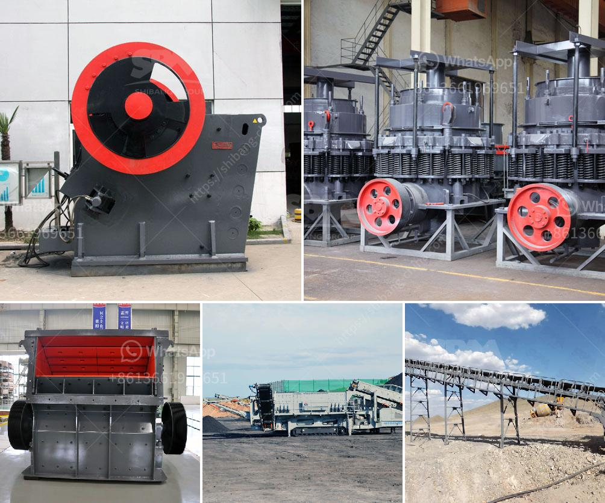

<h3>كسارة حجر لصنع رمل البناء</h3>
تعد كسارة الحجر أحد الأدوات الهامة في صناعة البناء والتشييد، حيث تقوم بتكسير الحجارة الكبيرة إلى جزيئات صغيرة يمكن استخدامها في إنتاج الرمل المستخدم في البناء. يُعتبر الرمل من أهم مكونات مواد البناء ويستخدم في العديد من التطبيقات مثل صنع الخرسانة والأسفلت والجص والطوب الأحمر والسيراميك.

ميزة كسارة الحجر هي قدرتها على تكسير الحجارة الكبيرة إلى جزيئات صغيرة بتجانس، مما يسهل استخدامها في صنع الرمل المطلوب للبناء. تتكون كسارة الحجر عادةً من جزئين رئيسيين: المغذي ومجرى تكسير الحجر. يتم تغذية الحجر في المغذي الذي يقوم بنقله نحو مجرى التكسير. بعد ذلك، يقوم مجرى تكسير الحجر بتكسير الحجارة الكبيرة إلى جزيئات صغيرة بطرق عديدة مثل الضرب والطحن والقص والسحق.

تتوفر كسارات الحجر بمختلف الأحجام والقدرات، حيث يمكن تكييفها وفقًا لاحتياجات العملاء ومتطلبات المشروع. تعتمد قدرة كسارة الحجر على قدرتها على تكسير الحجارة بسرعة وكفاءة عالية، كما يؤثر حجم الحجارة في القدرة الإجمالية للكسارة. يمكن أيضًا تحديد الحجم المطلوب من الرمل المنتج عن طريق ضبط حجم فتحة الفك أو الأسطوانة في كسارة الحجر.

تعتبر كسارة الحجر الأوتوماتيكية الهيدروليكية أحدث تقنية مستخدمة في صناعة إنتاج الرمل. تعمل الكسارات الهيدروليكية بواسطة الضغط الهيدروليكي، حيث تصمم لتكسير الحجارة بكفاءة عالية وبدقة. بالإضافة إلى ذلك، تتميز كسارات الحجر الأوتوماتيكية بسهولة الاستخدام وتشغيلها السهل، مما يعني أن العمال يمكنهم العمل بها بسهولة وأمان.

في الختام، تلعب كسارة الحجر دورًا مهمًا في إنتاج رمل البناء، حيث تتيح للبناة والمقاولين استخدام الرمل الجيد الجودة في مشاريعهم. بفضل تطور التكنولوجيا، يمكن الحصول على كسارات الحجر بمختلف الأحجام والقدرات، وقد قدمت التقنيات الهيدروليكية جودة وكفاءة أعلى في إنتاج الرمل. بالتالي، يمكن القول أن كسارة الحجر تعد أداة أساسية في عملية بناء البنية التحتية وتلبية احتياجات السوق للرمل المستخدم في صناعة البناء.
<h3>Contact us</h3><ul><li><strong>Whatsapp:&nbsp;<a href="https://wa.me/8613661969651">+8613661969651</a></strong></li><li><a href="https://swt.shibang-china.com/?git&amp;zhl&amp;كسارة حجر لصنع رمل البناء"><strong>Online Service(chat now)</strong></a></li></ul><h3>Related</h3><ul><li><a href='حدود اهتزاز مطحنة الكرة.md'>حدود اهتزاز مطحنة الكرة</a></li><li><a href='إجراء التعدين في محجر الحجر الجيري.md'>إجراء التعدين في محجر الحجر الجيري</a></li><li><a href='كسارة الحجر في أوغندا.md'>كسارة الحجر في أوغندا</a></li><li><a href='أفضل كسارة طين في الهند.md'>أفضل كسارة طين في الهند</a></li><li><a href='قطع غيار كسارة مخروطية hp 500.md'>قطع غيار كسارة مخروطية hp 500</a></li></ul>