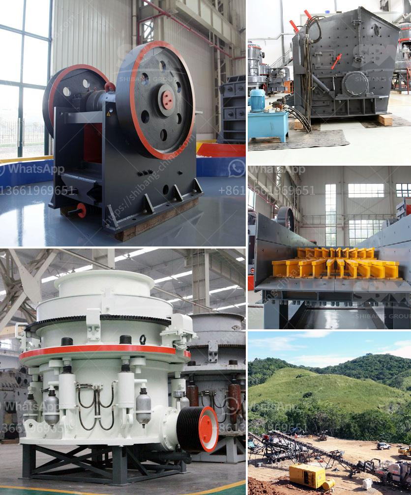

<h3>كسارة حجر للبناء</h3>
تُعتبر كسّارة الحجارة أحد الأدوات الأساسية في صناعة البناء، حيث تستخدم لتكسير الأحجار الكبيرة إلى قطع أصغر ومتجانسة، التي يمكن استخدامها في عمليات البناء المختلفة. تتميز كسّارات الحجارة بالقدرة على تحويل الأحجار الضخمة إلى مواد قابلة للتداول والاستخدام.

تعمل كسّارات الحجارة من خلال الضغط والاحتكاك لتحويل الأحجار الضخمة إلى قطع صغيرة، حيث يتم استخدام آلية تتألف من فكين متحركين أو أسطوانتين تدوران في اتجاهات معاكسة وفقًا للضغط اللازم. وباستخدام الكسّارة المناسبة، يمكن تكسير الأحجار بسرعة وكفاءة فائقة، مما يسهل عملية البناء بشكل كبير.

تستخدم كسّارات الحجارة في العديد من عمليات البناء، بدءًا من إنشاء الطرق والجسور حتى البناء العمراني والصناعي. فهي تستخدم لتكسير الأحجار المستخدمة في تعبيد الطرق، وإنتاج الركام اللازم لإنشاء الأساسات والأعمدة الخرسانية، وتصنيع الدهانات، بالإضافة إلى العديد من التطبيقات الأخرى في عالم البناء.

إن استخدام كسّارة الحجارة في عمليات البناء يوفر الكثير من الفوائد. فعند تحويل الأحجار الضخمة إلى قطع صغيرة، يتم تبسيط وتسهيل عملية البناء، مما يوفر الوقت والجهد الضروريان لإتمام المشروع. كما تساهم التقنيات الحديثة في الكسّارات في تقليل تكاليف العمل وتحسين جودة المنتجات النهائية.

بصفة عامة، فإن كسّارات الحجارة تعد عنصرًا حاسمًا لنجاح أي مشروع بناء، حيث تمكن من تحويل الأحجار الضخمة إلى مواد استثمارية قابلة للاستخدام في تشييد الهياكل المختلفة. وبفضل التطور التكنولوجي، أصبحت الكسّارات متوفرة بتقنيات مختلفة ومتعددة، مما يسمح بتلبية احتياجات العديد من الصناعات والمشاريع الكبيرة والصغيرة.

في الختام، تُعتبر كسّارات الحجارة أداة ضرورية وفعالة في صناعة البناء. فهي تحوّل الأحجار الضخمة إلى مواد بنائية صغيرة ومتجانسة، مما يسهل العملية ويوفر الجهد والتكلفة. بفضل التقنيات المتطورة، أصبح استخدام الكسّارات أكثر كفاءة وفعالية في البناء، مما يساهم في تقدم الصناعة وتحسين جودة المشاريع.
<h3>Contact us</h3><ul><li><strong>Whatsapp:&nbsp;<a href="https://wa.me/8613661969651">+8613661969651</a></strong></li><li><a href="https://swt.shibang-china.com/?git&amp;zhl&amp;كسارة حجر للبناء"><strong>Online Service(chat now)</strong></a></li></ul><h3>Related</h3><ul><li><a href='كسارة الكرة باكستان للبيع.md'>كسارة الكرة باكستان للبيع</a></li><li><a href='آخر آلة معالجة ذهب في إندونيسيا.md'>آخر آلة معالجة ذهب في إندونيسيا</a></li><li><a href='قائمة مصنع الكسارة.md'>قائمة مصنع الكسارة</a></li><li><a href='كسارة عينة صغيرة.md'>كسارة عينة صغيرة</a></li><li><a href='خط إنتاج مسحوق الجبس.md'>خط إنتاج مسحوق الجبس</a></li></ul>