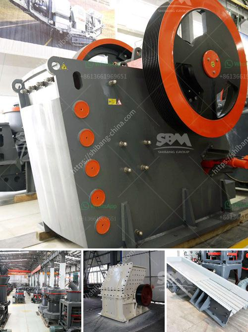

<h3>كسارة حجر محمولة</h3>
تعتبر كسارة الحجر المحمولة أحد التكنولوجيات الحديثة التي تم تطويرها في صناعة البناء والتعدين. وهي عبارة عن آلة ذات حجم صغير يمكن نقلها بسهولة وسرعة بين مواقع العمل المختلفة. توفر كسارة الحجر المحمولة العديد من المزايا، حيث توفر العديد من المزايا للشركات والمقاولين.

أولاً وقبل كل شيء، فإن الحجر المحمولة تتيح سرعة الإعداد والتشغيل. فهي لا تتطلب بنية ثابتة أو أعمدة تحمل خاصة للاستخدام. وبالتالي يمكن ضبطها وتشغيلها في وقت قصير، وهذا يوفر الكثير من الوقت والجهد في عملية الإعداد.

ثانياً، فإن الحجر المحمولة توفر استعمالاً مرناً ومتعدد الاستخدامات. يمكن استخدامها لسحق الحجارة من مختلف الأحجام والأنواع. فهي تعتمد على نظام السحق الحديث الذي يمكن تخصيصه وفقًا لاحتياجات العملاء المحددة.

ثالثاً، فإن كسارة الحجر المحمولة توفر كفاءة عالية لعملية السحق. إذ تحتوي على محرك قوي مصمم لتوفير أقصى كمية من الطاقة والكفاءة. وبالتالي فهي قادرة على تجهيز كميات كبيرة من الحجارة في وقت قصير.

رابعاً، فإن الكسارة المحمولة تسهل الحصول على المنتج النهائي المطلوب. حيث يمكن ضبط حجم المنتج المطلوب بسهولة من خلال ضبط قضيب التذبذب وإعدادات الشق، وذلك لتناسب احتياجات العميل.

خامساً، فإن كسارة الحجر المحمولة تقلل من التكاليف العامة لعملية البناء والتشييد. إذ تتيح للشركات تجنب تكاليف النقل وتكاليف العمالة العالية. كما أنها تقلل من الحاجة إلى شراء معدات إضافية لعمليات السحق.

في الختام، تعتبر كسارة الحجر المحمولة خيارًا مثاليًا للشركات والمقاولين الذين يبحثون عن تحسين كفاءة عملية السحق وتقليل التكاليف. فهي توفر سرعة، مرونة، كفاءة عالية، ومنتج نهائي مطابق للمواصفات المطلوبة. وبالتالي، فإن استخدام كسارة الحجر المحمولة سيكون له تأثير إيجابي على إنتاجية العمل والأرباح.
<h3>Contact us</h3><ul><li><strong>Whatsapp:&nbsp;<a href="https://wa.me/8613661969651">+8613661969651</a></strong></li><li><a href="https://swt.shibang-china.com/?git&amp;zhl&amp;كسارة حجر محمولة"><strong>Online Service(chat now)</strong></a></li></ul><h3>Related</h3><ul><li><a href='خطة عمل محجر الجرانيت.md'>خطة عمل محجر الجرانيت</a></li><li><a href='سعر آلة تصنيع لوحات الجبس.md'>سعر آلة تصنيع لوحات الجبس</a></li><li><a href='كسارة الحجر للبيع الفلبين.md'>كسارة الحجر للبيع الفلبين</a></li><li><a href='شاشة اهتزازية لرمل الكوارتز.md'>شاشة اهتزازية لرمل الكوارتز</a></li><li><a href='الجيوكيمياء التطبيقية لمعالجة اللميكا.md'>الجيوكيمياء التطبيقية لمعالجة اللميكا</a></li></ul>