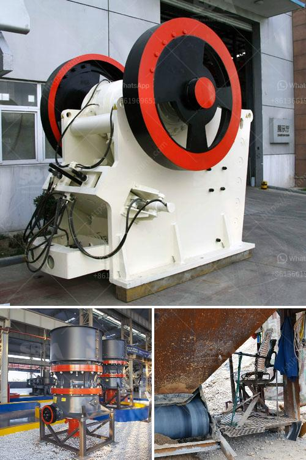

<h3>كسارة حجر مستعملة في أونتاريو</h3>
تعتبر الكسارات الحجرية المستعملة أداة مهمة في صناعة البناء والبنية التحتية. واحدة من هذه الكسارات المستعملة تقع في مقاطعة أونتاريو في كندا. تمتلك هذه الكسارة سمعة طيبة وتاريخ ناجح في تقديم خدمات عالية الجودة لعملائها.

تعمل الكسارة على سحق الصخور وتحويلها إلى مواد صالحة للاستخدام في البناء والتشييد. تعتبر هذه العملية أساسية في تلبية الطلب المتزايد على المواد الإنشائية في المنطقة. كما تعتبر الكسارة المستعملة بديلاً مستدامًا للكسارات الجديدة، حيث يتم إعادة استخدامها بدلاً من التخلص منها بالكامل.

توفر الكسارة المستعملة في أونتاريو العديد من المزايا للعملاء. أولاً، تكلفتها أقل من الكسارات الجديدة، مما يتيح للعملاء الحصول على أداة ذات جودة عالية بسعر معقول. ثانيًا، يتم توفير المواد بشكل أسرع، حيث لا يلزم إنشاء مصنع جديد للكسارة. كما يمكن الوصول إلى خدمات الكسارة المستعملة بسهولة في أونتاريو بفضل توفر شبكة النقل واللوجستية المتطورة.

يتطلب استخدام الكسارة المستعملة في أونتاريو الحفاظ على جودة التشغيل والصيانة الدورية. تقوم الشركة المالكة بتنفيذ الفحوصات والاختبارات المناسبة للحفاظ على أداء الكسارة بأعلى مستوى. كما يتابع الفريق الفني بشكل دوري عمليات الإصلاح والتجديد للكسارة، مما يضمن استمراريتها في العمل بكفاءة.

بشكل عام، تعد الكسارة المستعملة في أونتاريو خيارًا مثاليًا للعملاء الذين يبحثون عن جودة عالية وتكلفة معقولة. يمكن للعملاء الحصول على مواد إنشائية جيدة الجودة بطريقة مستدامة، مما يسهم في تطوير بنية تحتية مستدامة ومستدامة في المنطقة.

قد يكون لديك بعض الشكوك حول شراء الكسارة المستعملة. ومع ذلك، يعد الحصول على معلومات كافية عن الكسارة، والفحص الدقيق، والتفاوض بشأن السعر مع البائع أمورًا هامة يجب النظر فيها قبل اتخاذ القرار النهائي. يجب على العميل أن يتأكد من أن الكسارة المستعملة قابلة للتشغيل وتتوافق مع متطلباته الخاصة.

في النهاية، الكسارة المستعملة في أونتاريو تعتبر خيارًا موثوقًا للعملاء الذين يهتمون بالجودة والاستدامة والتكلفة. يمكن للعملاء الاعتماد على الكسارة في توفير مواد البناء عالية الجودة لمشاريعهم، مما يسهم في تطوير البنية التحتية في أونتاريو وتعزيز الاقتصاد المحلي.
<h3>Contact us</h3><ul><li><strong>Whatsapp:&nbsp;<a href="https://wa.me/8613661969651">+8613661969651</a></strong></li><li><a href="https://swt.shibang-china.com/?git&amp;zhl&amp;كسارة حجر مستعملة في أونتاريو"><strong>Online Service(chat now)</strong></a></li></ul><h3>Related</h3><ul><li><a href='تكلفة معدات التكسير والطحن في إثيوبيا.md'>تكلفة معدات التكسير والطحن في إثيوبيا</a></li><li><a href='مصنع تكسير المحاجر الكامل في جنوب أفريقيا.md'>مصنع تكسير المحاجر الكامل في جنوب أفريقيا</a></li><li><a href='مصنع غسل الرمل المستعمل للبيع.md'>مصنع غسل الرمل المستعمل للبيع</a></li><li><a href='أنظمة ناقلات الحصى للمسافة.md'>أنظمة ناقلات الحصى للمسافة</a></li><li><a href='آلة معالجة الرماد الطائر.md'>آلة معالجة الرماد الطائر</a></li></ul>