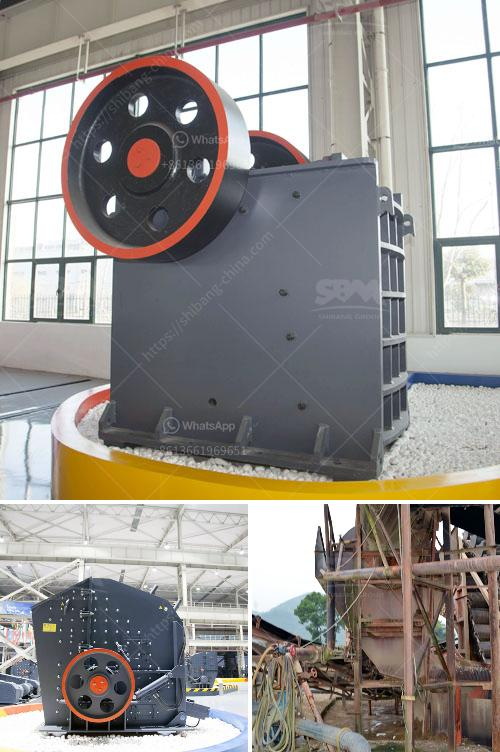

<h3>كسارة حجر مستعملة للبيع في ألمانيا</h3>
تعتبر كسارات الحجر من المعدات الأساسية في صناعة البناء والتشييد. إلا أنها قد تكون مكلفة للغاية، خاصةً إذا كانت جديدة. لذا، فإن التفكير في شراء كسارة حجر مستعملة للبيع في ألمانيا يمكن أن يكون حلاً مثالياً لتلك الشركات التي ترغب في توفير التكاليف وتوفير الوقت والجهد.

تتوفر في ألمانيا العديد من الكسارات المستعملة للبيع، حيث يمكن العثور عليها في المزادات أو من خلال التجار المحليين. تتراوح أسعار هذه الكسارات من 200 إلى 400 ألف يورو، حسب حجم وحالة الكسارة وقدرتها على سحق الحجر.

تعتبر الكسارات المستعملة من البدائل الجيدة للشراء الجديد، حيث تكون متوفرة بأسعار أقل بكثير. ومع ذلك، يجب أخذ بعض العوامل في الاعتبار قبل شراء كسارة حجر مستعملة.

أولاً، يجب معرفة سبب بيع الكسارة من قبل البائع. قد يكون هناك أسباب عديدة لذلك، مثل انتهاء الفترة الزمنية لاستخدام الكسارة أو الحاجة إلى ترقية إلى كسارة أحدث. يجب التحقق من حالة الكسارة ومستوى الاستخدام السابق لتأكد من أنها تعمل بكفاءة وليس بها عيوب كبيرة.

ثانيًا، يجب التحقق من تاريخ صيانة الكسارة ومعرفة مدى استمرار عملها بشكل جيد. قطع الغيار تعتبر جزءًا هامًا في صناعة الكسارات، لذا يجب التأكد من توفر قطع الغيار المستقبلية وكفاءة التوريد.

وأخيرًا، يجب مراعاة النقل والتسليم للكسارة. يجب التأكد من أنه يتم تنظيم النقل والتسليم بشكل جيد لضمان سلامة وصول الكسارة إلى موقع العمل.

في النهاية، شراء كسارة حجر مستعملة في ألمانيا يعد قرارًا ذكيًا للشركات التي ترغب في توفير التكاليف وتلبية احتياجاتها في البناء. سواء كنت تبحث عن كسارة مستعملة بسعر مناسب أو تريد بيع كسارة قديمة، يمكن العثور على العديد من الفرص في سوق البيع والشراء في ألمانيا. يجب فقط القيام بالبحث المناسب والتحقق من حالة وموثوقية الكسارة قبل إجراء أي صفقة.
<h3>Contact us</h3><ul><li><strong>Whatsapp:&nbsp;<a href="https://wa.me/8613661969651">+8613661969651</a></strong></li><li><a href="https://swt.shibang-china.com/?git&amp;zhl&amp;كسارة حجر مستعملة للبيع في ألمانيا"><strong>Online Service(chat now)</strong></a></li></ul><h3>Related</h3><ul><li><a href='مطحنة هامر في جنوب أفريقيا.md'>مطحنة هامر في جنوب أفريقيا</a></li><li><a href='كسارة نصف متنقلة.md'>كسارة نصف متنقلة</a></li><li><a href='تجار الكسارات المتنقلة المستخدمة في غانا.md'>تجار الكسارات المتنقلة المستخدمة في غانا</a></li><li><a href='كيفية صنع مسحوق التلك الصناعي.md'>كيفية صنع مسحوق التلك الصناعي</a></li><li><a href='مطحنة هامر تقليدية.md'>مطحنة هامر تقليدية</a></li></ul>