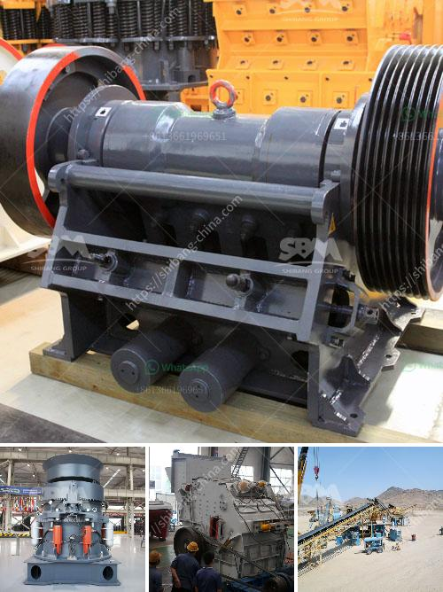

<h3>كسارة حجرية بسعة 100 طن في الساعة استهلاك الديزل</h3>
تعتبر الكسارات الحجرية من أهم الآلات التي تُستخدم في صناعة البناء والإنشاءات، حيث تستخدم لسحق الصخور والحجارة الكبيرة إلى قطع أصغر تُستخدم في تشييد المباني والطرق. إحدى الكسارات الحجرية ذات السعة الكبيرة هي الكسارة بسعة 100 طن في الساعة.

تتميز الكسارات الحجرية بسعة 100 طن في الساعة بقدرتها على معالجة كمية كبيرة من الحجارة في وقت قصير، مما يعزز كفاءة العمل ويوفر الوقت والجهد. تُعتبر هذه الكسارات مفيدة جدًا في مشاريع البنية التحتية الكبيرة التي تتطلب مواد بناء كثيرة.

تعمل الكسارة الحجرية بواسطة محرك ديزل، وهو ما يجعلها قادرة على العمل في المواقع التي لا تتوفر فيها مصادر طاقة كهربائية. تحتوي هذه الكسارة على محرك ديزل يستهلك ما بين 200 إلى 400 لتر من الديزل في الساعة، وهذا يعتمد على نوع المحرك وكفاءته. يجب الانتباه لاحتياجات الوقود اللازمة للكسارة وضمان توفُّر الديزل بكميات كافية للعمل المستمر والمستدام.

توفر الكسارة الحجرية بسعة 100 طن في الساعة فوائد كبيرة للمشاريع الكبيرة. فعلى سبيل المثال، تُساعد هذه الكسارة في تقليل التكاليف بشكل كبير، حيث يمكن استخراج وسحق الصخور الموجودة في الموقع نفسه بدلاً من شراء المواد الخام من مصادر خارجية. تقلل الكسارة أيضًا من الوقت المستغرق في عملية النقل والتخلص من الصخور الكبيرة، حيث يمكن سحقها مباشرة في الموقع واستخدامها في البناء والإنشاءات.

بالإضافة إلى ذلك، توفر الكسارة الحجرية بسعة 100 طن في الساعة جودة ودقة في عملية التكسير، حيث يمكن ضبط حجم القطع المراد سحقها بدقة وفقًا لمتطلبات المشروع. تعمل الكسارة أيضًا بكفاءة عالية وتوفر جودة متسقة في المنتج النهائي، مما يضمن تلبية متطلبات البناء والإنشاءات بأعلى جودة ممكنة.

باختصار، الكسارة الحجرية بسعة 100 طن في الساعة هي آلة قوية وفعالة تستخدم في صناعة البناء والإنشاءات. بفضل قدرتها على سحق الصخور الكبيرة وتحويلها إلى قطع أصغر، توفر الكسارة توفيرًا في التكاليف والجهد وتساهم في تنفيذ المشاريع بكفاءة عالية وفي وقت قصير. إلى جانب ذلك، يجب الاهتمام بتوفير الديزل الكافي لتشغيل الكسارة وضمان استمرار العمل بكفاءة مستدامة.
<h3>Contact us</h3><ul><li><strong>Whatsapp:&nbsp;<a href="https://wa.me/8613661969651">+8613661969651</a></strong></li><li><a href="https://swt.shibang-china.com/?git&amp;zhl&amp;كسارة حجرية بسعة 100 طن في الساعة استهلاك الديزل"><strong>Online Service(chat now)</strong></a></li></ul><h3>Related</h3><ul><li><a href='الفصل المغناطيسي لرمل خام الحديد.md'>الفصل المغناطيسي لرمل خام الحديد</a></li><li><a href='سير ناقل في دبي.md'>سير ناقل في دبي</a></li><li><a href='الشركة المصنعة للكسارة الرئيسية من الرخام.md'>الشركة المصنعة للكسارة الرئيسية من الرخام</a></li><li><a href='كسارة الكرة.md'>كسارة الكرة</a></li><li><a href='مصنعو كسارات الجيري.md'>مصنعو كسارات الجيري</a></li></ul>